# SDD — High-Level System Design Document

**Продукт:** внутренний модуль «Кошелёк пользователя» → экран обмена валют (Exchange Screen)
**Функциональность:** создание заявки на обмен (Exchange Order) до статуса `PENDING`
**Автор:** Software Architect
**Дата:** 2026-08-07
**Статус:** Draft for engineering handoff
**Нормативный источник:** [`docs/00-canonical-model.md`](./00-canonical-model.md)

---

## 1. Назначение документа, аудитория, скоуп

### 1.1 Назначение

Документ описывает **целевую продакшен-архитектуру** процесса создания заявки на обмен валют:
состав контейнеров и компонентов, границы ответственности, последовательности взаимодействий,
точки отказа и стратегии деградации, контракт REST API верхнего уровня, жизненный цикл заявки,
цепочку бизнес-проверок и предположения по масштабированию.

Документ спроектирован так, чтобы команда разработки могла начать работу **без устных пояснений**:
каждое архитектурное решение сопровождается названной ценой (trade-off), каждая точка отказа —
описанием поведения системы и того, что видит пользователь.

### 1.2 Аудитория

| Роль | Что берёт из документа |
|------|------------------------|
| Backend-разработчик | §5–§6 (компоненты и границы), §9–§12 (последовательности), §15 (проверки), §17 (ошибки) |
| Frontend-разработчик | §7 (контейнеры), §8–§11 (последовательности), §13 (API), §17 (коды ошибок) |
| API Architect | §13 как рамка для OpenAPI, §6 как источник границ ответственности |
| QA / Business Analyst | §14 (жизненный цикл), §15 (проверки), §16 (failure modes) — основа для Gherkin |
| SRE / DevOps | §16 (точки отказа), §18 (масштабирование), §19 (наблюдаемость) |
| Security / Compliance | §15 (Compliance-First), §20 (безопасность и комплаенс) |

### 1.3 В скоупе

- Открытие экрана обмена и загрузка контекста: активы, балансы, KYC-статус, лимиты, первичная котировка.
- Построение котировки (quote) при вводе суммы, TTL котировки, обработка дрейфа курса.
- Создание заявки `POST /v1/exchange-orders`: полная цепочка валидации §6 канона, резерв средств (hold),
  регистрация заявки, асинхронное уведомление.
- Поведение системы при отказах внешних систем S1..S9, компенсация при частичном отказе.

### 1.4 Вне скоупа

Исполнение заявки и matching на бирже, бухгалтерские проводки, ончейн-транзакции, ввод/вывод средств,
история операций, авторизация и управление сессиями, схема БД и физическая модель данных
(прямой запрет `System Design Brief`), UI-спецификация (живёт в `docs/UX-UI-Spec.md`),
детальные схемы запросов/ответов (живут в `docs/api/`).

**Терминальное состояние скоупа — заявка в статусе `PENDING`.** Всё, что за `PENDING`, показано
на диаграммах серым и помечено как граница скоупа.

### 1.5 Связанные документы

| Документ | Отношение к SDD |
|----------|-----------------|
| `docs/00-canonical-model.md` | **Нормативный.** Имена, коды ошибок, статусы, порядок проверок, таймауты. При расхождении прав канон |
| `docs/BRD.md` | Первоисточник бизнес-требований |
| `docs/Product Context.md` | Продуктовый контекст, принцип «одно действие, один экран, одно подтверждение» |
| `docs/System Design Brief.md` | Бриф на этот документ |
| `docs/api/exchange-orders.openapi.yaml` | Детальный контракт основного API. SDD даёт только сводку |
| `docs/api/INTEGRATIONS.md` | Контракты интеграций с S1..S9 |
| `docs/features/exchange-order.feature` | Приёмочные сценарии |
| `promtlog.md` | Журнал решений и разрешённых конфликтов |

---

## 2. Архитектурный контекст и bounded contexts

Задача выглядит как «форма с двумя полями», но по сути это **распределённая транзакция с деньгами
и регуляторными проверками**, у которой есть окно консистентности длиной 15 секунд (TTL котировки)
и точка невозврата (создание hold). Архитектура строится вокруг двух фактов:

1. **Котировка — это обязательство системы**, а не отображаемое число. Она должна жить на сервере,
   иметь идентификатор и однократно потребляться.
2. **Резерв средств и регистрация заявки — два разных ресурса в двух разных системах** (S6 и S8),
   между которыми нет распределённой транзакции. Значит, нужна явная компенсация (§12).

### Bounded contexts

| Контекст | Владелец | Язык домена | Отношение к нам |
|----------|----------|-------------|-----------------|
| **Exchange (наш)** | Exchange Orchestrator | Quote, ExchangeOrder, FeePolicy, ValidationChain, Hold | Core domain |
| **Identity** | S1 Users Service | User, Tier, Residency, Status | Upstream, conformist |
| **Verification** | S2 KYC Service | KycLevel, KycStatus, ValidUntil | Upstream, conformist |
| **Risk** | S3 Scoring / AML | RiskScore, Decision | Upstream, conformist |
| **Pricing & Policy** | S4 Limits & Fees | MinAmount, MaxAmount, FeeSchedule, TurnoverLimit | Upstream, ACL |
| **Market Data** | S5 Exchange Rate Service | Rate, RateSource, Staleness | Upstream, ACL |
| **Ledger** | S6 Accounting Service | Balance, Hold | Upstream/downstream, ACL |
| **Liquidity** | S7 Crypto Provider | OrderBook, NetworkFee, NetworkStatus | Upstream, degradable |
| **Order Management** | S8 Order Service | Order, OrderStatus | Downstream, ACL |
| **Messaging** | S9 Notification Service | Notification, DeliveryReceipt | Downstream, fire-and-forget |

Ко всем внешним системам применяется **Anti-Corruption Layer** — по одному адаптеру на систему
внутри `IntegrationClients` (§5). Внешние модели не протекают в доменные объекты `Quote` и
`ExchangeOrder`: адаптер отвечает за маппинг, нормализацию денежных величин в decimal-строки
и трансляцию ошибок upstream в коды каталога §7 канона.

---

## 3. Ключевые архитектурные решения (ADR)

Формат: **решение → альтернативы → обоснование → цена**. Решение без названной цены считается
недокументированным.

| ID | Решение | Альтернативы | Обоснование | Цена решения (trade-off) | Статус |
|----|---------|--------------|-------------|--------------------------|--------|
| **ADR-01** | **Выделенный BFF-слой** `Exchange BFF` между Web SPA и доменом. Фронтенд ходит **только** в BFF, не в S1..S9 и не в Orchestrator напрямую | (a) SPA дергает внешние сервисы напрямую; (b) API Gateway с composition-плагинами; (c) GraphQL-шлюз | Экран обмена требует агрегата из 5 источников за один заход (§8). Без BFF SPA получает 5 сетевых зависимостей, 5 контрактов на изменение и обязанность считать `inverseRate` и форматирование денег на клиенте — а деньги на клиенте нельзя считать в `float` (§5.1 канона). BFF также единственная точка, где живёт презентационная логика: `inverseRate`, локализация, склейка `degraded`-флага | +1 сетевой хоп (≈10–20 мс к каждому запросу) и +1 деплоймент-юнит. BFF становится узким местом релизного цикла фронта: изменение view-модели требует релиза бэкенда. Риск «BFF превращается в второй домен» — купируется правилом §6: BFF **не содержит** бизнес-проверок | Accepted |
| **ADR-02** | **Двухфазный протокол `quote → order`**: `POST /v1/exchange/quotes` возвращает `quoteId` + `expiresAt`, `POST /v1/exchange-orders` ссылается на `quoteId` | Одношаговый `POST /exchange-orders` с суммой и парой, курс определяется на сервере в момент submit | Пользователь обязан видеть **тот же** курс, комиссию и сумму получения, которые будут применены (BRD §2). При одношаговом протоколе между отображением и submit курс меняется молча — это либо обман пользователя, либо убыток системы. `quoteId` даёт: (1) фиксацию обязательства на 15 с, (2) детект дрейфа `RATE_CHANGED`, (3) естественную защиту от повторного использования `QUOTE_ALREADY_USED` | Система держит серверное состояние с TTL (Quote Store, ADR-11), которого при одношаговом протоколе не было бы. Появляются 5 кодов ошибок вокруг котировки (`QUOTE_NOT_FOUND`, `QUOTE_EXPIRED`, `QUOTE_ALREADY_USED`, `QUOTE_MISMATCH`, `RATE_CHANGED`) — фронтенд обязан обрабатывать каждый. Растёт число запросов: минимум 2 round-trip на обмен | Accepted |
| **ADR-03** | **Идемпотентность через обязательный заголовок `Idempotency-Key`** (UUIDv4) на `POST /v1/exchange-orders`, окно 24 ч. Повтор с тем же телом → тот же `201`; с другим телом → `409 IDEMPOTENCY_CONFLICT` | (a) Полагаться на однократность `quoteId`; (b) дедупликация по хешу тела; (c) без защиты, разбор дублей вручную | Однократность `quoteId` защищает от логического дубля, но **не** от сетевого: если ответ `201` потерялся в пути, клиент ретраит и получает `QUOTE_ALREADY_USED` — пользователь видит ошибку при фактически созданной заявке. `Idempotency-Key` возвращает исходный `201`, а не ошибку. Дедупликация по хешу тела ломается на равных телах двух намеренно одинаковых обменов подряд | Нужен распределённый Idempotency Store с окном 24 ч и атомарной операцией «занять ключ» (§18). Клиент обязан генерировать и **сохранять** ключ до получения финального ответа — это требование к фронтенду, а не к бэкенду. Стоимость записи ключа лежит на критическом пути `POST` | Accepted |
| **ADR-04** | **Все денежные величины и курсы — decimal-строки** на всём пути: API, BFF, домен, состояние фронтенда, отображение. `float`/`double` запрещены | (a) `number` в JSON; (b) целочисленные minor units везде; (c) строки только на API, `double` внутри | `0.1 + 0.2 ≠ 0.3` в IEEE-754; при `decimals=8` у BTC ошибка представления попадает в значащие разряды. Minor units корректны, но при `decimals(BTC)=8` и `decimals(USDT)=6` требуют таскать масштаб рядом с каждым числом и ломают читаемость логов и Problem Details. Инвариант `I1: feeAmount + netFromAmount == fromAmount` требует **точного** равенства — оно недостижимо на `double` | Каждый арифметический шаг требует decimal-библиотеки: `decimal.js` на фронте, `BigDecimal`/`decimal` на бэке. Разработчик обязан явно указывать режим округления в каждой операции — забытый режим даёт исключение или дефолт, не совпадающий с §5.4. Сериализация/десериализация дороже, JSON-схема требует `pattern` вместо `type: number`. Сравнение сумм в тестах — только через нормализацию строк | Accepted |
| **ADR-05** | **Цепочка валидации 1..19 выполняется синхронно** внутри одного HTTP-запроса `POST /v1/exchange-orders`. Асинхронно уходит только уведомление S9 | (a) Принять заявку в `VALIDATING` и валидировать асинхронно, отдав `202`; (b) event-driven saga с очередью между шагами | Продуктовое обещание — «обмен за несколько секунд» (BRD §2) и «одно подтверждение» (Product Context). При `202` пользователь остаётся на экране с неопределённостью и системе нужен канал доставки результата (WS/push) — это отдельная подсистема ради единственного экрана. Синхронный ответ укладывается в бюджет p95 ≤ 900 мс (§11 канона) при параллельном фан-ауте S1–S4 и кешировании | Верхняя граница latency жёстко связана с самой медленной внешней системой. Любая деградация S1..S6/S8 видна пользователю немедленно. Худший случай последовательного исполнения превышает бюджет (см. §16, FM-11) — поэтому параллельный фан-аут и кеши **обязательны**, а не оптимизация. Единственное исключение из синхронности — `SCORING_REVIEW_REQUIRED` → `202` + `MANUAL_REVIEW` | Accepted |
| **ADR-06** | **Кеш курсов с TTL 1 с и деградация**: при недоступности S5 отдаём stale-курс с `degraded: true` до 10 с от момента последнего успешного чтения, далее `503 RATE_SERVICE_UNAVAILABLE` | (a) Без кеша, каждый quote → вызов S5; (b) неограниченный stale; (c) немедленный `503` при первой ошибке S5 | Без кеша нагрузка на S5 линейна по числу нажатий клавиш пользователями — при дебаунсе 300 мс это десятки RPS на пару при малой аудитории. TTL 1 с срезает фан-аут в десятки раз и делает нагрузку на S5 постоянной и не зависящей от числа пользователей. Неограниченный stale недопустим: продавать по курсу минутной давности — прямой финансовый риск. Немедленный `503` превращает секундную сетевую икоту в отказ экрана | Пользователь может получить курс возрастом до 10 с и создать по нему заявку — система осознанно принимает ценовой риск в этом окне в обмен на доступность. Требуется честный признак `degraded: true` в ответе и его отображение в UI, иначе решение превращается в скрытый обман. Порог 10 с и TTL 1 с — конфигурируемые параметры, требующие подтверждения риск-менеджментом (ASSUMPTION-05) | Accepted |
| **ADR-07** | **Circuit breaker на каждом адаптере** к S1..S9: порог 50 % ошибок на окне 20 запросов, open 30 с, half-open с одиночным пробным запросом | (a) Только таймауты и ретраи; (b) общий breaker на все интеграции; (c) bulkhead без breaker | Таймаут в 1 500 мс, умноженный на очередь ожидающих запросов, выедает пул соединений Orchestrator и превращает отказ одной внешней системы в отказ всего экрана — каскад (FM-16). Breaker обрывает ожидание за миллисекунды и позволяет применить стратегию деградации немедленно. Общий breaker недопустим: отказ `Degradable` S7 не должен закрывать путь к `Blocking` S6 | Возможен ложный open при коротком всплеске ошибок — тогда пользователи получают `503` те 30 с, что реальный сервис уже жив. Half-open с одиночным пробником ограничивает потери, но добавляет до 30 с к времени восстановления. Breaker per-instance (не распределённый) даёт разное состояние на разных подах — принято сознательно ради простоты; цена — «рваное» поведение при частичной деградации upstream | Accepted |
| **ADR-08** | **Hold создаётся ПОСЛЕ всех проверок 1..17 и ДО регистрации заявки в S8** (шаг 18 → шаг 19). При провале шага 19 — компенсирующее снятие hold | (a) Hold в самом начале, до проверок — «сначала заберём деньги»; (b) hold после регистрации заявки в S8; (c) без hold, проверка баланса в момент исполнения | Hold до проверок означал бы блокировку средств у пользователя, который заведомо получит `KYC_REQUIRED` — деньги замораживаются без права на операцию, и требуется компенсация на каждом отказном пути. Hold после регистрации создаёт заявку без обеспечения: между `PENDING` и holdом пользователь может потратить средства другой операцией, и заявка станет неисполнимой. Порядок «проверки → hold → заявка» гарантирует, что любая заявка в `PENDING` обеспечена | Открывается окно частичного отказа: hold создан, регистрация в S8 упала (FM-12). Требуется явная компенсация — saga с компенсирующей транзакцией (§12) и фоновый reaper для случая, когда компенсация тоже не прошла. Это дополнительный код, дополнительная метрика и дополнительный алерт. Альтернатива (c) этого кода не требует, но допускает `PENDING`-заявки без денег, что в финтехе неприемлемо | Accepted |
| **ADR-09** | **Compliance-First: порядок проверок 13→14→15→16→17** — пользователь, кошелёк, KYC, лимиты, скоринг, и только потом баланс | Сначала дешёвые локальные проверки и баланс, потом комплаенс | Различие сообщений об ошибке — канал утечки. Если неверифицированный пользователь при переборе сумм получает `INSUFFICIENT_FUNDS` на 30 000 и `LIMIT_EXCEEDED_DAILY` на 400 000, он бинарным поиском восстанавливает баланс и остаток лимита чужого/скомпрометированного аккаунта, не имея права на операцию вообще. Compliance-First делает ответ инвариантным относительно суммы, пока субъект не допущен | Пользователь с достаточным KYC-статусом, но с явной нехваткой средств, всё равно платит стоимость вызовов S2/S3/S4 перед тем, как получить `INSUFFICIENT_FUNDS`. Это +2 внешних вызова на массовом отказном пути. Смягчается кешированием KYC 30 с и лимитов, а также клиентской предвалидацией баланса (§15), которая отсекает большинство таких запросов до сервера | Accepted |
| **ADR-10** | **`orderId` = `"ord_" + ULID`**; `quoteId` остаётся UUIDv4 | (a) UUIDv4 для orderId; (b) автоинкремент; (c) Snowflake ID | `orderId` — долгоживущий идентификатор, по которому строятся выборки «последние заявки», курсоры пагинации и разбор инцидентов по времени. ULID лексикографически сортируется по времени создания, что даёт бесплатный курсор и локальность записей без отдельного индекса по `createdAt`. Автоинкремент раскрывает объём бизнеса и не генерируется распределённо. Snowflake требует координации worker-id. `quoteId` живёт 15 с, сортировка ему не нужна — там UUIDv4 достаточен и не раскрывает частоту котирования | ULID **раскрывает время создания заявки** любому, кто её видит, — для внутреннего кошелька это приемлемо, для публичного API было бы утечкой. Монотонность внутри миллисекунды требует корректной реализации (монотонный счётчик), иначе два заказа в одну мс могут отсортироваться неверно. Гетерогенность идентификаторов (ULID + UUID) — когнитивная нагрузка на команду, требует явного правила в code review | Accepted |
| **ADR-11** | **Quote Store — отдельное короткоживущее строго-консистентное хранилище** для котировок (TTL 15 с) и маркеров потребления (TTL 15 мин), с атомарной операцией `consume` | (a) Хранить котировку в JWT/подписанном токене у клиента; (b) в общей операционной БД; (c) в памяти инстанса | Однократность (`QUOTE_ALREADY_USED`) требует атомарного compare-and-set — подписанный токен у клиента этого дать не может в принципе, он проверяет подлинность, но не потребление. Общая операционная БД получила бы поток записей с TTL 15 с и мусор от неиспользованных котировок — 60–70 % котировок никогда не превращаются в заявку. Память инстанса ломается при горизонтальном масштабировании: submit может прийти на другой под | Ещё один stateful-компонент в системе и ещё одна зависимость на критическом пути `POST` — его отказ равносилен отказу обмена (FM-15). Требуется политика вытеснения и алерт на заполнение. Потеря Quote Store = потеря всех активных котировок; пользователи получают `QUOTE_NOT_FOUND` и обновляют котировку — деградация мягкая, но заметная | Accepted |
| **ADR-12** | **Уведомление S9 — fire-and-forget через transactional outbox**: заявка отдаётся пользователю сразу после `PENDING`, событие уведомления кладётся в outbox и доставляется воркером с ретраями | (a) Синхронный вызов S9 перед ответом; (b) прямая публикация в очередь без outbox | Класс критичности S9 — `Non-blocking` (§3 канона). Синхронный вызов добавляет к p95 время самой ненужной для пользователя операции и делает падение почтовой системы причиной отказа обмена. Прямая публикация без outbox теряет событие, если процесс умер между регистрацией заявки и публикацией | Outbox — это отдельный воркер, отдельный лаг и семантика at-least-once: пользователь может получить дублирующее уведомление о созданной заявке. Дедупликация — на стороне S9 по `orderId`. Требуется мониторинг лага и глубины outbox | Accepted |
| **ADR-13** | **Exchange Orchestrator — модульный монолит** с явными внутренними компонентами (§5), а не набор микросервисов | Отдельные сервисы Quote Service / Validation Service / Order Facade | Все компоненты цепочки живут в одном бизнес-транзакционном окне длиной < 1 с и имеют один темп изменения. Разбиение добавило бы 3–4 сетевых хопа внутрь бюджета p95 ≤ 900 мс и превратило бы компенсацию (§12) в распределённую сагу с собственным состоянием. Границы домена ещё не проверены нагрузкой — фиксировать их сетевыми вызовами преждевременно | Все компоненты масштабируются вместе: рост нагрузки на построение котировок заставляет масштабировать и путь создания заявок. Отсутствует изоляция отказов между компонентами внутри процесса. Требуется дисциплина: зависимости между компонентами только через интерфейсы, чтобы будущее выделение `QuoteBuilder` в отдельный сервис оставалось дешёвым | Accepted |
| **ADR-14** | **Request/response-опрос котировок вместо WebSocket-стрима курсов**: клиент запрашивает котировку по дебаунсу ввода и по истечении TTL | (a) WebSocket-канал с потоком тиков курса; (b) SSE-стрим котировок; (c) polling курсов с фиксированным интервалом | Клиенту нужен не тик рынка, а **обязательство системы** — `quoteId` с комиссией, лимитами и TTL. Поток тиков заставил бы клиента самостоятельно сопоставлять цену с зафиксированной котировкой и считать деньги на клиенте, что запрещено ADR-04. Сессия на экране обмена живёт ~40 с — держать WS-соединение и его инфраструктуру ради этого невыгодно. Нагрузка на S5 всё равно срезается кешем ADR-06, а не транспортом | Нет живого «бегущего» курса между котировками: пользователь видит ступенчатое обновление раз в 15 с и явный таймер. Каждый рефреш — полноценный HTTP round-trip (≈100–200 мс), что заметно на медленной сети. Если появится продуктовое требование живого тикера — эволюционный путь: односторонний SSE от BFF, питаемый **одной** внутренней подпиской на S5, без переноса расчётов на клиент | Accepted |

---

## 4. C4 Level 1 — System Context

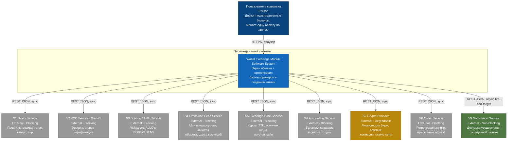

**Легенда критичности:** серые — `Blocking` (отказ → заявка не создаётся, `503`),
жёлтая — `Degradable` (отказ → работаем на кеше, `degraded: true`),
зелёная — `Non-blocking` (отказ → заявка создана, доставка уходит в ретрай).

> **Замечание по BRD §10.** BRD перечисляет `Wallet Service`, `Exchange Rate Service`,
> `Exchange Service`, `Order Service`. Согласно §3 канона: `Wallet Service` = S6 `Accounting Service`,
> `Exchange Rate Service` = S5, `Order Service` = S8, а **`Exchange Service` — это не внешняя система,
> а наш внутренний `Exchange Orchestrator`** (§7). Поэтому на диаграмме контекста его нет — он внутри
> периметра.

---

## 5. C4 Level 2 — Container Diagram

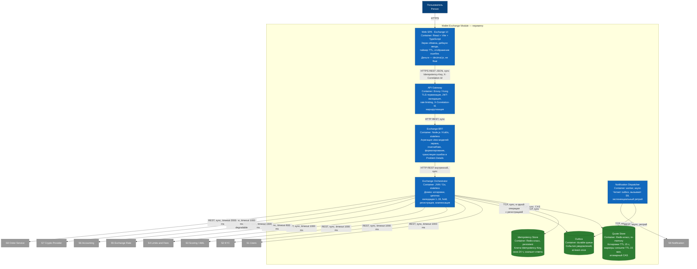

### 5.1 Синхронность и протоколы

| Связь | Протокол | Синхронность | Таймаут | Примечание |
|-------|----------|--------------|---------|------------|
| SPA → Gateway | HTTPS/1.1, JSON | sync | 10 с клиентский | `Idempotency-Key`, `X-Correlation-Id` |
| Gateway → BFF | HTTP, JSON | sync | 5 с | Gateway не знает домена |
| BFF → Orchestrator | HTTP, JSON | sync | 3 с | Внутренняя сеть, mTLS |
| Orchestrator → Quote Store | TCP, бинарный | sync | 50 мс | Атомарный `consume` |
| Orchestrator → Idempotency Store | TCP, бинарный | sync | 50 мс | Атомарный `claim` |
| Orchestrator → Outbox | TCP | sync (запись) | 100 мс | Запись в одном шаге с фиксацией заявки |
| Dispatcher → Outbox → S9 | TCP / REST | **async** | — | Fire-and-forget, ретраи |
| Orchestrator → S1..S8 | REST/JSON | sync | §11 канона | По одному ACL-адаптеру на систему |

### 5.2 Замечание по `Order Service`

`Order Service` (S8) в §3 канона классифицирован как **внешняя система**. В диаграмме контейнеров
он показан **за периметром**: наш деплоймент-юнит, отвечающий за общение с ним, — компонент
`OrderRegistrar` + адаптер `S8Adapter` внутри Orchestrator. Мы не владеем ни хранилищем заявок,
ни жизненным циклом после `PENDING`. Разрешение противоречия зафиксировано в §22 (ASSUMPTION-08).

---

## 6. C4 Level 3 — Component Diagram: Exchange Orchestrator

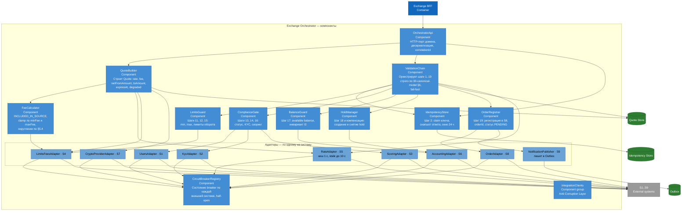

**Правило зависимостей:** стрелки идут только сверху вниз. `ValidationChain` не знает про HTTP,
адаптеры не знают про домен, доменные компоненты (`FeeCalculator`, `QuoteBuilder`) не знают про сеть
и получают данные через порты. Это условие делает выделение `QuoteBuilder` в отдельный сервис
дешёвым, если ADR-13 когда-нибудь будет пересмотрен.

---

## 7. Ответственность компонентов и внешних систем

### 7.1 Наши контейнеры

| Контейнер | Зона ответственности | Чего **НЕ** делает |
|-----------|----------------------|--------------------|
| **Web SPA (Exchange UI)** | Отрисовка экрана; дебаунс ввода 300 мс; таймер обратного отсчёта TTL; клиентская предвалидация шагов 1, 4, 11, 12, 17 для скорости отклика; генерация и **сохранение** `Idempotency-Key` до получения финального ответа; отображение баннеров и inline-ошибок; ветвление **только** по полю `code` | Не считает комиссию и `toAmount` как источник истины — только повторяет серверный расчёт для отображения. Не хранит и не отображает `float`-деньги. Не решает, можно ли создать заявку. Не ходит ни в одну систему, кроме BFF. Не ретраит `POST /v1/exchange-orders` без того же `Idempotency-Key`. Не ветвится по `title`/`detail`/HTTP-статусу вместо `code` |
| **API Gateway** | TLS-терминация; валидация `Bearer` JWT и проброс `X-User-Id`; rate limiting и заголовки `X-RateLimit-*`; генерация `X-Correlation-Id` при отсутствии; маршрутизация; WAF | Не содержит бизнес-логики и не знает про котировки, комиссии и статусы заявок. Не агрегирует ответы. Не транслирует доменные ошибки — пропускает Problem Details как есть. Не хранит состояние сессии |
| **Exchange BFF** | Агрегация view-модели экрана из нескольких доменных вызовов; вычисление `inverseRate` (только для отображения, §5.2 канона); нормализация форматов и локализация; проброс `correlationId`; трансляция доменных ошибок в RFC 9457 Problem Details; сборка `degraded`-флага в ответ | **Не выполняет ни одной из проверок 1..19.** Не строит котировку и не считает комиссию. Не создаёт и не снимает hold. Не ходит в S1..S9 напрямую. Не хранит состояние между запросами. Не изобретает коды ошибок вне §7 канона |
| **Exchange Orchestrator** | Весь домен: построение котировки, цепочка валидации 1..19 в нормативном порядке, расчёт комиссии, hold, регистрация заявки, компенсация, идемпотентность, circuit breaking, публикация события уведомления | Не рендерит и не локализует. Не считает `inverseRate`. Не исполняет заявку и не двигает её дальше `PENDING`. Не хранит балансы, лимиты, KYC-данные и историю заявок. Не решает, что показать пользователю — отдаёт `code` и `params` |
| **Quote Store** | Хранение активных котировок с TTL 15 с; атомарная операция `consume(quoteId)`; маркеры потребления с TTL 15 мин для корректного `QUOTE_ALREADY_USED` после истечения самой котировки | Не является системой учёта. Не хранит заявки. Не переживает полную потерю — восстановление не требуется, котировки пересоздаются. Не источник курса — только слепок |
| **Idempotency Store** | Атомарный `claim` ключа; хранение отпечатка тела запроса и снапшота успешного ответа; окно 24 ч | Не дедуплицирует по содержимому без ключа. Не заменяет однократность `quoteId`. Не хранит PII — только хеши и минимальный снапшот ответа |
| **Outbox + Notification Dispatcher** | Долговечная запись события «заявка создана»; доставка в S9 с экспоненциальным ретраем и DLQ | Не блокирует ответ пользователю. Не гарантирует exactly-once — семантика at-least-once, дедупликация на стороне S9 по `orderId`. Не решает, какой канал использовать — это ответственность S9 |

### 7.2 Компоненты Exchange Orchestrator

| Компонент | Зона ответственности | Чего **НЕ** делает |
|-----------|----------------------|--------------------|
| **OrchestratorApi** | Приём внутренних HTTP-вызовов от BFF; десериализация; извлечение `correlationId` и `Idempotency-Key`; шаг 1 (схема запроса, формат сумм по regex §5.1) | Не выполняет бизнес-проверок 3..19. Не обращается к внешним системам |
| **QuoteBuilder** | Сбор входов для котировки: курс от `RateAdapter`, схема комиссий от `LimitsFeesAdapter`, статус сети от `CryptoProviderAdapter`; вызов `FeeCalculator`; расчёт `netFromAmount`, `toAmount`, `expiresAt = quotedAt + 15s`; проставление `degraded`; запись в Quote Store | Не проверяет баланс, KYC, лимиты и скоринг — котировка строится и для заведомо отказного запроса, потому что пользователю нужно видеть курс до подтверждения. Не резервирует средства. Не создаёт заявку |
| **ValidationChain** | Исполнение шагов **1..19 строго в порядке §6 канона**, fail-fast, с остановкой на первом провале; выбор кода ошибки из §7; сбор `params` для сообщения; передача управления `HoldManager` и `OrderRegistrar` | Не меняет порядок проверок «для оптимизации» — порядок нормативен и задаёт детерминированную ошибку. Не выполняет проверки параллельно там, где порядок значим (13→14→15→16→17). Не пропускает проверки на основании клиентской предвалидации |
| **FeeCalculator** | Реализация `INCLUDED_IN_SOURCE` по §5.3: `feeRaw = fromAmount × percent / 100`, `clamp(minFee, maxFee)`, `ROUND_UP` до `decimals(fromAsset)`; расчёт `toAmount` с `ROUND_DOWN` до `decimals(toAsset)`; проверка инвариантов I1, I2, I4, I5 | Не запрашивает схему комиссий сам — получает `FeePolicy` на вход. Не применяет banker's rounding. Не работает с `networkFee ≠ 0` — для внутреннего обмена он всегда `"0"` (§5.5) |
| **LimitsGuard** | Шаги 11 и 12 (`AMOUNT_BELOW_MINIMUM` / `AMOUNT_ABOVE_MAXIMUM`) и шаг 15 (лимиты оборота день/месяц) на данных S4 | Не проверяет баланс — это `BalanceGuard`. Не считает комиссию. Не кеширует лимиты оборота (кешируется только схема комиссий и min/max, но не потреблённый объём) |
| **ComplianceGate** | Шаги 13 (`USER_BLOCKED` / `WALLET_FROZEN`), 14 (`KYC_*`), 16 (`SCORING_DENIED` / `SCORING_REVIEW_REQUIRED`); реализация принципа Compliance-First | Не хранит и не логирует KYC-данные и содержимое риск-профиля — только решение и код. Не кеширует KYC дольше 30 с и **не отдаёт stale KYC** при недоступности S2 (§11 канона). Не принимает решение о ручной проверке — только транслирует решение S3 |
| **BalanceGuard** | Шаг 17: получение свежего баланса от S6 и проверка `fromAmount ≤ available` (инвариант I3) | Не кеширует балансы — никогда. Не создаёт hold. Не выполняется до прохождения комплаенса (ADR-09) |
| **HoldManager** | Шаг 18: создание hold в S6 с ключом идемпотентности, привязанным к `orderIntentId`; получение `holdId`; **компенсирующее снятие hold** при провале шага 19 (§12); публикация метрики компенсаций | Не решает, достаточно ли средств — это `BalanceGuard`. Не ретраит создание hold автоматически (неидемпотентная финансовая операция без ключа). Не списывает средства — hold ≠ списание |
| **OrderRegistrar** | Шаг 19: регистрация заявки в S8 с `Idempotency-Key`; получение `orderId` (`"ord_" + ULID`) и `estimatedCompletionAt`; фиксация статуса `PENDING`; запись события в Outbox через `NotificationPublisher` | Не генерирует `orderId` сам — источник истины S8. Не двигает заявку дальше `PENDING`. Не откатывает hold самостоятельно — сообщает `ValidationChain`, откатывает `HoldManager` |
| **IntegrationClients** (адаптеры S1..S9) | Anti-Corruption Layer: HTTP-клиент, таймаут по §11, маппинг внешней модели в доменную, нормализация чисел в decimal-строки, трансляция ошибок upstream в коды §7, регистрация метрик и участие в circuit breaker | Не содержат бизнес-логики и не принимают решений «можно/нельзя». Не ретраят неидемпотентные `POST`. Не пропускают внешние DTO в домен |
| **CircuitBreakerRegistry** | Состояние breaker **на каждую внешнюю систему отдельно**: closed / open / half-open, порог 50 % на окне 20 запросов, open 30 с; экспорт состояния в метрики | Не общий на все интеграции. Не подменяет таймауты. Не решает, чем заменить ответ при open — стратегию деградации выбирает адаптер/компонент |
| **IdempotencyStore** (компонент) | Шаг 2: атомарный `claim(Idempotency-Key)`; сравнение отпечатка тела; возврат сохранённого ответа при точном совпадении; `IDEMPOTENCY_CONFLICT` при расхождении | Не дедуплицирует `GET`. Не хранит ответ дольше 24 ч. Не заменяет `QUOTE_ALREADY_USED` |

### 7.3 Внешние системы

| Система | Что мы от неё получаем | На что **НЕ** полагаемся / чего она НЕ делает за нас |
|---------|------------------------|-------------------------------------------------------|
| **S1 Users Service** | Профиль, резидентство, `tier`, `status`, идентификаторы кошельков | Не проверяет KYC и лимиты. Не источник баланса. Мы не кешируем `status` дольше 30 с — блокировка пользователя должна применяться быстро |
| **S2 KYC Service (WebID)** | Уровень и статус верификации, `validUntil`, разрешённые операции | Не хранит и не отдаёт нам документы и биометрию — и не должен: мы их не принимаем и не храним (§20). Не решает лимиты. Stale-значение не используется **никогда** |
| **S3 Scoring / AML** | `riskScore`, решение `ALLOW` / `REVIEW` / `DENY`, причины | Не блокирует пользователя сам — исполнение решения на нас. Причины отказа не показываются пользователю (только `Operation declined. Contact support.`) |
| **S4 Limits & Fees** | Min/max по паре, остатки лимитов оборота, схема комиссий, список поддерживаемых пар | Не считает комиссию за нас — отдаёт `FeePolicy`, расчёт наш (`FeeCalculator`). Остаток лимита **не кешируется** — иначе два параллельных обмена пробьют лимит |
| **S5 Exchange Rate Service** | Курсы, TTL, `rateSource`, признак stale | Не фиксирует котировку — фиксация наша (Quote Store). Не знает про нашу комиссию. Курс **не округляем** (§5.4) |
| **S6 Accounting Service** | Балансы `total`/`held`/`available`, создание и снятие hold | Не выполняет обмен и не двигает средства между балансами в рамках нашего скоупа. Hold ≠ списание. Мы не пересчитываем `available` сами — берём как есть |
| **S7 Crypto Provider** | Данные ордеров/ликвидности, сетевые комиссии, статус сети | **Degradable**: при отказе используем кеш/дефолты и ставим `degraded: true`. Не источник курса на пути котировки — курс от S5. Не блокирует создание заявки |
| **S8 Order Service** | Регистрация заявки, `orderId`, статус | Не выполняет наши бизнес-проверки — они выполнены до вызова. Не создаёт hold. Не владеет котировкой |
| **S9 Notification Service** | Подтверждение доставки уведомления | **Non-blocking**: не влияет на успех создания заявки. Не источник истины о статусе заявки. Дедупликация уведомлений — на её стороне |

---

## 8. Sequence Diagram 1 — открытие экрана обмена

Цель: минимальное время до первого осмысленного кадра. Все независимые вызовы идут параллельно;
котировка строится последней, потому что зависит от активов и схемы комиссий.

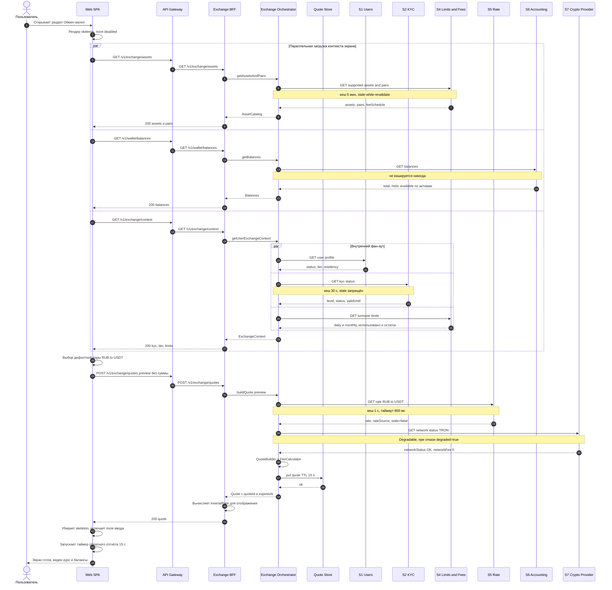

**Замечания для реализации.**
- Три верхних запроса независимы — SPA отправляет их одновременно, экран собирается по мере
  прихода ответов, а не по последнему. Балансы и активы приходят раньше и позволяют показать
  форму до готовности котировки.
- Первичная котировка строится **без суммы** — она нужна, чтобы показать курс и запустить таймер.
  Заявку по ней создать нельзя: шаг 9 (`QUOTE_MISMATCH`) отсечёт запрос с суммой, не совпадающей
  с котировкой.
- Отказ S7 не блокирует экран: котировка помечается `degraded: true`.
- Отказ S2 блокирует: экран показывает баннер `Rates are temporarily unavailable` только для S5;
  для S2 — соответствующий `KYC_*` или `EXCHANGE_SERVICE_UNAVAILABLE`, а кнопка `Exchange` disabled.

---

## 9. Sequence Diagram 2 — построение котировки при вводе суммы

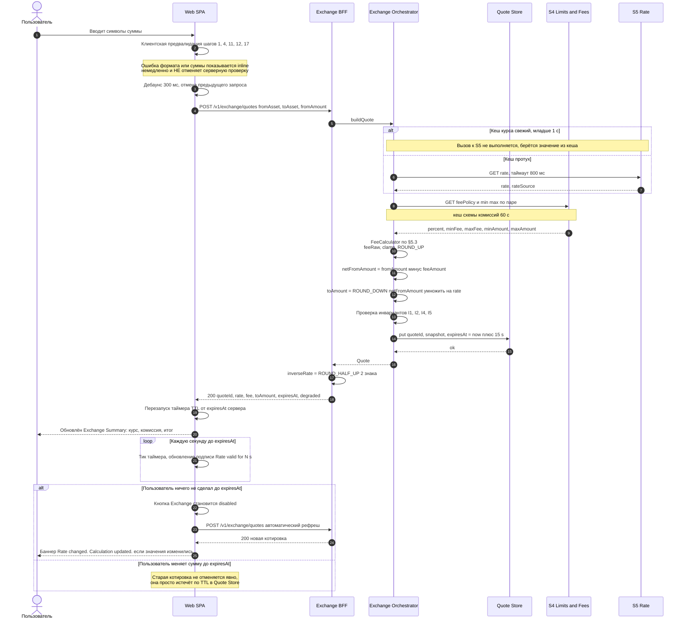

**Замечания.**
- Дебаунс 300 мс (§11 канона) и отмена in-flight запроса обязательны: без отмены поздний ответ
  на старый ввод перезапишет свежий расчёт — классическая гонка.
- Таймер обратного отсчёта считается **от серверного `expiresAt`**, а не от локального
  `now + 15s`. Иначе расхождение часов клиента даёт таймер, который «доходит до нуля» после того,
  как котировка уже мертва, или наоборот (FM-13).
- Неиспользованные котировки не удаляются явно — они истекают по TTL. Это осознанный отказ
  от явного `DELETE`: экономит round-trip и не создаёт нового кода ошибки.

---

## 10. Sequence Diagram 3 — happy path создания заявки

`POST /v1/exchange-orders` с полной цепочкой проверок 1..19 (§6 канона).

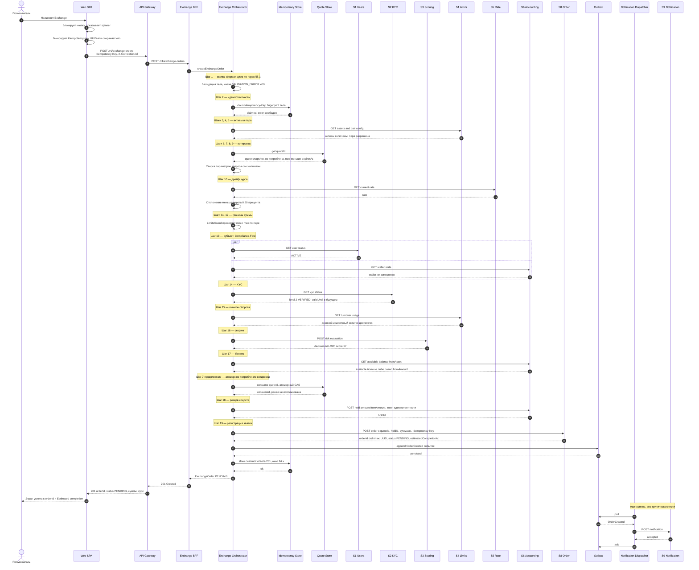

**Замечания для реализации.**
- Порядок шагов **нормативен**. Параллелить разрешено только внутри одного шага (S1 и S6 на шаге 13)
  и там, где порядок не влияет на выбор кода ошибки. Параллелить шаги 14 и 15 запрещено: это ломает
  детерминированность и принцип Compliance-First.
- `consume(quoteId)` выполняется **непосредственно перед hold**, а не на шаге 7. Проверка на шаге 7
  («не использована») — это чтение; потребление — атомарная запись перед точкой невозврата.
  Это закрывает гонку двух параллельных submit по одной котировке (FM-14).
- `Idempotency-Key` пробрасывается и в S6 (hold), и в S8 (order) — производными детерминированными
  ключами, чтобы повтор нашего собственного запроса не создал второй hold и вторую заявку.
- Ответ пользователю не ждёт S9. Пользователь видит `orderId` до того, как уведомление отправлено.

---

## 11. Sequence Diagram 4 — курс истёк или изменился

Два близких, но разных исхода: `QUOTE_EXPIRED` (истёк TTL) и `RATE_CHANGED` (TTL жив, но курс
уехал больше порога 0.20 %). Оба требуют повторного подтверждения пользователем.

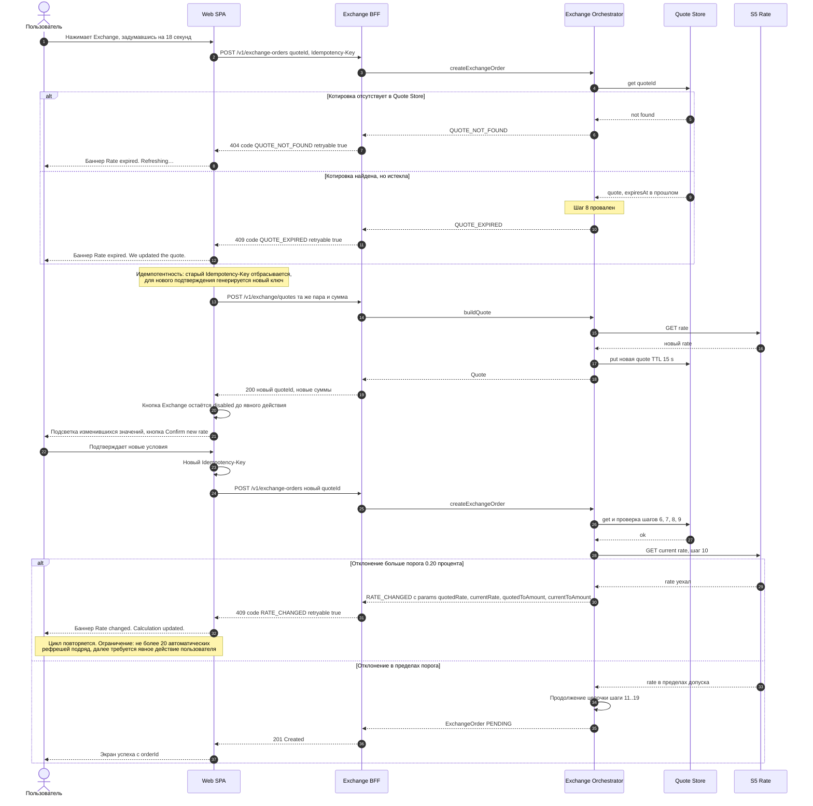

**Замечания.**
- `QUOTE_EXPIRED` и `RATE_CHANGED` — разные шаги (8 и 10) и разные причины. Не объединять:
  первое означает «вы думали слишком долго», второе — «рынок ушёл, пока запрос был в пути».
  Пользователю показываются разные сообщения (§7 канона).
- **Новый `Idempotency-Key` на каждое новое подтверждение обязателен.** Повтор со старым ключом,
  но новым `quoteId`, даст `409 IDEMPOTENCY_CONFLICT` — тело изменилось.
- Ограничение на 20 автоматических рефрешей подряд защищает от бесконечного цикла на волатильном
  рынке и от того, что пользователь останется в петле «курс снова изменился».

---

## 12. Sequence Diagram 5 — деградация: Rate Service недоступен

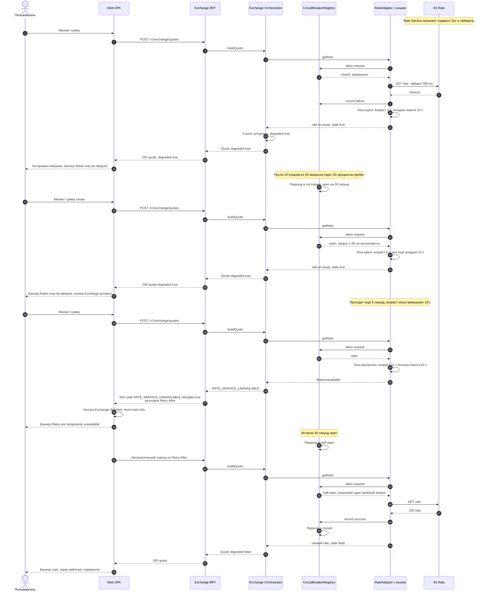

**Правила деградации (нормативно по §11 канона).**

| Возраст кеша курса | Поведение | Что видит пользователь |
|--------------------|-----------|------------------------|
| ≤ 1 с | Нормальная работа | Обычный экран |
| 1–10 с при недоступном S5 | Котировка строится, `degraded: true` | Баннер о возможной задержке, обмен разрешён |
| > 10 с при недоступном S5 | `503 RATE_SERVICE_UNAVAILABLE` | Баннер `Rates are temporarily unavailable`, кнопка disabled |

Заявка по `degraded`-котировке создаётся — это осознанное принятие ценового риска в окне до 10 с
(ADR-06). Флаг `degraded` сохраняется в аудите заявки, чтобы риск-подразделение могло выделить
такие сделки постфактум.

---

## 13. Sequence Diagram 6 — компенсация: hold создан, заявка не зарегистрирована

Единственная точка в скоупе, где нужна распределённая компенсация. Между S6 (hold) и S8 (order)
нет общей транзакции — реализуется **saga с компенсирующей операцией**.

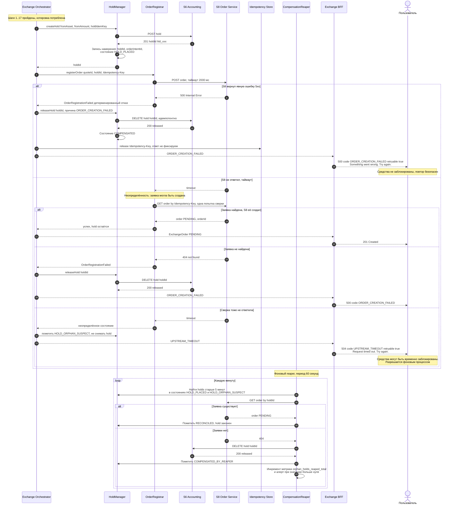

**Свойства компенсации.**

| Свойство | Как обеспечено |
|----------|----------------|
| Идемпотентность компенсации | `DELETE hold {holdId}` идемпотентен на стороне S6: повторное снятие уже снятого hold возвращает `200`, а не ошибку |
| Отсутствие «висящих» hold | Двухуровневая защита: немедленная компенсация в потоке запроса + фоновый `CompensationReaper` с окном 5 минут |
| Отсутствие двойного hold | `holdIdemKey` детерминированно выводится из `Idempotency-Key` запроса: повтор нашего собственного вызова возвращает тот же `holdId` |
| Отсутствие заявки без обеспечения | Регистрация в S8 идёт **после** успешного hold, `holdId` передаётся в тело заявки |
| Ретрай пользователем безопасен | При детерминированном отказе `Idempotency-Key` освобождается, hold снят — повтор создаёт чистую попытку. При неопределённости ключ **не** освобождается, повтор вернёт тот же результат |
| Наблюдаемость | Метрики `compensation_triggered_total`, `orphan_holds_reaped_total`, `hold_release_failed_total`. Последние две — алерт при любом ненулевом значении |

**Чего мы сознательно НЕ делаем:** не пытаемся реализовать two-phase commit между S6 и S8.
Цена 2PC — блокирующий координатор на критическом пути финансовой операции и требование к обеим
внешним системам поддерживать prepare/commit, которого у них нет. Saga с компенсацией слабее
по гарантиям (существует окно, в котором hold есть, а заявки нет), но это окно ограничено
5 минутами и наблюдаемо.

---

## 14. Основные REST API

Сводка. **Детальные схемы, примеры и JSON Schema живут в `docs/api/exchange-orders.openapi.yaml`** —
здесь только контур для понимания архитектуры.

| Метод и путь | Назначение | Идемпотентность | Таймаут (клиент / сервер) | Успех | Ошибки (`code`) |
|--------------|------------|-----------------|---------------------------|-------|-----------------|
| `GET /v1/wallet/balances` | Балансы пользователя: `total`, `held`, `available` по каждому активу и сети | Идемпотентен по природе `GET`. Ретрай разрешён: 2 попытки, backoff + jitter | 5 с / 1 500 мс | `200` | `EXCHANGE_SERVICE_UNAVAILABLE`, `UPSTREAM_TIMEOUT`, `RATE_LIMITED` |
| `GET /v1/exchange/assets` | Каталог активов: `assetId`, `type`, `network`, `decimals`, `symbol`, `displayName`, признак включённости | Идемпотентен. Кеш 5 мин, stale-while-revalidate | 5 с / 1 000 мс | `200` | `EXCHANGE_SERVICE_UNAVAILABLE`, `UPSTREAM_TIMEOUT` |
| `GET /v1/exchange/pairs` | Разрешённые направленные пары с `minAmount`, `maxAmount`, `FeePolicy` | Идемпотентен. Кеш 5 мин (пары) и 60 с (комиссии) | 5 с / 1 000 мс | `200` | `EXCHANGE_SERVICE_UNAVAILABLE`, `UPSTREAM_TIMEOUT` |
| `POST /v1/exchange/quotes` | Построение котировки: `quoteId`, `rate`, `feeAmount`, `netFromAmount`, `toAmount`, `expiresAt`, `degraded`. Бюджет p95 ≤ 300 мс | **Не идемпотентен** — каждый вызов создаёт новую котировку. `Idempotency-Key` не требуется: побочный эффект дешёвый и самоистекающий | 5 с / 800 мс на S5 | `200` | `VALIDATION_ERROR`, `ASSET_NOT_SUPPORTED`, `SAME_ASSET_PAIR`, `PAIR_NOT_SUPPORTED`, `AMOUNT_BELOW_MINIMUM`, `AMOUNT_ABOVE_MAXIMUM`, `RATE_SERVICE_UNAVAILABLE`, `UPSTREAM_TIMEOUT`, `RATE_LIMITED` |
| `GET /v1/exchange/quotes/{quoteId}` | Чтение действующей котировки: восстановление состояния после перезагрузки страницы, сверка TTL | Идемпотентен, **без побочных эффектов** — чтение не потребляет котировку | 5 с / 200 мс | `200` | `QUOTE_NOT_FOUND`, `QUOTE_EXPIRED` |
| `POST /v1/exchange-orders` | **Создание заявки.** Полная цепочка 1..19, hold, регистрация. Бюджет p95 ≤ 900 мс, p99 ≤ 2 000 мс | **Обязателен `Idempotency-Key`** (UUIDv4), окно 24 ч. Повтор с тем же телом → тот же `201`; с другим телом → `409 IDEMPOTENCY_CONFLICT` | 10 с / 3 000 мс | `201`, а также `202` при `SCORING_REVIEW_REQUIRED` → `MANUAL_REVIEW` | Весь каталог §7: `VALIDATION_ERROR`, `IDEMPOTENCY_CONFLICT`, `ASSET_NOT_SUPPORTED`, `SAME_ASSET_PAIR`, `PAIR_NOT_SUPPORTED`, `QUOTE_NOT_FOUND`, `QUOTE_ALREADY_USED`, `QUOTE_EXPIRED`, `QUOTE_MISMATCH`, `RATE_CHANGED`, `AMOUNT_BELOW_MINIMUM`, `AMOUNT_ABOVE_MAXIMUM`, `WALLET_FROZEN`, `USER_BLOCKED`, `KYC_*`, `LIMIT_EXCEEDED_DAILY`, `LIMIT_EXCEEDED_MONTHLY`, `SCORING_DENIED`, `INSUFFICIENT_FUNDS`, `HOLD_FAILED`, `ORDER_CREATION_FAILED`, `EXCHANGE_SERVICE_UNAVAILABLE`, `UPSTREAM_TIMEOUT`, `RATE_LIMITED` |
| `GET /v1/exchange-orders/{orderId}` | Чтение заявки: статус, суммы, курс, `holdId`, `estimatedCompletionAt`. Используется экраном успеха и при восстановлении после потери ответа | Идемпотентен. Ретрай разрешён | 5 с / 1 000 мс | `200` | `VALIDATION_ERROR`, `EXCHANGE_SERVICE_UNAVAILABLE`, `UPSTREAM_TIMEOUT` |

### 14.1 Общие соглашения (§9 канона)

- Базовый путь `/v1`; ломающее изменение → новый major в пути.
- `Content-Type: application/json; charset=utf-8`; ошибки — `application/problem+json`.
- `X-Correlation-Id` принимается от клиента, генерируется при отсутствии, возвращается **в каждом**
  ответе и в каждой ошибке.
- Время — ISO-8601 UTC с миллисекундами и суффиксом `Z`.
- Деньги — всегда строки, regex `^(0|[1-9]\d{0,18})(\.\d{1,18})?$`.
- Rate limiting: `X-RateLimit-Limit` / `-Remaining` / `-Reset`, превышение → `429 RATE_LIMITED`.
- Аутентификация: `Bearer` JWT + `X-User-Id` от gateway (в прототипе не используется, §21).

### 14.2 Замечание о наименовании

Канон §11 называет операцию котировки `POST /exchange-quotes` (в контексте бюджета latency),
а в §12 и в структуре API используется `POST /v1/exchange/quotes`. Это **одна и та же операция**.
В SDD и в OpenAPI принят путь `POST /v1/exchange/quotes`: он группирует все под-ресурсы экрана
обмена (`assets`, `pairs`, `quotes`) под общим префиксом `/v1/exchange/`, тогда как
`/v1/exchange-orders` — самостоятельный ресурс верхнего уровня, потому что заявка живёт дольше
экрана и адресуется извне. Расхождение зафиксировано как ASSUMPTION-09.

---

## 15. Жизненный цикл заявки

Строго по §8 канона.

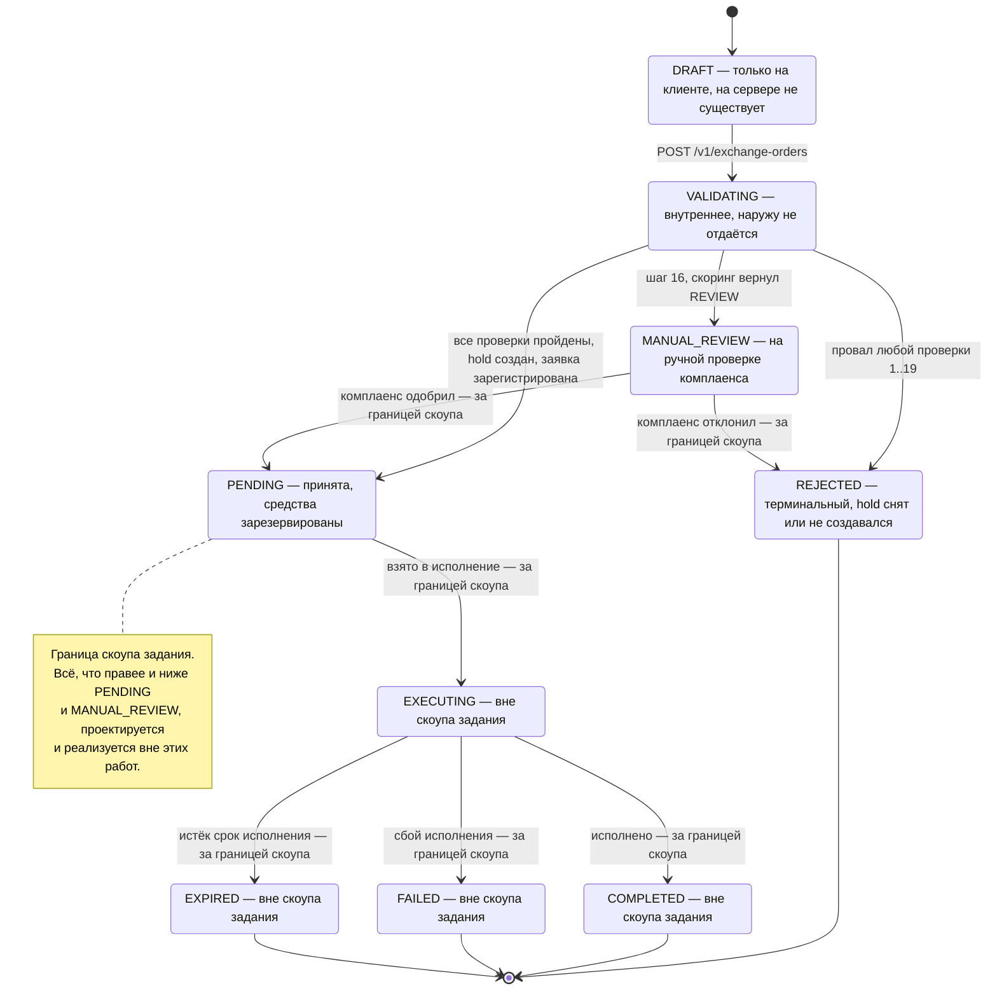

### 15.1 Таблица переходов

| Из | В | Триггер | Кто инициирует | Состояние средств после перехода | В скоупе |
|----|---|---------|----------------|----------------------------------|----------|
| `—` | `DRAFT` | Пользователь открыл экран и ввёл сумму | Web SPA | не тронуты | да |
| `DRAFT` | `VALIDATING` | `POST /v1/exchange-orders` принят сервером | Orchestrator | не тронуты | да |
| `VALIDATING` | `REJECTED` | Провал любого из шагов 1..17 | ValidationChain | не тронуты | да |
| `VALIDATING` | `REJECTED` | Провал шага 18 (`HOLD_FAILED`) | HoldManager | не тронуты, hold не создан | да |
| `VALIDATING` | `REJECTED` | Провал шага 19 (`ORDER_CREATION_FAILED`) | OrderRegistrar → компенсация | hold создан и **снят** компенсацией (§13) | да |
| `VALIDATING` | `MANUAL_REVIEW` | Шаг 16: скоринг вернул `REVIEW` → `202` | ComplianceGate | **зарезервированы** | да |
| `VALIDATING` | `PENDING` | Шаги 1..19 пройдены, `orderId` получен | OrderRegistrar | **зарезервированы** | да |
| `PENDING` | `EXECUTING` | Заявка взята в исполнение | Execution engine | зарезервированы | нет |
| `MANUAL_REVIEW` | `PENDING` | Решение комплаенс-офицера — одобрено | Compliance | зарезервированы | нет |
| `MANUAL_REVIEW` | `REJECTED` | Решение комплаенс-офицера — отклонено | Compliance | hold снят | нет |
| `EXECUTING` | `COMPLETED` | Обмен исполнен | Execution engine | списаны и зачислены | нет |
| `EXECUTING` | `FAILED` | Сбой исполнения | Execution engine | hold снят | нет |
| `EXECUTING` | `EXPIRED` | Истёк срок исполнения | Scheduler | hold снят | нет |

**Важно:** `VALIDATING` — внутреннее состояние, оно **никогда** не появляется в ответе API.
Пользователь либо получает `201 PENDING`, либо `202 MANUAL_REVIEW`, либо ошибку из §7.
`REJECTED` в рамках нашего скоупа тоже не материализуется в S8 как запись заявки — отказ
возвращается синхронно как ошибка, а не как заявка в статусе `REJECTED`. Это следствие ADR-05:
мы не создаём заявку, пока не уверены, что она пройдёт (ASSUMPTION-04).

---

## 16. Основные бизнес-проверки

Воспроизведение §6 канона с добавлением источника данных, кеширования и поведения при
недоступности источника. **Порядок нормативен, fail-fast.**

| Шаг | Проверка | Источник | Кеш | Поведение при недоступности источника | Код при провале |
|-----|----------|----------|-----|----------------------------------------|-----------------|
| 1 | Схема запроса, формат сумм, обязательные поля | локально | — | н/д | `VALIDATION_ERROR` (400) |
| 2 | Идемпотентность: ключ не переиспользован с другим телом | Idempotency Store | сам является хранилищем, окно 24 ч | **Отказ обслуживания**: без гарантии идемпотентности `POST` выполнять нельзя → `503 EXCHANGE_SERVICE_UNAVAILABLE` | `IDEMPOTENCY_CONFLICT` (409) |
| 3 | Активы существуют и включены | S4 / конфиг | 5 мин, stale-while-revalidate | Работаем на stale-каталоге: список активов меняется редко, риск низкий | `ASSET_NOT_SUPPORTED` (422) |
| 4 | `fromAsset ≠ toAsset` с учётом `network` | локально | — | н/д | `SAME_ASSET_PAIR` (422) |
| 5 | Пара разрешена к обмену | S4 | 5 мин, stale-while-revalidate | Работаем на stale. Риск: пара, отключённая минуту назад, ещё доступна — принимается | `PAIR_NOT_SUPPORTED` (422) |
| 6 | Котировка существует | Quote Store | сам является хранилищем, TTL 15 с | Отказ Quote Store → `503 EXCHANGE_SERVICE_UNAVAILABLE`. Нельзя допустить создание заявки без верифицированной котировки | `QUOTE_NOT_FOUND` (404) |
| 7 | Котировка не использована | Quote Store, атомарный CAS | маркеры consume TTL 15 мин | Отказ → `503`. Fail-closed: без атомарного CAS возможен двойной обмен | `QUOTE_ALREADY_USED` (409) |
| 8 | Котировка не истекла, `now < expiresAt` | Quote Store + серверные часы | — | Отказ NTP/расхождение часов → см. FM-13; при подозрении на рассинхрон fail-closed | `QUOTE_EXPIRED` (409) |
| 9 | Параметры запроса совпадают со снапшотом котировки | локально | — | н/д | `QUOTE_MISMATCH` (409) |
| 10 | Курс не уехал за порог 0.20 % | S5 | 1 с; stale до 10 с с `degraded: true` | При stale-курсе проверка дрейфа выполняется **против stale-значения**; если кеш старше 10 с — `503 RATE_SERVICE_UNAVAILABLE` | `RATE_CHANGED` (409) |
| 11 | `fromAmount ≥ minAmount(pair)` | S4 | 60 с (схема) | Работаем на stale-схеме; при полном отсутствии данных — `503` (создать заявку без известного минимума нельзя) | `AMOUNT_BELOW_MINIMUM` (422) |
| 12 | `fromAmount ≤ maxAmount(pair)` | S4 | 60 с (схема) | Аналогично шагу 11 | `AMOUNT_ABOVE_MAXIMUM` (422) |
| 13 | Пользователь активен, кошелёк не заморожен | S1, S6 | 30 с (`status`), баланс/кошелёк — без кеша | **Fail-closed**: `503 EXCHANGE_SERVICE_UNAVAILABLE`. Разрешать обмен заблокированному пользователю недопустимо | `WALLET_FROZEN` / `USER_BLOCKED` (403) |
| 14 | KYC-уровень достаточен и не истёк | S2 | 30 с, **stale запрещён** | **Fail-closed**: `503`. Канон §11 явно: KYC-статус не отдаётся из устаревшего кеша | `KYC_REQUIRED` / `KYC_LEVEL_INSUFFICIENT` / `KYC_PENDING` / `KYC_EXPIRED` (403) |
| 15 | Лимиты оборота день/месяц не превышены | S4 | **не кешируется** (потреблённый объём) | **Fail-closed**: `503`. Кеширование остатка лимита позволило бы двум параллельным обменам пробить лимит | `LIMIT_EXCEEDED_DAILY` / `LIMIT_EXCEEDED_MONTHLY` (422) |
| 16 | Скоринг разрешает операцию | S3 | **не кешируется** (решение по конкретной операции) | **Fail-closed**: `503`. Проведение операции без AML-решения — регуляторный риск | `SCORING_DENIED` (403) / `SCORING_REVIEW_REQUIRED` (202) |
| 17 | Достаточно доступного баланса, `fromAmount ≤ available` | S6 | **никогда не кешируется** | **Fail-closed**: `503`. Устаревший баланс → овердрафт | `INSUFFICIENT_FUNDS` (422) |
| 18 | Резерв (hold) успешно создан | S6 | — | **Fail-closed**, ретрай запрещён без ключа идемпотентности → `409 HOLD_FAILED`, retryable пользователем | `HOLD_FAILED` (409) |
| 19 | Заявка зарегистрирована | S8 | — | **Fail-closed** + компенсация hold (§13). При таймауте — сверка по `Idempotency-Key`, затем компенсация или reaper | `ORDER_CREATION_FAILED` (500) |

### 16.1 Клиентская предвалидация

Шаги **1, 4, 11, 12, 17** дублируются на клиенте inline и немедленно — ради скорости отклика
и снижения отказных запросов. Три правила, нарушение которых считается дефектом:

1. Клиентская предвалидация **не заменяет** серверную — сервер всегда прогоняет всю цепочку заново.
2. Клиент не выводит собственных кодов ошибок — использует те же значения `code` из §7.
3. Клиент **не** предвалидирует шаги 13–16 (комплаенс): он не должен знать причину отказа
   до того, как её вернёт сервер, иначе Compliance-First (ADR-09) обходится через DevTools.

### 16.2 Почему проверки 13–17 идут именно в этом порядке

Compliance-First: неверифицированный или заблокированный субъект не должен различать
`INSUFFICIENT_FUNDS`, `LIMIT_EXCEEDED_DAILY` и успех по коду ответа — иначе перебором сумм
восстанавливается баланс и остаток лимита чужого аккаунта. Цена: пользователь с незавершённым
KYC и нехваткой средств увидит сначала сообщение про KYC. Это приемлемо: KYC блокирует его
в любом случае.

---

## 17. Точки отказа (failure modes)

Вероятность оценена для внутренней инфраструктуры при 99.9 % SLA каждой внешней системы.
«Что видит пользователь» — тексты из §7 канона.

| ID | Точка отказа | Вероятн. | Влияние | Детект | Смягчение | Что видит пользователь |
|----|--------------|----------|---------|--------|-----------|------------------------|
| **FM-01** | **S1 Users Service** недоступен | низкая | Шаг 13 не выполняется, заявка не создаётся; экран открывается частично | HTTP 5xx/timeout на `UsersAdapter`, breaker open, метрика `upstream_errors_total{system="S1"}` | Кеш `status` 30 с покрывает короткие сбои; fail-closed за пределами кеша; breaker обрывает ожидание | `Exchange is temporarily unavailable` (503), кнопка disabled |
| **FM-02** | **S2 KYC Service** недоступен | низкая | Шаг 14 не выполняется; **stale запрещён** — обмен блокируется сразу после истечения кеша 30 с | Timeout/5xx на `KycAdapter`, breaker open | Только кеш 30 с. Осознанно **нет** деградации: пропустить неверифицированного пользователя дороже, чем отказать верифицированному | `Exchange is temporarily unavailable` (503) |
| **FM-03** | **S3 Scoring / AML** недоступен | средняя (внешний вендор, тяжёлые вычисления) | Шаг 16 не выполняется, обмен блокируется полностью | Timeout 1 000 мс, breaker | Fail-closed. Обсуждается fallback-политика «низкорисковые суммы ниже порога проходят с пометкой для post-factum review» — требует решения комплаенса (ASSUMPTION-06) | `Exchange is temporarily unavailable` (503) |
| **FM-04** | **S4 Limits & Fees** недоступен | низкая | Шаги 3, 5, 11, 12, 15. Каталог и схема комиссий — на stale; **остаток лимита — нет** | Timeout, breaker, метрика доли stale-ответов | Каталог 5 мин и схема комиссий 60 с из кеша; лимиты оборота fail-closed | Котировка строится, но при submit — `Exchange is temporarily unavailable` (503) |
| **FM-05** | **S5 Exchange Rate Service** недоступен | **средняя** (частые вызовы, зависимость от рынка) | Нельзя построить котировку и нельзя проверить дрейф (шаг 10) | Timeout 800 мс, breaker, метрика возраста кеша `rate_cache_age_seconds` | Stale-кеш с `degraded: true` до 10 с (§12), затем `503` с `Retry-After` | 0–10 с: котировка + баннер о задержке. Далее: `Rates are temporarily unavailable` (503) |
| **FM-06** | **S6 Accounting Service** недоступен | низкая, но **влияние критическое** | Шаги 13, 17, 18 и компенсация. Балансы не показываются, hold не создаётся, hold не снимается | Timeout 1 500 мс, breaker, алерт P1 | Fail-closed на чтении. На компенсации — **ретрай с backoff и передача в `CompensationReaper`**: снятие hold нельзя «просто бросить» | Экран открывается без балансов; при submit — `Exchange is temporarily unavailable` (503) |
| **FM-07** | **S7 Crypto Provider** недоступен | средняя (внешние биржи) | Нет статуса сети и данных ликвидности | Timeout, breaker | **Degradable**: дефолты + `degraded: true`. Обмен внутренний, `networkFee = "0"` — прямого финансового влияния нет | Экран работает; ненавязчивая пометка о неполноте данных |
| **FM-08** | **S8 Order Service** недоступен | низкая, **влияние критическое** | Шаг 19. Все проверки пройдены, hold создан, заявка не регистрируется | Timeout 2 000 мс, breaker, метрика `compensation_triggered_total` | Компенсация hold (§13); при таймауте — сверка по `Idempotency-Key`, затем reaper | `Something went wrong. Try again.` (500), средства не заблокированы |
| **FM-09** | **S9 Notification Service** недоступен | средняя | Заявка создана, уведомление не доставлено | Рост глубины Outbox, метрика `notification_dlq_depth` | **Non-blocking**: outbox + экспоненциальный ретрай + DLQ. Пользователь уже видел `orderId` на экране | Ничего. Заявка создана успешно |
| **FM-10** | **Quote Store** недоступен или потерял данные | низкая | Нельзя ни создать, ни прочитать котировку; шаги 6, 7, 8 fail-closed | Timeout 50 мс, метрика `quote_store_errors_total`, алерт P1 | Fail-closed на submit. Построение котировок падает целиком — экран становится read-only. Восстановление не требует миграции данных: котировки эфемерны | `Exchange is temporarily unavailable` (503) |
| **FM-11** | **Таймаут / превышение бюджета latency** — сумма последовательных вызовов выходит за p99 2 000 мс | средняя | Пользователь ждёт и получает `504` | Гистограмма `http_request_duration_seconds`, per-upstream latency | Параллельный фан-аут (§10), кеши, **сквозной дедлайн запроса**: каждый адаптер получает остаток бюджета, а не собственный статичный таймаут | `Request timed out. Try again.` (504) |
| **FM-12** | **Частичный отказ: hold прошёл, заявка не создалась** | средняя (следствие FM-08) | Средства заблокированы без заявки — худший из наблюдаемых исходов для пользователя | `compensation_triggered_total`, `orphan_holds_reaped_total` — алерт при значении > 0 | Saga с компенсацией + фоновый reaper с окном 5 минут (§13). `holdIdemKey` предотвращает двойной hold при ретрае | `Something went wrong. Try again.` (500). При неопределённости — `504`, средства освобождаются reaper'ом в течение 5 минут |
| **FM-13** | **Рассинхрон часов и TTL котировки** — часы клиента или инстанса Orchestrator ушли | средняя (клиентские часы гуляют регулярно) | Клиентский таймер показывает жизнь котировки, которая уже мертва; или наоборот. При рассинхроне между инстансами Orchestrator — недетерминированный `QUOTE_EXPIRED` | Метрика `quote_expired_with_positive_client_timer_total`; расхождение `now` между подами | Клиентский таймер считается **от серверного `expiresAt`**, полученного в ответе, а не от локального `now + 15s`. На сервере — единый NTP-источник и допуск ±500 мс при проверке шага 8. При выходе за допуск — fail-closed | Баннер `Rate expired. We updated the quote.` и автоматический рефреш котировки |
| **FM-14** | **Дубль submit по двойному клику** | **высокая** (типовое поведение) | Два параллельных `POST` с одним `quoteId` | Метрика `idempotency_replay_total`, `quote_already_used_total` | Три уровня: (1) UI блокирует кнопку сразу; (2) `Idempotency-Key` — второй запрос получает тот же `201`; (3) атомарный `consume(quoteId)` — если ключи разные, второй получит `QUOTE_ALREADY_USED` | При одинаковом ключе — тот же экран успеха. При разных — `This exchange was already submitted` (409) |
| **FM-15** | **Гонка между истечением котировки и submit** — запрос вышел на 14.9 с, дошёл на 15.1 с | средняя | Формально валидное действие пользователя отклоняется | `quote_expired_total` с распределением по «расстоянию» до `expiresAt` | Проверка шага 8 выполняется по **серверному времени приёма запроса**, а не по времени достижения шага 8. UI блокирует кнопку за 1 с до `expiresAt` (grace-зона), чтобы физически исключить submit в последний момент | Кнопка становится disabled за секунду до нуля; при проскоке — `Rate expired. We updated the quote.` (409) с автоматическим рефрешем |
| **FM-16** | **Переполнение Quote Store** — всплеск трафика или утечка ключей | низкая | Вытеснение живых котировок → массовый `QUOTE_NOT_FOUND` | Метрики `quote_store_memory_used_ratio`, `quote_store_evictions_total`; алерт при заполнении > 70 % | Жёсткий TTL 15 с на котировку и 15 мин на маркер consume; политика вытеснения `volatile-ttl` (вытесняем ближайшие к истечению, а не случайные); квота на пользователя — не более N активных котировок; rate limit на `POST /v1/exchange/quotes` | `Rate expired. Refreshing…` (404) с автоматическим построением новой котировки |
| **FM-17** | **Каскадный отказ** — медленный upstream выедает пул потоков/соединений Orchestrator, падает весь экран | низкая, **влияние тотальное** | Отказ одной внешней системы превращается в отказ обмена целиком | Рост `inflight_requests`, насыщение пула, рост p99 по **всем** эндпоинтам одновременно | Circuit breaker per-system (ADR-07) + **bulkhead**: отдельный пул соединений и ограничение параллелизма на каждую внешнюю систему + сквозной дедлайн (FM-11) + load shedding на gateway при насыщении | `Exchange is temporarily unavailable` (503) или `Too many requests. Slow down.` (429) |
| **FM-18** | **Idempotency Store недоступен** | низкая | Нельзя гарантировать однократность создания заявки | Timeout 50 мс, метрика ошибок | **Fail-closed**: `POST /v1/exchange-orders` отклоняется. Выполнять неидемпотентную финансовую операцию без защиты хуже, чем отказать | `Exchange is temporarily unavailable` (503) |
| **FM-19** | **Отравленный кеш каталога/схемы комиссий** — S4 отдал некорректные данные, они закешированы на 5 мин | низкая | Неверная комиссия или неверные границы суммы у всех пользователей | Валидация ответа адаптером перед записью в кеш; алерт на аномалию `fee_percent` | Схема-валидация и sanity-границы в ACL-адаптере: значения вне разумного диапазона не кешируются, используется предыдущее валидное; ручной сброс кеша как runbook-процедура | Ничего либо `This pair is not available right now` (422) |

---

## 18. Обработка ошибок

### 18.1 Где ошибка превращается в код каталога §7

Трансляция происходит **ровно в двух местах**, чтобы не размазывать логику:

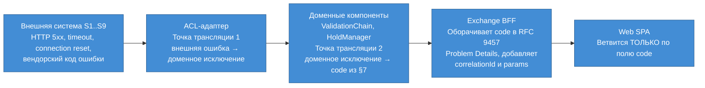

- **ACL-адаптер** превращает транспортную и вендорскую ошибку в доменное исключение
  (`RateUnavailable`, `HoldRejected`, `KycUnavailable`). Он **не** знает про HTTP-коды нашего API.
- **Доменный компонент** выбирает `code` из §7 канона. Новые коды **не изобретаются** — если
  ситуация не покрыта каталогом, используется `EXCHANGE_SERVICE_UNAVAILABLE` или
  `ORDER_CREATION_FAILED`, а пробел фиксируется как дефект контракта.
- **BFF** оборачивает результат в `application/problem+json`, добавляет `correlationId`,
  `timestamp`, `instance`, `params` и `retryable`.
- **SPA** ветвится **только** по `code`. Ветвление по `title`, `detail` или голому HTTP-статусу
  запрещено: `403` носят и `KYC_PENDING` (retryable), и `SCORING_DENIED` (нет).

### 18.2 Правила ретраев

| Что | Ретрай | Политика | Почему |
|-----|--------|----------|--------|
| `GET /v1/wallet/balances`, `/assets`, `/pairs`, `/exchange-orders/{id}` | **да** | 2 попытки, экспоненциальный backoff + jitter | Идемпотентны по природе, побочных эффектов нет |
| `POST /v1/exchange/quotes` | **да**, автоматически клиентом | 1 повтор при `503`/`504`, далее — по `Retry-After` | Побочный эффект дешёвый и самоистекающий: лишняя котировка умрёт через 15 с |
| `POST /v1/exchange-orders` | **только с тем же `Idempotency-Key`** | Не более 2 автоматических повторов при `503`/`504`, затем ручное действие пользователя | Без ключа ретрай = двойной hold и двойная заявка. С ключом — безопасен и возвращает исходный результат |
| Вызов S6 `POST hold` (шаг 18) | **нет** автоматического | Только с производным `holdIdemKey`; при неопределённости — сверка, не повтор | Неидемпотентная финансовая операция. Двойной hold замораживает средства дважды |
| Вызов S8 `POST order` (шаг 19) | **нет** автоматического | При таймауте — **одна** сверка `GET order by Idempotency-Key`, затем компенсация | Повтор без сверки может создать вторую заявку по одной котировке |
| Компенсирующий `DELETE hold` | **да, обязательно** | До 5 попыток с backoff, затем передача в `CompensationReaper` | Идемпотентен на стороне S6. Не снять hold — хуже, чем снять дважды |
| Вызов S9 | **да** | Экспоненциальный backoff, до 24 ч, затем DLQ | Non-blocking, at-least-once приемлемо |

**Ретраить нельзя (жёсткий запрет):**
- любой `POST` с финансовым эффектом без ключа идемпотентности;
- ошибки категории «бизнес-отказ» (`INSUFFICIENT_FUNDS`, `KYC_*`, `SCORING_DENIED`,
  `LIMIT_EXCEEDED_*`, `VALIDATION_ERROR`, `PAIR_NOT_SUPPORTED`) — они детерминированы,
  повтор даст тот же результат и только сожжёт квоту rate limit;
- `QUOTE_ALREADY_USED` и `IDEMPOTENCY_CONFLICT` — повтор структурно бессмысленен;
- любой запрос при открытом circuit breaker — до перехода в half-open.

Поле `retryable` в Problem Details — **машиночитаемое указание клиенту**, ретраить или нет.
Клиент обязан его соблюдать, а не выводить решение из HTTP-кода.

### 18.3 Идемпотентность

| Уровень | Механизм | Область действия |
|---------|----------|------------------|
| Транспортный | `Idempotency-Key` (UUIDv4) на `POST /v1/exchange-orders`, окно 24 ч | Защита от сетевого дубля и ретрая клиента |
| Доменный | Атомарный `consume(quoteId)` в Quote Store | Защита от логического дубля: два разных запроса по одной котировке |
| Интеграционный | Производные детерминированные ключи для S6 (`holdIdemKey`) и S8 | Защита от дубля при нашем собственном повторе вызова |
| Компенсационный | `DELETE hold {holdId}` идемпотентен | Повторное снятие безопасно |

Все четыре уровня нужны: транспортный не защищает от двух разных ключей на одну котировку,
доменный не защищает от потери ответа, интеграционный не защищает от действий клиента.

### 18.4 correlationId сквозь все хопы

- Клиент генерирует `X-Correlation-Id` (ULID) при первом запросе экрана и переиспользует его
  для **всей сессии обмена**: открытие экрана → котировки → submit. Это позволяет собрать
  историю одного намерения пользователя, а не отдельных запросов.
- Gateway генерирует `X-Correlation-Id`, если клиент его не прислал.
- Каждый хоп (Gateway → BFF → Orchestrator → адаптер → внешняя система) пробрасывает заголовок
  без изменений и логирует его в каждой записи.
- `correlationId` попадает: в каждый ответ, в каждый Problem Details, в поле `ExchangeOrder.correlationId`,
  в audit trail, в span трассировки как атрибут.
- Дополнительно каждый запрос имеет `requestId` (уникален на хоп) — для различения ретраев
  внутри одного `correlationId`.

### 18.5 Логирование

**Что логируем всегда:** `correlationId`, `requestId`, `userId` (в псевдонимизированном виде),
имя операции, шаг цепочки валидации, `code` результата, длительность каждого upstream-вызова,
состояние circuit breaker, версия котировки и `quoteId`, `orderId`, `holdId`.

**Что логировать ЗАПРЕЩЕНО:**

| Категория | Примеры | Почему | Что вместо |
|-----------|---------|--------|------------|
| Суммы вместе с идентификатором субъекта в открытом виде | `user=usr_01J8... amount=25450.00 RUB` | Лог становится финансовой выпиской; доступ к логам шире, чем к банковской тайне | Суммы — в отдельный audit-поток с ограниченным доступом; в обычном логе — только порядок величины (bucket) или ничего |
| PII | ФИО, email, телефон, адрес, дата рождения, номер документа | GDPR/152-ФЗ; логи реплицируются и живут дольше, чем срок хранения ПДн | Псевдонимизированный `userId`; `displayName` не логируется вообще |
| KYC-данные | Уровень + документ, страна + резидентство + документ, результаты биометрии | Специальная категория данных; мы их **не храним** (§20) и не должны накапливать через логи | Только факт: `kycCheck=PASSED` / `kycCheck=FAILED code=KYC_EXPIRED` |
| Риск-профиль | `riskScore=17`, причины отказа скоринга | Раскрытие модели скоринга помогает её обходить; причины отказа AML — чувствительны по закону | Только `scoringDecision=ALLOW|REVIEW|DENY` |
| Секреты | JWT целиком, `Authorization`, API-ключи внешних систем | Компрометация периметра | Хеш первых 8 символов токена для корреляции, не более |
| Полные тела запросов/ответов | `POST /v1/exchange-orders` body | Содержит суммы и идентификаторы одновременно | Структурированные поля из белого списка |

**Правило по умолчанию:** логирование — **allow-list**, не deny-list. Логируется только то,
что явно перечислено в схеме лога. Дамп объекта целиком (`log.info(order)`) запрещён на уровне
code review и линтера.

---

## 19. Предположения по масштабированию

### 19.1 Профиль нагрузки (оценка)

Точных цифр аудитории в BRD нет — профиль оценён и вынесен в ASSUMPTION-02 для подтверждения.

**Базовые допущения:** внутренний кошелёк, ~800 000 MAU; экран обмена открывают ~4 % активной
аудитории в сутки; сессия на экране — около 40 с; конверсия «экран → заявка» ≈ 35 %;
пиковый коэффициент к среднему — ×5 (вечерний пик и реакция на рыночные движения).

| Операция | В сутки | Средний RPS | Пиковый RPS | Комментарий |
|----------|---------|-------------|-------------|-------------|
| Открытие экрана (3 `GET` + 1 quote) | 32 000 | 0.4 | 2 | 4 запроса на открытие → ~8 RPS в пике по сумме |
| `POST /v1/exchange/quotes` | ~192 000 | 2.2 | 11 | ≈6 котировок на сессию: ввод, чипы, swap, авторефреш по TTL |
| `POST /v1/exchange-orders` | ~11 200 | 0.13 | 0.7 | Конверсия 35 % |
| `GET /v1/exchange-orders/{id}` | ~15 000 | 0.2 | 1 | Экран успеха + восстановление после потери ответа |

Абсолютные значения невелики — это **внутренний модуль, а не публичная биржа**. Архитектурная
задача здесь не в пропускной способности, а в **латентности, корректности и деградации**.
Поэтому проектирование ведётся от бюджета p95 ≤ 900 мс, а не от RPS.

### 19.2 Горизонтальное масштабирование

| Компонент | Stateless | Масштабирование | Ограничение |
|-----------|-----------|-----------------|-------------|
| Web SPA | да | CDN, статика | — |
| API Gateway | да | Реплики за L4-балансировщиком | Пропускная способность TLS |
| Exchange BFF | **да** | Горизонтально, без ограничений | Ни одного бита состояния между запросами |
| Exchange Orchestrator | **да** | Горизонтально | Состояние breaker — per-instance (ADR-07): при большом числе подов деградация «рваная» |
| Notification Dispatcher | да, с координацией | Несколько воркеров с шардированием по `orderId` | Порядок доставки не гарантируется — и не требуется |
| Quote Store | **нет — состояние** | Шардирование по `quoteId` | Требует строгой консистентности внутри шарда для CAS |
| Idempotency Store | **нет — состояние** | Шардирование по `Idempotency-Key` | Требует персистентности: потеря = потеря защиты |
| Outbox | **нет — состояние** | Шардирование по `orderId` | Durability обязательна |

**Правило:** всё состояние на пути создания заявки живёт **только** в трёх местах —
Quote Store, Idempotency Store, Outbox. Ни BFF, ни Orchestrator не хранят ничего между запросами,
включая «удобные» in-memory кеши пользовательских данных (общие справочные кеши — курсы,
каталог, схема комиссий — допустимы, они не привязаны к пользователю).

### 19.3 Кеш-стратегия

| Данные | TTL | Уровень | Стратегия при недоступности источника | Инвалидация |
|--------|-----|---------|----------------------------------------|-------------|
| Каталог активов и пар | 5 мин | Общий (per-instance + опционально распределённый) | stale-while-revalidate | По TTL + ручной сброс (runbook) |
| Схема комиссий | 60 с | Общий | stale | По TTL |
| Курсы | 1 с | Общий, ключ = пара | stale до 10 с с `degraded: true`, далее `503` | По TTL |
| KYC-статус | 30 с | Per-user | **stale запрещён** → fail-closed | По TTL |
| Статус пользователя | 30 с | Per-user | stale запрещён | По TTL |
| Балансы | **не кешируются** | — | — | — |
| Остаток лимита оборота | **не кешируется** | — | — | — |

Ключевая экономия — кеш курсов: при TTL 1 с нагрузка на S5 равна `число_активных_пар × 1 RPS`
**независимо** от числа пользователей. Это делает S5 нечувствительным к росту аудитории и
превращает наиболее часто вызываемую внешнюю систему в наименее нагруженную.

### 19.4 WebSocket vs polling — обоснование выбора

Выбран **request/response** (ADR-14). Сравнение:

| Критерий | Request/response (выбран) | WebSocket-стрим курсов |
|----------|---------------------------|------------------------|
| Что получает клиент | Готовую котировку с `quoteId`, комиссией и TTL | Поток цен, который клиент должен сам превратить в котировку |
| Соответствие ADR-04 | Полное: все расчёты на сервере | Нарушает: расчёт на клиенте либо второй round-trip всё равно нужен |
| Инфраструктура | Обычный HTTP, любой балансировщик | Sticky-сессии или общий pub/sub, отдельный масштабирующийся слой соединений |
| Стоимость при 40-секундной сессии | 1 соединение на запрос, ~6 запросов | Постоянное соединение ради 40 с |
| Нагрузка на S5 | Срезается кешем 1 с | Срезается той же подпиской — транспорт клиента здесь ни при чём |
| UX-цена | **Ступенчатое обновление раз в 15 с, нет живого тикера** | Плавный тикер |
| Латентность обновления | +100–200 мс HTTP round-trip | ~10 мс |

**Эволюционный путь**, если живой тикер станет требованием: односторонний **SSE** от BFF
(проще WebSocket, работает поверх HTTP/2, не требует своего протокола), питаемый **одной**
внутренней подпиской на S5. Котировка при этом остаётся request/response — стримится только
индикативная цена «для глаз», а обязательство системы по-прежнему выдаётся отдельным вызовом.

### 19.5 Backpressure

| Уровень | Механизм | Реакция |
|---------|----------|---------|
| Gateway | Rate limit per-user и per-IP, заголовки `X-RateLimit-*` | `429 RATE_LIMITED` с `Retry-After` |
| Gateway | Load shedding при насыщении: сброс низкоприоритетных запросов (`POST /quotes`) раньше высокоприоритетных (`POST /exchange-orders`) | `429` / `503` |
| BFF и Orchestrator | Ограничение параллелизма (bounded queue) + fail-fast при переполнении, без бесконечных очередей | `503 EXCHANGE_SERVICE_UNAVAILABLE` |
| Адаптеры | **Bulkhead**: отдельный пул соединений и лимит параллелизма на каждую внешнюю систему | Отказ одной системы не выедает ресурсы других (FM-17) |
| Все хопы | Сквозной дедлайн: остаток бюджета передаётся вниз, истёкший дедлайн — немедленный отказ без вызова | `504 UPSTREAM_TIMEOUT` |
| Клиент | Дебаунс 300 мс, отмена in-flight запроса, экспоненциальный backoff при `429`/`503` | Самоограничение |

Ключевой принцип: **очередь конечна и коротка**. Длинная очередь превращает всплеск нагрузки
в лавину таймаутов, в которой клиенты уже отвалились, а сервер продолжает обрабатывать мёртвые
запросы. Лучше быстро отказать, чем медленно отказать.

### 19.6 Что упрётся первым

**При росте ×10** (≈110 RPS котировок в пике, 7 RPS заявок):
1. **S6 Accounting** — единственная система, которую нельзя кешировать: балансы читаются
   и на открытии экрана, и на шагах 13 и 17. Это ≈25 RPS запросов баланса в пике.
   *Смягчение:* объединить чтения шагов 13 и 17 в один вызов; ввести очень короткий (200–500 мс)
   per-request кеш баланса **внутри одного запроса**, но не между запросами.
2. **Latency-бюджет**, не пропускная способность: при росте нагрузки на upstream растёт их p99,
   и p95 нашего `POST` начинает выходить за 900 мс. Упрётся раньше, чем CPU.

**При росте ×100** (≈1 100 RPS котировок, 70 RPS заявок):
1. **Quote Store**: ~16 500 живых котировок одновременно и ~1 100 записей/с. Объём мал, но
   требуется шардирование ради пропускной способности CAS-операций и изоляции отказа.
2. **Decimal-арифметика в `QuoteBuilder`** — decimal-операции в 20–50 раз дороже `double`;
   при 1 100 RPS это становится заметной долей CPU Orchestrator. *Смягчение:* горизонтальное
   масштабирование (компонент stateless) и кеширование `FeePolicy` в предвычисленном виде.
3. **S3 Scoring** — самая тяжёлая внешняя система, вызывается на каждом submit и не кешируется.
   70 RPS синхронных AML-проверок потребуют согласования пропускной способности с вендором
   и, возможно, пересмотра ADR-05 в пользу асинхронного скоринга для части потока.
4. **Idempotency Store**: ~1.1 млн ключей в сутки в окне 24 ч — объём приемлемый, но требуется
   персистентность и репликация, иначе потеря узла снимает защиту от дублей.

**Что НЕ упрётся:** S5 Rate Service (кеш 1 с делает нагрузку постоянной), S4 (кеши 5 мин / 60 с),
S9 (асинхронно, буферизовано outbox).

---

## 20. Наблюдаемость

### 20.1 RED-метрики (по каждому эндпоинту и каждому upstream-адаптеру)

| Метрика | Тип | Разрезы |
|---------|-----|---------|
| `http_requests_total` | counter | `route`, `method`, `status`, `code` |
| `http_request_duration_seconds` | histogram | `route`, `method`; бакеты 50/100/200/300/500/900/2000/5000 мс |
| `http_request_errors_total` | counter | `route`, `code` из §7 |
| `upstream_requests_total` | counter | `system` (S1..S9), `outcome` = success/error/timeout/short_circuited |
| `upstream_duration_seconds` | histogram | `system` |
| `circuit_breaker_state` | gauge | `system`; 0 closed, 1 half-open, 2 open |

### 20.2 USE-метрики (ресурсы)

| Ресурс | Utilization | Saturation | Errors |
|--------|-------------|------------|--------|
| Пул соединений к каждой внешней системе | `pool_active / pool_size` | `pool_queue_depth` | `pool_acquire_timeout_total` |
| Quote Store | `quote_store_memory_used_ratio` | `quote_store_evictions_total` | `quote_store_errors_total` |
| Idempotency Store | доля занятого объёма | ожидание записи | `idempotency_store_errors_total` |
| Outbox | глубина очереди | `outbox_lag_seconds` | `notification_dlq_depth` |
| Orchestrator | CPU, heap | `inflight_requests` | `rejected_by_backpressure_total` |

### 20.3 SLI / SLO

| SLI | Определение | SLO | Окно | Error budget |
|-----|-------------|-----|------|--------------|
| Доступность экрана обмена | доля успешных ответов на `GET /assets`, `/balances` | **99.9 %** | 30 дней | ≈43 мин/мес |
| Успешность построения котировки | доля `POST /quotes` без `5xx` | 99.5 % | 30 дней | — |
| Latency котировки | p95 `POST /quotes` | **≤ 300 мс** | 7 дней | — |
| Latency создания заявки | p95 / p99 `POST /exchange-orders` | **≤ 900 мс / ≤ 2 000 мс** | 7 дней | — |
| Корректность создания заявки | доля заявок без orphan-hold | **100 %** (любое отклонение — инцидент) | всегда | 0 |
| Свежесть курса | доля котировок с `degraded: false` | ≥ 99 % | 7 дней | — |

### 20.4 Алерты

| Приоритет | Условие | Смысл |
|-----------|---------|-------|
| **P1** | `orphan_holds_reaped_total > 0` | Средства пользователей были заблокированы без заявки. Любое срабатывание — инцидент |
| **P1** | `hold_release_failed_total > 0` после исчерпания ретраев | Компенсация не отработала, деньги заблокированы |
| **P1** | `circuit_breaker_state{system="S6"} == 2` дольше 2 мин | Ledger недоступен — обмен полностью не работает |
| **P1** | Доступность экрана < 99.9 % на скользящем окне 1 ч | Пробит SLO |
| **P2** | `circuit_breaker_state{system="S5"} == 2` дольше 1 мин | Курсы недоступны — экран деградирует, затем `503` |
| **P2** | Доля `degraded: true` котировок > 5 % за 15 мин | Рынок данных нестабилен |
| **P2** | p95 `POST /exchange-orders` > 900 мс на 15 мин | Пробит latency-бюджет |
| **P2** | `quote_store_memory_used_ratio > 0.7` | Приближение к вытеснению живых котировок (FM-16) |
| **P3** | `notification_dlq_depth > 100` | Уведомления не доставляются |
| **P3** | Доля `RATE_CHANGED` > 15 % за час | Либо рынок волатилен, либо порог 0.20 % выбран неверно |
| **P3** | Рост `IDEMPOTENCY_CONFLICT` | Дефект клиента: переиспользование ключа |

### 20.5 Трассировка

- OpenTelemetry, W3C `traceparent` + наш `X-Correlation-Id` как атрибут span.
- Один trace покрывает: SPA → Gateway → BFF → Orchestrator → все адаптеры → внешние системы.
- Обязательные span-атрибуты: `correlationId`, `quoteId`, `orderId` (после получения),
  `validation.step` (номер шага 1..19, на котором завершилась цепочка), `result.code`,
  `upstream.system`, `circuit_breaker.state`, `quote.degraded`.
- **Запрещённые атрибуты:** суммы, `userId` в открытом виде, любые KYC-поля, `riskScore`.
- Сэмплирование: 100 % для `POST /v1/exchange-orders` (низкий объём, высокая ценность),
  адаптивное 1–5 % для `POST /v1/exchange/quotes`, 100 % для всех запросов, завершившихся `5xx`.

### 20.6 Бизнес-метрики

| Метрика | Формула | Зачем |
|---------|---------|-------|
| **Конверсия экрана в заявку** | `count(201 или 202 на /exchange-orders) / count(уникальных сессий экрана)` | Главная продуктовая метрика. Падение = регресс UX или рост отказов |
| **Конверсия ввода в submit** | `count(POST /exchange-orders) / count(сессий с непустым fromAmount)` | Отделяет «не дошёл до кнопки» от «нажал и получил отказ» |
| **Доля отказов по каждому `code`** | `count(code=X) / count(всех POST /exchange-orders)`, разрез по всем кодам §7 | Показывает, какая проверка чаще всего отсекает пользователей. Высокая доля `AMOUNT_BELOW_MINIMUM` = проблема настройки лимитов, а не пользователей |
| **Доля `RATE_CHANGED`** | `count(RATE_CHANGED) / count(POST /exchange-orders)` | Прямой индикатор корректности порога 0.20 % и TTL 15 с. Норма — единицы процентов |
| **Доля `QUOTE_EXPIRED`** | аналогично | Показывает, хватает ли пользователю 15 с на принятие решения |
| **Доля `degraded: true` заявок** | по флагу в аудите заявки | Объём принятого ценового риска — для риск-подразделения |
| **Время от открытия экрана до submit** | распределение | Проверка гипотезы «обмен за несколько секунд» (BRD §2) |
| **Доля отказов, предотвращённых клиентской предвалидацией** | `count(inline-ошибок) / (count(inline) + count(серверных 422))` | Оценка полезности предвалидации |

---

## 21. Безопасность и комплаенс

### 21.1 Периметр и границы доверия

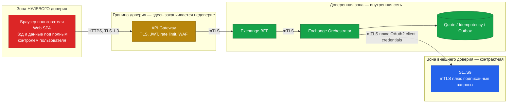

**Где заканчивается доверие:** на API Gateway. Всё, что пришло из браузера, считается враждебным
до валидации. Практические следствия:

- Клиентская предвалидация — **исключительно UX-оптимизация**. Сервер прогоняет всю цепочку 1..19
  заново. Отключение JavaScript, правка запроса в DevTools или прямой вызов API не даёт обойти
  ни одной проверки.
- Суммы, курс, комиссия и `toAmount` из клиентского запроса **не принимаются на веру**: шаг 9
  (`QUOTE_MISMATCH`) сверяет их со снапшотом котировки на сервере. Единственное, что клиент
  реально «выбирает», — это `quoteId` и подтверждение.
- Курс никогда не приходит от клиента. Клиент присылает `quoteId`; курс берётся из снапшота.
- `userId` берётся **только** из проверенного JWT / заголовка `X-User-Id`, выставленного Gateway,
  и никогда из тела запроса.

### 21.2 Защита от replay

| Вектор | Защита |
|--------|--------|
| Повторная отправка перехваченного `POST /v1/exchange-orders` | `Idempotency-Key` (окно 24 ч) вернёт исходный ответ, новой заявки не будет |
| Повторное использование `quoteId` | Атомарный `consume` в Quote Store → `QUOTE_ALREADY_USED` |
| Отложенный replay после истечения котировки | TTL 15 с + проверка шага 8 → `QUOTE_EXPIRED` |
| Replay после подмены суммы | Шаг 9 сверяет параметры со снапшотом → `QUOTE_MISMATCH` |
| Replay украденного JWT | Короткий TTL access-токена, привязка к устройству/сессии на стороне IdP, `429` при аномальной частоте |
| Массовый перебор сумм для восстановления баланса и лимитов | Compliance-First (ADR-09) + rate limit per-user + алерт на аномальную частоту `POST /quotes` |

Транспорт — TLS 1.3, HSTS, запрет downgrade. `Idempotency-Key` обязателен и является частью
контракта, а не рекомендацией.

### 21.3 Audit trail создания заявки

Отдельный **неизменяемый (append-only) поток**, физически отделённый от операционных логов,
с ограниченным доступом и сроком хранения по регуляторным требованиям (ASSUMPTION-07).

Что фиксируется на каждую попытку создания заявки:

| Поле | Назначение |
|------|------------|
| `correlationId`, `requestId` | Связь с трассировкой |
| `userId` (псевдонимизированный) | Субъект операции |
| `quoteId`, снапшот котировки: `rate`, `rateSource`, `feeAmount`, `fromAmount`, `toAmount`, `degraded` | Воспроизводимость расчёта постфактум — ключевое требование ревизии |
| Результат каждого шага 1..19: пройден / провален + `code` | Доказательство, что комплаенс-проверки выполнялись и в каком порядке |
| Решения внешних систем: `kycLevel`, `scoringDecision`, применённые лимиты — **как решения, без сырых данных** | Регуляторная отчётность |
| `holdId`, `orderId`, финальный статус | Связь с движением средств |
| Точные timestamps каждого шага | Разбор инцидентов и претензий |
| Факт компенсации, если была | Прозрачность частичных отказов |

**Свойства:** append-only, без возможности удаления и правки; отдельная политика доступа
(доступ шире, чем у разработчиков, но у́же, чем у операционных логов); хранение независимо
от логов приложения.

### 21.4 PII-минимизация и KYC-данные

**Принцип: мы не храним то, что можем спросить.**

| Данные | Где живут | Что у нас |
|--------|-----------|-----------|
| ФИО, дата рождения, адрес, документы, биометрия | **S1 / S2 (WebID)** | **Ничего.** Мы их не запрашиваем, не получаем, не кешируем и не логируем |
| Уровень и статус KYC | S2 | Кеш **30 с** в памяти, только `level`, `status`, `validUntil`. Не персистится, не попадает в логи и трассировку |
| Резидентство и `tier` | S1 | Кеш 30 с, только для проверки допустимости операции |
| Risk score и причины | S3 | **Не сохраняется вообще.** В аудите — только `ALLOW` / `REVIEW` / `DENY` |
| Балансы | S6 | Не кешируются, не персистятся, не логируются с суммами |
| Суммы операций | S8 + наш audit trail | Только в audit trail с ограниченным доступом |

Требования к реализации:
1. **KYC-данные не пересекают границу нашего сервиса** ни в каком виде, кроме решения
   «достаточно / недостаточно». Приём документов, их хранение и срок хранения — зона
   ответственности S2 и его регуляторного режима.
2. Кеш KYC — **только in-memory, только 30 с, без записи на диск и без репликации**.
   При рестарте пода кеш исчезает — это желаемое поведение.
3. `userId` в логах, метриках и трассировке — в псевдонимизированном виде (стабильный хеш
   с проектным salt), чтобы корреляция была возможна, а идентификация — нет.
4. Право на забвение исполняется в S1/S2; у нас удалять нечего, кроме audit trail, срок хранения
   которого определяется регуляторным требованием и имеет приоритет над правом на удаление
   (ASSUMPTION-07).
5. Ответы Problem Details не содержат PII. Поле `params` содержит только суммы и коды активов
   (`available`, `requested`, `assetId`, `min`, `max`) — это данные самого пользователя,
   возвращаемые ему же по авторизованному каналу.

---

## 22. Отличия прототипа от целевой архитектуры

Прототип (`prototype/`) демонстрирует UX и контракт, но **не** является уменьшенной копией
продакшен-архитектуры. Всё, что описано выше, относится к целевой системе.

| Аспект | Целевая архитектура | Прототип | Почему допустимо |
|--------|---------------------|----------|------------------|
| Авторизация | `Bearer` JWT + `X-User-Id` от Gateway | **Отсутствует**, `userId` зашит в фикстуры (§10.1 канона) | Требование заказчика; фокус задания — экран обмена |
| Бэкенд | Gateway + BFF + Orchestrator | **Отсутствует.** Моки в слое `src/api/`, сеть не используется | Внешние сервисы реализовывать не требуется |
| Внешние системы S1..S9 | 9 реальных интеграций | Хардкод-фикстуры §10 канона | Контракты описаны в `docs/api/`, реализация вне скоупа |
| Quote Store | Распределённое хранилище с атомарным CAS | Объект в памяти вкладки | Один пользователь, одна вкладка — гонок нет |
| Idempotency Store | Персистентное хранилище, окно 24 ч | Map в памяти на время сессии | Демонстрирует поведение, не гарантию |
| Цепочка валидации 1..19 | На сервере, порядок нормативен | **В моке, в том же порядке и с теми же кодами** | Порядок и коды — часть контракта, они демонстрируются честно |
| Деградация и circuit breaker | Реальные breaker'ы и stale-кеш | Сценарные переключатели dev-панели (§10.6 канона): `RATES_DOWN`, `EXCHANGE_DOWN`, `SLOW_NETWORK` | Позволяет показать все негативные пути без бэкенда |
| Дрейф курса | Реальное сравнение с S5, порог 0.20 % | Сценарий `RATE_DRIFT`: курс меняется через ~7 с | Демонстрирует UX-реакцию, а не механику детекта |
| Компенсация hold | Saga + фоновый reaper | **Не реализуется** | Без реального S6 и S8 компенсировать нечего |
| Outbox и уведомления | Durable queue + воркер | Не реализуется | Non-blocking, вне UX экрана |
| Наблюдаемость | OTel, метрики, алерты | `console` + dev-панель | Нет инфраструктуры |
| Деньги | decimal на всех слоях | **decimal.js — обязательно и в прототипе** | Единственное требование §5.1, которое прототип обязан соблюдать полностью: расчёты видны на экране и должны совпадать с целевыми |

**Что прототип обязан воспроизвести точно:** имена полей, коды ошибок §7, порядок проверок §6,
статусы §8, правила округления §5.4, TTL 15 с, дебаунс 300 мс и decimal-арифметику.
Всё остальное — имитация.

---

## 23. Открытые вопросы и допущения

| ID | Допущение | Основание | Что нужно подтвердить | Риск, если неверно |
|----|-----------|-----------|-----------------------|--------------------|
| **ASSUMPTION-01** | Под «welID» заказчика понимается **WebID Solutions GmbH** (VideoIdent / AutoIdent / eID); контракт S2 спроектирован по модели «асинхронная сессия верификации + webhook + уровни» | `promtlog.md` §1 | Вендора KYC и модель уровней верификации | Меняется маппинг полей S2; форма контракта и цепочка проверок сохраняются. Риск низкий |
| **ASSUMPTION-02** | Профиль нагрузки: ~800 000 MAU, 4 % открывают экран в сутки, конверсия 35 %, пиковый коэффициент ×5 | Оценка архитектора, точных цифр в BRD нет | Реальный размер аудитории и пиковый профиль | При аудитории на порядок больше первым упрётся S6 и латентность (§19.6) — потребуется пересмотр §19, но не архитектуры |
| **ASSUMPTION-03** | Все внешние системы S1..S9 доступны по REST/JSON синхронно, поддерживают `Idempotency-Key` (S6, S8) и идемпотентное снятие hold (S6) | BRD §10, `Product Context`, §3 канона | Наличие ключей идемпотентности в контрактах S6 и S8 | **Высокий риск.** Без идемпотентности на стороне S6/S8 компенсация (§13) и ADR-03 неполноценны: возможен двойной hold. Потребуется собственный дедуплицирующий слой |
| **ASSUMPTION-04** | Отказ при создании заявки **не материализуется** как запись в статусе `REJECTED` в S8 — возвращается синхронная ошибка | §8 канона показывает `REJECTED` как статус, но при синхронной валидации (ADR-05) заявка до S8 не доходит | Нужна ли регуляторно запись об отказных попытках в системе заявок | Если запись обязательна — добавляется вызов S8 на всех отказных путях, растёт нагрузка и latency отказного пути. Смягчено: попытка уже фиксируется в audit trail (§21.3) |
| **ASSUMPTION-05** | Окно stale-курса 10 с и TTL кеша 1 с приемлемы для риск-подразделения; ценовой риск в этом окне принимается | §11 канона задаёт значения, но не источник согласования | Согласование с риск-менеджментом и продуктом | Если окно должно быть меньше — падает доступность при сбоях S5; если больше — растёт ценовой риск. Параметр конфигурируемый |
| **ASSUMPTION-06** | При недоступности S3 (Scoring) применяется **fail-closed** — обмен блокируется полностью | §3 канона: S3 = `Blocking` | Возможна ли политика «суммы ниже порога X проходят с post-factum review» | Fail-closed на средневероятном отказе (FM-03) даёт заметные простои. Fallback-политика заметно повысила бы доступность, но это решение комплаенса, не архитектуры |
| **ASSUMPTION-07** | Срок хранения audit trail определяется регуляторным требованием юрисдикции и имеет приоритет над правом на удаление ПДн | Общая практика финтеха; в документах не задан | Юрисдикция (`residency = AE` в фикстурах) и конкретный срок | Влияет на объём хранилища и политику удаления, но не на архитектуру |
| **ASSUMPTION-08** | S8 Order Service — внешняя система, мы не владеем хранилищем заявок и жизненным циклом после `PENDING` | §3 канона (S8 внешняя) против формулировки задания на SDD, где `Order Service` перечислен среди контейнеров | Кто владеет Order Service — наша команда или смежная | Если Order Service наш — он становится контейнером внутри периметра, компенсация (§13) упрощается до локальной транзакции. Архитектура §5 меняется в этой части |
| **ASSUMPTION-09** | Путь построения котировки — `POST /v1/exchange/quotes`; упоминание `POST /exchange-quotes` в §11 канона относится к той же операции | §11 и §12 канона используют разные написания | Финальный путь в OpenAPI | Чисто именование. Требует синхронизации SDD, OpenAPI и прототипа перед сдачей |
| **ASSUMPTION-10** | S7 Crypto Provider не участвует ни в одном из шагов цепочки 1..19 и влияет только на обогащение котировки (статус сети) и `estimatedCompletionAt` | §3 канона относит S7 к `Degradable`, но §6 не содержит шага с источником S7 | Нужна ли проверка статуса сети как блокирующая для крипто-направлений | Если статус сети должен блокировать обмен при остановленной сети — потребуется новый шаг в цепочке и новый код ошибки, которого нет в §7. Это изменение канона, а не SDD |
| **ASSUMPTION-11** | Ограничение «не более 20 автоматических рефрешей котировки подряд» | Согласовано с UX-спецификацией §11 после расхождения: SDD предлагал 3, UX-спека — 20. Принято 20 | Продуктовое подтверждение числа | 3 обрывало бы отсчёт через минуту у пользователя, который просто внимательно читает; 20 даёт около пяти минут. Параметр конфигурируемый |
| **ASSUMPTION-12** | Circuit breaker — **per-instance**, не распределённый (ADR-07) | Решение архитектора ради простоты | Приемлемость «рваного» поведения при частичной деградации | При большом числе подов часть пользователей получает ошибки, часть — нет. При неприемлемости потребуется распределённое состояние breaker и дополнительная зависимость |
| **ASSUMPTION-13** | Grace-зона: UI блокирует кнопку `Exchange` за 1 с до `expiresAt` (FM-15) | Решение архитектора | Продуктовое подтверждение | Слишком широкая зона «съедает» полезное время котировки; слишком узкая не устраняет гонку |

---

*Документ соответствует `docs/00-canonical-model.md` на дату 2026-08-07. При расхождении
нормативным считается канонический контракт; расхождения в SDD оформляются как дефект
и исправляются в SDD, а не в каноне.*
