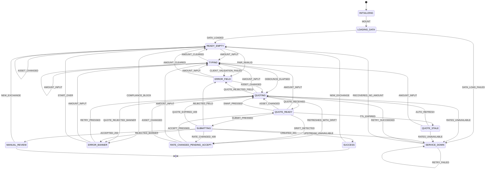

# UX/UI-спецификация — экран Exchange

> **Статус:** нормативный для фронтенда. Производный от `docs/00-canonical-model.md` (канон).
> При расхождении этого документа с каноном — **прав канон**, а этот документ считается дефектным.
>
> **Авторы:** UX Researcher (Часть I) → UX Architect (Часть II) → UI Designer (Часть III).
> **Область:** один экран — создание заявки на обмен. Данные хардкод (§10 канона), авторизации нет.
> **Терминальное состояние:** заявка в статусе `PENDING` (или `MANUAL_REVIEW`).
>
> **Язык документа** — русский. **Язык интерфейса** — английский (решение оркестратора,
> см. §20 «Соответствие подписей RU ↔ EN»).
>
> **Изменение скоупа от 2026-08-07 (требование заказчика).** Из прототипа исключены
> `DevScenarioPanel` и `BalancesStrip`. Балансы переносятся внутрь списка `AssetSelect`,
> который перестаёт быть нативным `<select>` и становится кастомным combobox.
> Нормативное описание — **§22**. Разделы §5 (S-04, S-05), §9.1, §9.3, §14.3, §15.3, §17.3,
> §17.5 читаются с поправками §22.6; при расхождении §22 старше.

## Содержание

| # | Раздел | Автор |
|---|--------|-------|
| 1 | Jobs-To-Be-Done и контекст использования | UX Researcher |
| 2 | User journey с точками трения | UX Researcher |
| 3 | Цена ошибки | UX Researcher |
| 4 | Предположения и способы их проверки | UX Researcher |
| 5 | Инвентаризация состояний | UX Researcher |
| 6 | Юзабилити-риски и меры | UX Researcher |
| 7 | Дизайн-токены (`:root`) | UX Architect |
| 8 | Сетка, layout, брейкпоинты | UX Architect |
| 9 | Дерево компонентов и props | UX Architect |
| 10 | Машина состояний экрана | UX Architect |
| 11 | Поведение таймера курса | UX Architect |
| 12 | Правила валидации в UI | UX Architect |
| 13 | Форматирование чисел | UX Architect |
| 14 | Доступность | UX Architect |
| 15 | Клавиатура | UX Architect |
| 16 | Wireframes | UI Designer |
| 17 | Пиксельная спецификация блоков | UI Designer |
| 18 | Спецификация Exchange Summary | UI Designer |
| 19 | Микровзаимодействия | UI Designer |
| 20 | Соответствие подписей RU ↔ EN | UI Designer |
| 21 | Чеклист визуальной приёмки | UI Designer |

---
---

# Часть I — UX Researcher

> Говорит **UX Researcher**. Я не описываю экран. Я описываю, зачем человек сюда пришёл,
> где он ошибётся и сколько это стоит. Всё, что ниже, — это ограничения для Частей II и III.

## 1. Jobs-To-Be-Done и контекст использования

### 1.1 Основная работа (Main Job)

> **Когда** у меня на балансе кошелька лежит одна валюта, а нужна другая,
> **я хочу** превратить одну в другую за несколько секунд, не выходя из кошелька,
> **чтобы** распоряжаться деньгами в нужной форме и не терять их на времени и на посредниках.

### 1.2 Смежные работы

| ID | Job | Что из этого следует для экрана |
|----|-----|----------------------------------|
| **J-1** | «Обменять ровно столько, сколько скажу» | Ввод суммы — главный элемент. Ничего не должно менять введённое пользователем число само по себе. |
| **J-2** | «Обменять всё, что есть» | Чипы `25/50/75/100 %` и `MAX` обязаны **всегда** приводить к валидной заявке, иначе они бесполезны. Отсюда режим комиссии `INCLUDED_IN_SOURCE` (§5.3 канона). |
| **J-3** | «Понять, не грабят ли меня» | Курс, комиссия и итог должны быть на экране **до** нажатия кнопки, а не в модалке после. |
| **J-4** | «Не ошибиться необратимо» | Заявка резервирует средства (hold). Пользователю нужна уверенность **до** submit, а не «отмена» после. |
| **J-5** | «Быстро проверить, сколько дадут» (job без намерения обменять) | Экран должен считать и показывать без обязательства нажать кнопку. Никаких «введите сумму, чтобы увидеть курс» — курс показываем сразу. |
| **J-6** | «Получить крипту в нужной сети» | `USDT@TRON ≠ USDT@ETHEREUM` (§2 канона). Сеть должна быть видима и в селекторе, и в Summary. |

**Emotional job:** «хочу чувствовать, что контролирую операцию» — это прямо конфликтует
с таймером обратного отсчёта, который контроль отнимает. См. риск **R-01**.

**Social job:** отсутствует. Операция приватная, шеринга не требуется.

### 1.3 Персона (по фикстурам §10.1 канона)

| Атрибут | Значение | Следствие для дизайна |
|---------|----------|------------------------|
| Имя | Alex Morgan | В прототипе нигде не показывается — авторизации нет. Экран безличный. |
| Резидентство | `AE` | Локаль интерфейса — `en-US`. Разделитель тысяч — запятая, десятичный — точка (§13). |
| Тир | `TIER_2` | Есть лимиты оборота (§10.5 канона) — их остаток может обрезать сумму. |
| KYC | уровень 2, `VERIFIED` до 2027-04-30 | В happy path блокировок нет; KYC-состояния воспроизводятся сценарным переключателем. |
| Risk score | 17 (`LOW`) | Скоринг в happy path не мешает. |
| Портфель | RUB, USDT@TRON, BTC, ETH (часть в held), EUR = 0 | На экране одновременно видны: фиат, крипто, актив с held и нулевой актив. Все четыре кейса обязаны выглядеть корректно. |

### 1.4 Контекст использования

| Параметр | Значение | Обоснование / следствие |
|----------|----------|--------------------------|
| **Устройство** | Предположительно ~65–70 % мобильный веб, ~30–35 % десктоп (кошельковый паттерн). Проверяется через **A-01**. | Мобильный layout — **не деградация десктопа**, а равноправный. Разработка ведётся mobile-first внутри карточки 440 px. |
| **Поза** | Одна рука, большой палец, вертикальный экран | Кнопка `Exchange Now` и чипы — в нижней трети. Тач-таргеты ≥ 44 px (§14). |
| **Длительность сессии** | 20–90 с. Это микрозадача, не «работа». | Никакой онбординг-каруселей, тултипов-обучалок, модалок-подтверждений с чекбоксом. |
| **Состояние внимания** | Разделённое. Экран открывают между делами (в транспорте, в перерыве, во время звонка). Возврат из фона — **штатный сценарий**, а не край. | Обязателен корректный `visibilitychange` (§11.5) и восстановление котировки. |
| **Сеть** | Мобильная, нестабильная. 2.5 с задержки — воспроизводимый сценарий `SLOW_NETWORK`. | Skeleton обязателен, спиннер «на весь экран» запрещён. |
| **Экспертиза** | Смешанная: от «первый раз вижу USDT» до трейдера, который знает bid/ask. | Курс показываем в человекочитаемом виде (`1 USDT = 94.00 RUB`), а не как `0.010638297872`. Технический курс доступен, но вторичен. |
| **Освещение** | В том числе улица / солнце | Основной текст `#111827` на белом (17.74:1). Серый `#6B7280` не используется для критичных цифр. |
| **Частота** | 1–8 раз в месяц. Мышечная память **не формируется**. | Нельзя рассчитывать на то, что пользователь «привыкнет к таймеру» или «запомнит, где MAX». |

### 1.5 Anti-jobs (что экран сознательно НЕ делает)

- Не даёт торговать (нет стакана, нет лимитных ордеров, нет графика).
- Не показывает историю операций (вне скоупа, §1 канона).
- Не выводит средства (сеть в Summary — **информация**, а не выбор точки назначения).
- Не даёт отменить созданную заявку (вне скоупа) — отсюда повышенные требования к предподтверждению.

---

## 2. User journey экрана обмена

Шкала эмоции: `+` уверенность, `0` нейтрально, `−` тревога/сомнение.

| # | Шаг | Что делает система | Что думает пользователь | Эмоция | Точка трения | Мера (раздел) |
|---|-----|--------------------|--------------------------|--------|--------------|----------------|
| 1 | Открытие экрана | Skeleton 200–2500 мс, затем балансы + дефолтная пара `RUB → USDT` + живой курс | «Сколько у меня вообще есть?» | 0 | **F-1:** пустая карточка без цифр читается как «сломалось». | Skeleton повторяет геометрию контента (§17.9), а не серый прямоугольник |
| 2 | Считывание баланса | `BalancesStrip`: 5 строк, среди них `ETH` с held и `EUR` = 0 | «Почему ETH 0.86, а доступно 0.76?» | − | **F-2:** расхождение `total`/`available` без объяснения = подозрение в краже | Показываем `available` как главное число, `held` — отдельной подписью `0.10 on hold` (§17.3) |
| 3 | Проверка пары | Пара `RUB → USDT` уже выбрана, курс уже показан | «Курс нормальный?» | 0 | **F-3:** курс `0.010638297872` нечитаем | `Current Rate = 1 USDT = 94.00 RUB` (§18) |
| 4 | Ввод суммы | Дебаунс 300 мс → котировка → пересчёт `You Receive` | «Введу 10 000» | 0 | **F-4:** пересчёт «прыгает» под пальцем при каждой цифре | Пересчёт только после дебаунса; во время набора старое значение приглушается, но **не исчезает** (§19.2) |
| 5 | Или чип `100 %` | Подставляется `25 450.00`, комиссия внутри | «Точно всё уйдёт?» | 0 | **F-5:** при комиссии «сверху» тут был бы отказ | `INCLUDED_IN_SOURCE` (§5.3 канона) гарантирует валидность |
| 6 | Чтение результата | `You Receive = 269.797021 USDT` | «А почему не 270.7? Умножал же…» | − | **F-6 (ключевая):** пользователь считает `сумма × курс` и не сходится на величину комиссии | Строка `Fee` обязательна и не скрывается; в `You Receive` подпись `after 89.08 RUB fee` (§17.6) |
| 7 | Взгляд на Summary | 5 строк: Rate / Fee / Estimated Receive / Timer / Network | «Что за Network? Я же не вывожу» | 0 | **F-7:** непонятно, зачем сеть при внутреннем обмене | Подпись `Network: TRON · no network fee` (§18.4) |
| 8 | Таймер | 15 → 0, предупреждение на 5 | «Я не успею! Меня торопят!» | − | **F-8 (ключевая):** обратный отсчёт создаёт искусственное давление | Таймер = «свежесть цены», а не «дедлайн». На 0 — **автообновление**, не блокировка (§11) |
| 9 | Дрейф курса | Баннер `Rate changed. Calculation updated.` + кнопка `Review` | «Меня переиграли в последний момент» | − | **F-9 (ключевая):** цифра меняется в момент нажатия | Submit блокируется, показывается «было → стало», требуется явный accept (§10, §17.11) |
| 10 | Нажатие `Exchange Now` | Кнопка → `loading`, поля read-only | «Прошло? Нажать ещё раз?» | − | **F-10:** нет мгновенного отклика → двойной клик | Кнопка блокируется в том же кадре события, спиннер + `Creating order…` (§19.5) |
| 11 | Успех | `SuccessPanel`: `orderId`, статус `PENDING`, суммы | «Где мои деньги? Уже обменялось?» | 0 | **F-11:** `PENDING` читается как «не получилось» | Явный текст: `Funds reserved. Order is queued for execution.` (§17.12) |
| 12 | Повтор | `New exchange` | «Ещё раз то же самое» | + | **F-12:** сброс всех полей раздражает | Пара сохраняется, сумма очищается (§10, эффект `E-14`) |

### 2.1 Три критические точки журнея

Если бюджет на полировку ограничен, вкладывать нужно сюда:

1. **Шаг 6** — понимание, что комиссия внутри суммы. Единственный шаг, где пользователь
   может решить, что его обманули, при полностью корректной работе системы.
2. **Шаги 8–9** — таймер и дрейф. Единственные места, где интерфейс меняется **сам**,
   без действия пользователя. Любое самопроизвольное изменение денежной цифры требует
   явного подтверждения.
3. **Шаг 10** — момент необратимости. После него отмена вне скоупа.

---

## 3. Цена ошибки в финтех-обмене

### 3.1 Классификация

| Класс | Определение | Требуемая защита |
|-------|-------------|------------------|
| **Необратимая** | После действия пользователь не может вернуть состояние средствами этого экрана | Предподтверждение: цифра видна, повторный ввод не нужен, но нужен осознанный клик |
| **Дорого обратимая** | Обратимо, но через поддержку / время / повторную комиссию | Явное предупреждение до действия |
| **Дёшево обратимая** | Один клик назад | Защита не нужна, защита вредна (замедляет) |

### 3.2 Матрица по действиям экрана

| Действие | Класс | Почему | Защита в UI |
|----------|-------|--------|-------------|
| Ввод суммы | дёшево обратимая | правится в поле | **Никаких** подтверждений. Не ругаться, пока печатает (§12.2) |
| Смена актива в селекторе | дёшево обратимая | обратный выбор | Нет подтверждения. Но: пересчёт суммы (§12.6) |
| `Swap` | дёшево обратимая | повторный swap возвращает | Нет подтверждения. Анимация объясняет, что произошло (§19.1) |
| Чип `100 %` / `MAX` | дёшево обратимая | сумма правится | Нет подтверждения |
| **Accept нового курса** | дорого обратимая | принимает **другую** цифру получения | Показ «было → стало» + дельта. Кнопка `Review` ≠ кнопка `Exchange` — **разные кнопки, разные позиции** (§17.11) |
| **`Exchange Now`** | **необратимая** | создаётся заявка, ставится hold, `orderId` выдан, отмена вне скоупа | Все цифры на экране до клика; кнопка активна только при валидном состоянии; блокировка от двойного клика; идемпотентность |
| Двойное нажатие `Exchange Now` | **необратимая, если не защищено** | вторая заявка = второй hold = деньги заморожены дважды | Синхронная блокировка + один `Idempotency-Key` на попытку (§10, эффект `E-10`) |
| Обмен не в ту сеть | необратимая **последствиями** | `USDT@TRON` нельзя «переложить» в `USDT@ETHEREUM` без вывода/ввода | Сеть в селекторе, в `You Receive`, в Summary. Три места — не избыточность, а требование (**R-05**) |
| Обмен не той пары (`RUB→BTC` вместо `RUB→USDT`) | необратимая | обратный обмен = вторая комиссия + спред (в фикстурах спред виден: 94.00 vs 93.60) | Обе валюты крупно и одновременно в поле зрения; swap-кнопка визуально показывает направление |
| Уход со страницы во время `SUBMITTING` | неопределённая | заявка могла создаться | `beforeunload`-предупреждение только в состоянии `SUBMITTING` (§10) |

### 3.3 Асимметрия ошибок

Не все ошибки равноценны, и дизайн должен быть смещён в одну сторону:

| Тип | Стоимость | Смещение дизайна |
|-----|-----------|-------------------|
| **Ложный отказ** (не дали обменять, хотя можно) | пользователь раздражён, уходит | Терпимо |
| **Ложное разрешение** (дали обменять не то) | потеря денег, тикет в поддержку, репутация | **Недопустимо** |

Отсюда правило: **кнопка `Exchange Now` активна только при полностью валидном состоянии**
(требование Design Brief). Спорные случаи трактуются в пользу блокировки.

**Но у этого правила есть цена:** отключённая кнопка без объяснения — сама по себе
юзабилити-дефект (**R-15**). Поэтому: кнопка `disabled` **всегда** сопровождается
либо inline-ошибкой у поля, либо текстом причины под кнопкой. Состояний
«серая кнопка без объяснения» на экране не существует.

### 3.4 Где нужна дополнительная защита (сверх обычного)

1. **`Exchange Now`** — единственная точка необратимости.
2. **Accept после дрейфа курса** — второе решение о деньгах в рамках одной операции.
3. **Выбор network для крипто-актива** — ошибка проявится не сейчас, а при выводе.
4. **`100 %` / `MAX` на активе с held** — пользователь считает от `total`, система от `available`.

---

## 4. Предположения, принятые на веру, и как их проверить

Каждое предположение — риск. Ниже: формулировка, чем рискуем, как проверяем, порог.

| ID | Предположение | Риск, если неверно | Метод проверки | Метрика и порог |
|----|---------------|--------------------|----------------|-----------------|
| **A-01** | ~65–70 % трафика — мобильный | Мы вложились в mobile-first зря; десктоп недооптимизирован | Аналитика: доля сессий по ширине viewport, 4 недели | Если mobile < 40 % — пересмотреть приоритет layout |
| **A-02** | Пользователь понимает `You Pay` / `You Receive` без обучения | Люди путают направление и обменивают наоборот | Модерируемый usability-тест, 8 участников, задача «обменяй 5 000 ₽ на USDT» | Ошибок направления 0/8. При ≥ 1 — добавить стрелку `→` между блоками и подпись валют в шапке |
| **A-03** | Таймер 15 с воспринимается как «свежесть цены», а не как «дедлайн» | Тревога, брошенные формы, поспешные ошибочные подтверждения | A/B: (A) числовой отсчёт `15…0`, (B) прогресс-кольцо без цифр, (C) статичная подпись `Live rate` с тихим авторефрешем | Конверсия ввод→submit; время между `QUOTE_READY` и кликом. Если у (A) медиана времени < 3 с и доля брошенных > контроля на 5 п.п. — переключиться на (C) |
| **A-04** | `INCLUDED_IN_SOURCE` понимается из строки `Fee` | Пользователь считает `сумма × курс`, не сходится, теряет доверие | Тест на понимание: показать заполненный экран, спросить «сколько спишется и сколько придёт» | Правильных ответов ≥ 7/8. Иначе — добавить микро-разбивку `10 000.00 − 35.00 fee = 9 965.00 → ×94.00` |
| **A-05** | 5 строк Summary — не перегруз | Слепота к блоку, `Fee` не читается | Eye-tracking или клик-тест «покажи, где комиссия» | ≥ 6/8 находят `Fee` за < 5 с |
| **A-06** | Английский UI приемлем для аудитории (в т.ч. русскоязычной) | Языковой барьер → ошибки | Тест с русскоязычными участниками без английского B1 | Успешное завершение ≥ 7/8. Иначе — включить i18n (архитектура §9 это уже допускает) |
| **A-07** | Чипы `25/50/75/100 %` полезнее ручного ввода | Мёртвый UI-элемент занимает место | Аналитика: доля submit, где сумма пришла из чипа | Использование ≥ 15 %. Иначе — оставить только `MAX` |
| **A-08** | Автообновление котировки на 0 с лучше, чем блокировка | Пользователь подтверждает «не глядя» изменившуюся цифру | A/B: (A) автообновление, (B) блокировка + кнопка `Refresh rate` | Доля submit с фактически неверно понятой суммой (proxy: жалобы/тикеты + отмены в поддержке) не растёт; конверсия у (A) выше |
| **A-09** | Порог дрейфа 0.20 % — верный компромисс (§11 канона) | Слишком часто → баннер-шум и слепота; слишком редко → ощущение подмены | Логи: частота `RATE_CHANGED` на сессию | Медиана ≤ 1 баннер за сессию. > 2 — поднять порог до 0.35 % |
| **A-10** | Пользователь понимает разницу `USDT@TRON` / `USDT@ETHEREUM` | Обмен в неверную сеть, дорогой вывод | Тест: «получи USDT так, чтобы вывод в TRON был дешёвым» | ≥ 6/8. Иначе — сделать сеть отдельным явным шагом выбора |
| **A-11** | Разница `total` / `available` понятна из подписи `on hold` | Подозрение в пропаже средств | Опрос после теста: «сколько ETH ты можешь обменять прямо сейчас» | ≥ 7/8 отвечают `0.76` |
| **A-12** | `PENDING` читается как успех | Пользователь повторяет операцию → двойной обмен | Тест: «операция прошла?» на экране успеха | ≥ 7/8 отвечают «да» |
| **A-13** | Дебаунс 300 мс ощущается мгновенным | Экран кажется тормозным или, наоборот, дёрганым | Тест восприятия отзывчивости + телеметрия p95 котировки | p95 котировки ≤ 300 мс (§11 канона), субъективная оценка ≥ 4/5 |
| **A-14** | Одна карточка без шагов — правильная модель | Перегруз на мобильном, «не влезает» | Тест на устройстве 360×640 без зума | Задача выполняется без горизонтального скролла; вертикальный скролл ≤ 1.5 экрана |
| **A-15** | Compliance First (KYC раньше баланса, §6 канона) не ломает понимание | Пользователь с пустым балансом видит «пройди KYC» и не понимает, при чём тут это | Тест на сценарии `KYC_PENDING` + недостаток средств | ≥ 6/8 понимают, что делать дальше |

> **Правило для команды:** ни одно из A-01…A-15 не является фактом. При каждом релизном
> ревью экрана проверяется, какие из них подтверждены данными, а какие всё ещё гипотезы.

---

## 5. Инвентаризация состояний

Полный перечень не-happy состояний. Колонка «Почему именно так» — обязательна:
без неё разработчик заменит решение на «более простое» и сломает замысел.

### 5.1 Состояния данных и загрузки

| # | Состояние | Что видит пользователь | Почему именно так |
|---|-----------|------------------------|--------------------|
| S-01 | **INITIALIZING** (< 200 мс) | Ничего не мигает. Каркас карточки уже отрисован, содержимое пустое | Показать skeleton раньше 200 мс — создать мигание, которое хуже пустоты |
| S-02 | **Skeleton** (загрузка > 200 мс) | Серые плашки **точно по геометрии** будущего контента: 5 строк балансов, два поля, 5 строк Summary. Кнопка `disabled`, текст `Loading…` | Skeleton, повторяющий layout, устраняет сдвиг вёрстки (CLS = 0). Спиннер по центру — нет: он не сообщает, что грузится |
| S-03 | **Empty (сумма не введена)** = `READY_EMPTY` | Балансы есть; поле `You Pay` пустое с placeholder `0.00`; `You Receive` показывает `0.00`; Summary показывает **реальный курс** и `Fee —`, `Estimated Receive —`; таймер **не идёт**; кнопка `disabled` + подпись `Enter an amount to continue` | Курс показываем сразу — это job **J-5** («сколько дадут?»). Таймер не запускаем: нечего фиксировать, а тикающий счётчик без цели = чистая тревога (**R-01**) |
| S-04 | **Empty (нулевой баланс актива)** — `EUR` | В `BalancesStrip` строка `EUR 0.00` приглушённая. При выборе `EUR` в `You Pay`: чипы и `MAX` `disabled`, под полем `Not enough EUR. Available: 0.00`, кнопка `disabled` | Актив не прячем: пользователь должен видеть, что счёт существует. Текст ошибки — дословно из §7 канона (`INSUFFICIENT_FUNDS`) |
| S-05 | **Актив с held** — `ETH` | Главное число — `0.76` (available). Под ним caption `0.86 total · 0.10 on hold`. Чип `100 %` подставляет `0.76`, не `0.86` | Все проверки идут по `available` (§2 канона). Показ `total` как главного числа гарантирует ошибку ожидания (**R-07**) |
| S-06 | **Stale data (котировка старше TTL, но новая ещё не пришла)** | Цифры остаются на месте, но получают `opacity: 0.55`; таймер заменяется на `Updating…` со спиннером 12 px; кнопка `disabled` | Убирать цифры нельзя — пользователь теряет контекст и место чтения. Приглушение = «эти числа больше не действительны» без пустоты |
| S-07 | **Degraded quote** (`degraded: true`, S7 недоступен) | В Summary у строки `Current Rate` появляется бейдж `Indicative`, tooltip `Using cached market data` | Пользователь имеет право знать, что цена не первой свежести. Молчать — обман |
| S-08 | **Slow network** (`SLOW_NETWORK`, 2.5 с) | После 400 мс ожидания котировки — inline-спиннер в `You Receive`; после 1200 мс — подпись `Still fetching the rate…` | Два порога вместо одного: до 400 мс молчим (иначе мигание), после 1200 мс объясняем, иначе пользователь решит, что зависло |
| S-09 | **Offline** (`navigator.onLine === false`) | Баннер поверх Summary: `You're offline. Rates are paused.`; таймер `paused`; кнопка `disabled`. При возврате сети — автоматический перезапрос котировки без действий пользователя | Оффлайн — состояние среды, не ошибка пользователя. Требовать от него нажать «повторить» после восстановления сети — перекладывать работу |

### 5.2 Состояния курса и котировки

| # | Состояние | Что видит пользователь | Почему именно так |
|---|-----------|------------------------|--------------------|
| S-10 | **Quote running** | Таймер `15 → 6`, серый (`#6B7280`), кольцо прогресса уменьшается | Нейтральный цвет: это не опасность, это индикатор свежести |
| S-11 | **Quote warning** (≤ 5 с) | Таймер `5 → 1`, цвет `#B45309` (amber), кольцо amber. **Ничего не блокируется, никакого мигания** | Единственная функция предупреждения — «сейчас цифра может поменяться». Мигание/красный превратили бы это в панику (**R-01**) |
| S-12 | **Quote expired → auto-refresh** (0 с) | Таймер → `Updating…`; значения приглушаются; через ≤ 300 мс приходит новая котировка; таймер снова `15`. Если новые цифры **совпали** — никакого баннера. Если разошлись более чем на 0.20 % — переход в S-13 | Автообновление вместо блокировки: блокировка наказывает пользователя за то, что он читал экран (решение A-08) |
| S-13 | **Rate drift** = `RATE_CHANGED_PENDING_ACCEPT` | Баннер над Summary: `Rate changed. Calculation updated.` + строка `269.797021 → 269.257427 USDT (−0.20 %)` + кнопка `Review & continue`. Кнопка `Exchange Now` **disabled**, пока не нажат accept. Таймер **остановлен** на новом значении | Требование BRD §8. Останов таймера критичен: иначе пользователь читает дельту под тикающий счётчик — двойное давление |
| S-14 | **Rate drift во время печати** | Баннер **не показывается**. Новая котировка тихо применяется, потому что пользователь всё равно ещё не зафиксировал намерение | Прерывать ввод баннером — грубейшее нарушение потока. Accept нужен только когда пользователь уже перешёл к чтению итога |
| S-15 | **Rates service down** (`RATE_SERVICE_UNAVAILABLE`) | Баннер `Rates are temporarily unavailable`; оба поля read-only; Summary в состоянии `—`; кнопка `disabled` с подписью `Waiting for rates`; автоповтор каждые 5 с + кнопка `Retry` | Ошибка `retryable: true` → автоповтор обязателен. Ручная кнопка — для нетерпеливых, не вместо |
| S-16 | **Exchange service down при submit** (`EXCHANGE_SERVICE_UNAVAILABLE`) | Баннер `Exchange is temporarily unavailable`; **введённые данные сохраняются**; кнопка возвращается в `enabled` с текстом `Try again` | Потерять введённую сумму из-за отказа сервера — наказание пользователя за чужую проблему |

### 5.3 Состояния взаимодействия

| # | Состояние | Что видит пользователь | Почему именно так |
|---|-----------|------------------------|--------------------|
| S-17 | **Повторное нажатие `Exchange Now`** | Кнопка становится `disabled` **в том же обработчике события**, до сетевого вызова; спиннер + `Creating order…`; `pointer-events: none` | Гонка «пользователь быстрее сети» — реальность, а не теория. Защита должна быть синхронной; идемпотентность на бэкенде — второй рубеж, а не первый |
| S-18 | **`IDEMPOTENCY_CONFLICT` / `QUOTE_ALREADY_USED`** | Баннер `This exchange was already submitted` (для `QUOTE_ALREADY_USED`) / `Conflicting request` (для `IDEMPOTENCY_CONFLICT`); форма read-only; единственное действие — `Start over` | Не даём «попробовать ещё раз»: заявка, вероятно, уже существует |
| S-19 | **Возврат на экран (вкладка была в фоне)** | При `visibilitychange → visible`: если котировка жива — таймер продолжается с реального остатка (не с того, где остановился); если истекла — сразу `Updating…` и новая котировка | Таймер, который «замёрз» в фоне и продолжил с 8 с, показывает **ложь**. Считаем от `expiresAt`, а не тиками (§11.5) |
| S-20 | **Возврат на экран после успеха** | Показывается `SuccessPanel` с `orderId`; повторный submit невозможен | Успешный результат нельзя терять при перерисовке |
| S-21 | **Возврат фокуса в поле после ошибки** | Ошибка **не исчезает** при фокусе; исчезает при первом изменении значения | Ошибка, пропадающая по фокусу, лишает пользователя возможности перечитать её |
| S-22 | **Неподдерживаемая пара** (`EUR → *`) | Селектор `You Receive` при `from = EUR`: все опции `disabled` с подписью-причиной; под селектором `This pair is not available right now`; кнопка `disabled` | Дословный текст `PAIR_NOT_SUPPORTED` из §7 канона. Не прячем опции — прячем возможность ошибиться, оставляя видимость модели |
| S-23 | **Одинаковые активы** (`SAME_ASSET_PAIR`) | Опция, равная активу противоположного поля, `disabled` в списке. Если состояние всё же достигнуто — `Select two different assets` у селектора | Предотвращение > сообщение. Но сообщение обязано существовать (клиент не единственный источник состояния) |
| S-24 | **Сумма ниже минимума** | При blur или при попытке submit: `Minimum amount is 500.00 RUB` под полем `You Pay`. Во время печати — молчим | Ругать пользователя на цифре `5`, когда он печатает `5000`, — классический дефект (§12.2) |
| S-25 | **Сумма выше максимума / лимита** | `Maximum amount is 1,000,000.00 RUB` или `Daily limit reached. Available today: 320,000.00` | Дословно из §7 канона |
| S-26 | **KYC-состояния** | Баннер над Summary с текстом из §7 канона; форма остаётся интерактивной (можно считать), но `Exchange Now` `disabled` | Пользователь может изучать курсы, даже если сейчас не может обменять. Блокировать весь экран — избыточно |
| S-27 | **`SCORING_REVIEW_REQUIRED` (202)** | `SuccessPanel` в варианте `MANUAL_REVIEW`: нейтральный (не зелёный) значок, `orderId`, текст `Sent for manual review` | Это **не ошибка** (§7 канона), но и не успех. Зелёная галочка была бы ложью |
| S-28 | **Свернули вкладку на 30 минут и вернулись** | Полный перезапрос: балансы + котировка; если поле было заполнено — сумма сохраняется, пересчёт выполняется автоматически | Сохранение ввода — то немногое, что можно сохранить безопасно. Сохранять котировку через 30 минут нельзя |
| S-29 | **Печать в момент истечения таймера** | Истечение **игнорируется** как событие UI: пользователь уже в `TYPING`, новая котировка придёт по дебаунсу и перекроет старую. Баннер не показывается | Одно изменение цифры за раз. Два одновременных источника изменений = потеря доверия |

**Итого: 29 состояний.** Реализация, покрывающая только `S-03` и happy path, считается неполной.

---

## 6. Юзабилити-риски экрана и меры

Формат: риск → почему он реален именно здесь → мера → как проверить, что мера сработала.

### R-01. Таймер обратного отсчёта как источник тревоги

**Почему реален.** Обратный отсчёт эксплуатирует дефицит («успей!»). В финтехе это
двойной вред: (1) пользователь торопится и подтверждает не читая; (2) пользователь
интерпретирует давление как манипуляцию и уходит. Пользователь заходит сюда 1–8 раз
в месяц — привыкнуть к таймеру он не успеет (§1.4).

**Мера.**
1. Таймер не запускается, пока сумма не введена (`READY_EMPTY` → таймера нет).
2. По достижении нуля — **автообновление котировки**, а не блокировка. Пользователь
   ничего не теряет, кроме, возможно, нескольких копеек курса.
3. Визуальный вес минимальный: 12 px, `#6B7280`, тонкое кольцо 16 px. Это **не** главный
   элемент Summary.
4. На 5 с — единственная смена цвета в amber `#B45309`. Без мигания, без пульсации,
   без звука, без красного.
5. Подпись рядом с числом — `Rate updates in 7s`, а не `Expires in 7s`. Слово «обновится»
   вместо «истечёт» меняет смысл с угрозы на сервис.

**Проверка.** A/B из **A-03**: медиана времени `QUOTE_READY → click` не должна падать
ниже 3 с (признак поспешности); доля отказов не должна расти.

---

### R-02. Автоматическая подмена курса под пальцем в момент нажатия

**Почему реален.** Между `mousedown` и обработкой клика проходят десятки миллисекунд;
между решением нажать и нажатием — сотни. Если в этот интервал придёт новая котировка,
пользователь подтвердит **не ту** цифру, которую читал. Это не редкость — TTL 15 с,
порог дрейфа 0.20 %.

**Мера.**
1. **Freeze-окно:** с момента `pointerdown` по кнопке `Exchange Now` и до разрешения
   запроса применение новых котировок к UI **приостанавливается**. Пришедшая котировка
   кладётся в очередь.
2. Если после ответа сервера окажется, что курс уехал (`RATE_CHANGED`, 409) — переход
   в `RATE_CHANGED_PENDING_ACCEPT` с явным сравнением «было → стало». Заявка **не создана**.
3. Обновление цифр в `You Receive` **никогда** не происходит в интервале 400 мс после
   любого `pointerdown` внутри карточки: если новая котировка пришла в это окно, она
   применяется по истечении окна.
4. Кнопка `Review & continue` в баннере располагается **не в том же месте**, где
   `Exchange Now`, — чтобы «нажатие по памяти» не сработало как accept (см. §17.11).

**Проверка.** Сценарий `RATE_DRIFT`: дрейф на 7-й секунде. В логах прототипа не должно
быть ни одного случая, где значение `You Receive` изменилось в интервале
`[pointerdown, pointerdown + 400 мс]`.

---

### R-03. Непонимание, что комиссия внутри суммы, а не сверху

**Почему реален.** Ментальная модель большинства: «комиссия добавляется к платежу».
Здесь наоборот: `INCLUDED_IN_SOURCE` (§5.3 канона). Пользователь умножит
`10 000 × 94.00⁻¹ = 106.38` и увидит `106.010638`. Разница `0.37 USDT` выглядит как
скрытое воровство, хотя всё честно. Это **единственная** ситуация, где корректная работа
системы читается как обман.

**Мера.**
1. Строка `Fee` в Exchange Summary **обязательна и не скрывается никогда** — прямое
   требование §5.3 канона.
2. Под полем `You Receive` — caption: `After 89.08 RUB fee`. Число комиссии повторяется
   рядом с результатом, а не только в Summary.
3. Метка баланса в `You Pay` — `Available`, метка списания — явная: в Summary строка
   `Fee` идёт **сразу под** `Current Rate` и **перед** `Estimated Receive`, повторяя
   порядок вычисления `§5.3`: курс → комиссия → результат.
4. Формат строки `Fee`: `89.08 RUB (0.35%)` — и абсолют, и процент. Абсолют отвечает
   на «сколько», процент — на «справедливо ли».
5. Значение `Estimated Receive` **точно совпадает** с числом в поле `You Receive`.
   Две разные цифры для одного смысла — гарантированное недоверие.

**Проверка.** Тест **A-04**: ≥ 7/8 верно отвечают «сколько спишется / сколько придёт».

---

### R-04. Читаемость длинных крипто-чисел

**Почему реален.** `106.010638` (USDT, 6 знаков), `0.00159200` (BTC, 8 знаков),
`0.014200000` — эти строки без группировки и без табличных цифр читаются как шум.
Пользователь не может за секунду сравнить `0.00159200` и `0.00195200`.

**Мера.**
1. `font-variant-numeric: tabular-nums` **на всех** денежных значениях. Без исключений.
   Иначе цифры «пляшут» при пересчёте.
2. Группировка целой части по 3 (`25,450.00`), дробная — **без** группировки
   (`106.010638`, не `106.010 638`): группировка дробной части нестандартна для en-US
   и создаёт больше шума, чем пользы.
3. Отсечение незначащих нулей справа для крипто до минимума 2 знаков:
   `0.00001440 → 0.0000144`; `135.270000 → 135.27`. Для фиата — всегда ровно
   `decimals` знаков (`25,450.00`).
4. Очень малые суммы: если `0 < value < 10^-decimals` — показываем `< 0.00000001`
   (BTC) и подсвечиваем строку как `warning`, а не рисуем `0.00000000`.
5. Автоуменьшение шрифта в поле: `28 → 24 → 20 px`, ниже 20 не опускаемся; перенос
   и `ellipsis` **запрещены** — обрезать деньги нельзя.
6. Полная точность доступна: `title` / `aria-label` содержит неусечённое значение.

**Проверка.** Тест на сравнение: показать две BTC-суммы, отличающиеся в 4-м знаке;
≥ 7/8 находят большую за < 4 с.

---

### R-05. Ошибочный выбор network для USDT

**Почему реален.** `USDT@TRON` и `USDT@ETHEREUM` — **разные балансы** (§2 канона).
В списке они выглядят почти одинаково: та же иконка, тот же тикер. Последствие ошибки
проявляется не сейчас, а при выводе, когда сеть определяет реальную стоимость. Ошибка
**необратима** в рамках этого экрана.

**Мера.**
1. В `AssetSelect` сеть — **часть первичной строки опции**, а не подпись мелким шрифтом:
   `USDT · TRON`, `USDT · ETHEREUM`. Одинаковых по виду строк в списке не существует.
2. Цветной сетевой бейдж (`TRON` — зелёный контур, `ETHEREUM` — синий контур), чтобы
   различие считывалось периферийным зрением.
3. Сеть повторяется в трёх местах: в закрытом селекторе, в caption под `You Receive`
   (`You'll receive USDT on TRON`), в строке `Network` Summary.
4. Строка `Network` в Summary для крипто выводится как `TRON · no network fee`
   (§18.4). Для фиата — `—` с подписью `Internal transfer`.
5. Если для одного тикера доступна более чем одна сеть, в списке они идут **подряд**
   и разделяются подзаголовком тикера — чтобы стало очевидно, что это выбор, а не дубль.

**Проверка.** Тест **A-10**: ≥ 6/8 выбирают верную сеть по заданию.

---

### R-06. Чип `100 %` не даёт «ровного» числа и создаёт сомнение

**Почему реален.** `100 %` от `25 450.00` подставляет `25 450.00`, а получает пользователь
`269.797021` — при этом `89.08` уходит в комиссию. Возникает вопрос «а точно ли всё?».

**Мера.** При активном чипе `100 %` / `MAX` под полем `You Pay` появляется caption
`Your entire available RUB balance`. Активный чип подсвечивается (blue-50 + синий текст),
чтобы было видно: сумма пришла из чипа, а не набрана вручную. Любое ручное изменение
цифры немедленно снимает подсветку чипа.

**Проверка.** Клик-тест: после нажатия `100 %` ≥ 7/8 подтверждают «обменивается весь баланс».

---

### R-07. Held-баланс: пользователь считает от `total`

**Почему реален.** `ETH`: `total = 0.86`, `held = 0.10`, `available = 0.76`. Если показать
`0.86`, пользователь введёт `0.86` и получит `INSUFFICIENT_FUNDS` при том, что «деньги же есть».

**Мера.** Главное число строки баланса — **всегда `available`**. `total` и `held` — caption
ниже: `0.86 total · 0.10 on hold`. У строки с ненулевым `held` — иконка замка 12 px
с `title="0.10 ETH reserved by pending operations"`. В `You Pay` метка — `Available: 0.76 ETH`.
Слово `Balance` без уточнения на экране **не используется** нигде, кроме заголовка блока.

**Проверка.** **A-11**: ≥ 7/8 отвечают, что доступно `0.76`.

---

### R-08. Порядок ошибок Compliance First сбивает с толку

**Почему реален.** §6 канона: KYC (шаг 14) проверяется **раньше** баланса (шаг 17).
Пользователь с 100 ₽ на счету и незавершённым KYC, вводя 50 000 ₽, увидит
`Verification in progress`, а не `Not enough RUB`. Он подумает, что верификация
«съела» его деньги, или что сообщение ошибочно.

**Мера.**
1. **Клиентская предвалидация** выполняет шаги 1, 4, 11, 12, 17 немедленно и inline
   (§6 канона). Поэтому недостаток средств пользователь увидит **до** submit,
   в поле, и до того, как сервер ответит про KYC. Конфликт снимается порядком
   во времени, а не порядком в цепочке.
2. Серверные compliance-ошибки крепятся к баннеру, поле при этом **сохраняет** свою
   inline-ошибку. Два сообщения о разных вещах в разных местах — это корректно, они
   не конкурируют.
3. Баннер KYC содержит действие `Complete verification` (в прототипе — no-op с tooltip
   `Out of scope for this prototype`), а не только констатацию.

**Проверка.** **A-15**: ≥ 6/8 понимают следующий шаг.

---

### R-09. Двойное нажатие `Exchange Now`

**Почему реален.** Кнопка без мгновенного отклика при задержке сети 2.5 с
(сценарий `SLOW_NETWORK`) будет нажата повторно почти гарантированно. Цена — второй hold.

**Мера.**
1. Синхронная блокировка: `disabled = true` устанавливается в первой строке обработчика,
   до `await`.
2. `pointer-events: none` на кнопке в состоянии `loading`.
3. Один `Idempotency-Key` (UUIDv4) генерируется **на попытку** и переиспользуется при
   ретраях той же попытки; новый ключ — только после явного изменения параметров формы.
4. Визуальный отклик ≤ 100 мс: спиннер 16 px + текст `Creating order…`.
5. Клавиатура: `Enter` в состоянии `SUBMITTING` игнорируется.

**Проверка.** Автотест: 10 кликов за 300 мс → ровно один `POST`.

---

### R-10. Read-only поле `You Receive` читается как сломанный ввод

**Почему реален.** Поле выглядит как input, но не принимает ввод. Пользователь тыкает,
ничего не происходит, он решает, что интерфейс завис.

**Мера.** `You Receive` — **не `<input>`**, а `<output>`: другой фон (`#F9FAFB` без
внутренней рамки поля), `cursor: default`, отсутствие caret, отсутствие focus-ring
при клике (но остаётся доступным для чтения скринридером через `aria-live`). Caption
под полем — дословно из Design Brief: `Calculated automatically using the current exchange rate.`
При клике по полю фокус программно переводится в `You Pay` — потому что пользователь,
кликнувший туда, хочет ввести сумму.

**Проверка.** В usability-тесте ни один участник не должен произнести «не работает» про это поле.

---

### R-11. Неподдерживаемая пара создаёт тупик

**Почему реален.** `EUR → *` не поддерживается (§10.4 канона). Пользователь выбирает `EUR`
и обнаруживает, что ничего не работает, без объяснения.

**Мера.** Опции в противоположном селекторе, недоступные для текущей пары, показываются
`disabled` с причиной справа (`Not available`), а не скрываются. Под селектором —
`This pair is not available right now` (дословно, `PAIR_NOT_SUPPORTED`). Предлагается
выход: кнопка-ссылка `Switch to RUB → USDT` (возврат к дефолтной паре).

---

### R-12. Возврат из фона с мёртвой котировкой

**Почему реален.** `setInterval` в фоновой вкладке троттлится браузером до 1 раза в минуту.
Наивный таймер покажет `9 s` там, где котировка истекла 4 минуты назад.

**Мера.** Оставшееся время **вычисляется** как `expiresAt − Date.now()` при каждом кадре
отрисовки, а не декрементируется. На `visibilitychange → visible` — немедленный пересчёт
и, при `≤ 0`, немедленный запрос новой котировки (§11.5).

**Проверка.** Ручной тест: свернуть вкладку на 2 мин → вернуться → таймер не показывает
положительное значение от старой котировки.

---

### R-13. `You Receive` и `Estimated Receive` читаются как две разные цифры

**Почему реален.** Одно и то же число в двух местах с разными подписями порождает вопрос
«а какая настоящая?». Слово `Estimated` усиливает сомнение.

**Мера.** Числа обязаны быть **байт-в-байт идентичны** (один источник — `quote.toAmount`,
одна функция форматирования). Строка Summary подписывается
`Estimated Receive` (требование Design Brief), но её значение сопровождается пояснением
в tooltip: `Final amount is fixed when the order is created.` Проверка идентичности —
пункт чеклиста приёмки (§21).

---

### R-14. Направление курса непонятно

**Почему реален.** `rate = 0.010638297872` формально верен, но человек читает курс как
«сколько рублей за доллар». Дополнительно: `RUB→USDT = 94.00`, а `USDT→RUB = 93.60`
(спред, §10.3 канона) — при swap пользователь увидит, что курс «изменился», и решит,
что его обманывают.

**Мера.** `Current Rate` всегда показывается в форме `1 {крипто/дороже} = {N} {фиат/дешевле}`,
т.е. `1 USDT = 94.00 RUB` — независимо от направления обмена. При swap значение курса
меняется (94.00 → 93.60) — рядом появляется caption `Buy/sell spread` с tooltip
`Buying and selling rates differ.` Технический `rate` доступен в `title`.

---

### R-15. Отключённая кнопка без объяснения

**Почему реален.** Требование Design Brief «кнопка активна только после всех проверок»
при буквальной реализации даёт серую кнопку и молчащий экран.

**Мера.** Инвариант: **если `SubmitButton` в состоянии `disabled`, на экране обязан
присутствовать ровно один видимый текст с причиной** — либо `InlineError` у поля,
либо баннер, либо подпись под кнопкой (`Enter an amount to continue`). Отсутствие
причины — дефект приёмки (§21, пункт 18).

---

### Сводная таблица рисков

| ID | Риск | Приоритет | Ключевая мера |
|----|------|-----------|----------------|
| R-01 | Таймер как источник тревоги | **Высокий** | Автообновление вместо блокировки; низкий визуальный вес |
| R-02 | Подмена курса под пальцем | **Высокий** | Freeze-окно 400 мс + accept-состояние |
| R-03 | Комиссия внутри суммы | **Высокий** | Обязательная строка `Fee` + caption у результата |
| R-04 | Длинные крипто-числа | Средний | `tabular-nums`, группировка, trim нулей, автоскейл шрифта |
| R-05 | Неверная network для USDT | **Высокий** | Сеть в трёх местах, бейджи, `TICKER · NETWORK` |
| R-06 | Чип 100 % → «не ровно» | Средний | Caption `Your entire available balance` + подсветка чипа |
| R-07 | Held-баланс | **Высокий** | Главное число — `available`; caption `on hold` |
| R-08 | Compliance First сбивает | Средний | Клиентская предвалидация опережает сервер |
| R-09 | Двойной submit | **Высокий** | Синхронная блокировка + idempotency key |
| R-10 | Read-only поле «сломано» | Средний | `<output>`, иной фон, фокус уводится в `You Pay` |
| R-11 | Тупик на неподдерживаемой паре | Средний | `disabled` опции с причиной + `Switch to RUB → USDT` |
| R-12 | Мёртвая котировка после фона | Средний | Расчёт от `expiresAt`, `visibilitychange` |
| R-13 | Две цифры получения | Средний | Единый источник и форматтер, проверка в чеклисте |
| R-14 | Направление курса и спред | Средний | Всегда `1 X = N Y` + пояснение спреда |
| R-15 | Немая disabled-кнопка | **Высокий** | Инвариант «disabled ⇒ видимая причина» |

---
---

# Часть II — UX Architect

> Говорит **UX Architect**. Ниже — фундамент, который разработчик копирует в проект.
> Разработчик не должен принимать ни одного архитектурного решения самостоятельно.

## 7. Дизайн-токены

### 7.1 Принципы

1. **Два слоя.** `--palette-*` — сырые значения (что это за цвет). `--color-*`, `--font-*`,
   `--space-*` и т. д. — семантические алиасы (зачем он нужен). В компонентах
   разрешено использовать **только семантический слой**. Обращение к `--palette-*`
   в стилях компонента — дефект код-ревью.
2. **Ни одного хардкод-значения** в CSS компонентов: ни `#2563EB`, ни `16px`, ни `200ms`.
3. Палитра Design Brief воспроизведена **дословно**. Производные оттенки добавлены
   там, где это необходимо для (а) состояний интеракции (hover/active) и
   (б) прохождения WCAG AA — см. §14.1.
4. Тема одна — светлая (Design Brief: «Рекомендуемый стиль — светлая тема»).
   Структура токенов не препятствует добавлению `[data-theme="dark"]`, но тёмная тема
   **вне скоупа** этого задания и не реализуется.

### 7.2 Готовый блок `:root { … }`

```css
/* ============================================================================
   Exchange Screen — Design Tokens
   Источник палитры:      docs/Design Brief.md → «Цветовая схема»
   Источник шкалы шрифтов: docs/Design Brief.md → «Типографика»
   Доменные константы:    docs/00-canonical-model.md §5, §11
   Не редактировать значения без обновления docs/UX-UI-Spec.md §7
   ========================================================================= */

:root {
  /* ---------- 1. PALETTE (raw) --------------------------------------- */
  /* Design Brief — дословно */
  --palette-bg:            #F8F9FB;  /* Background       */
  --palette-white:         #FFFFFF;  /* Cards            */
  --palette-blue-600:      #2563EB;  /* Primary Blue     */
  --palette-green-600:     #16A34A;  /* Green            */
  --palette-red-600:       #DC2626;  /* Red              */
  --palette-gray-900:      #111827;  /* Text             */
  --palette-gray-500:      #6B7280;  /* Secondary Text   */
  --palette-gray-200:      #E5E7EB;  /* Border           */

  /* Производные — для состояний интеракции и WCAG AA (см. §14.1) */
  --palette-gray-50:       #F9FAFB;
  --palette-gray-100:      #F3F4F6;
  --palette-gray-300:      #D1D5DB;
  --palette-gray-400:      #9CA3AF;
  --palette-gray-600:      #4B5563;
  --palette-gray-700:      #374151;

  --palette-blue-50:       #EFF6FF;
  --palette-blue-100:      #DBEAFE;
  --palette-blue-700:      #1D4ED8;  /* hover  */
  --palette-blue-800:      #1E40AF;  /* active */

  --palette-green-50:      #F0FDF4;
  --palette-green-200:     #BBF7D0;
  --palette-green-700:     #15803D;  /* AA-safe зелёный ДЛЯ ТЕКСТА */

  --palette-red-50:        #FEF2F2;
  --palette-red-200:       #FECACA;
  --palette-red-700:       #B91C1C;  /* hover / текст на светло-красном */

  --palette-amber-50:      #FFFBEB;
  --palette-amber-200:     #FDE68A;
  --palette-amber-700:     #B45309;  /* AA-safe янтарный ДЛЯ ТЕКСТА */

  /* ---------- 2. SEMANTIC COLORS ------------------------------------- */
  /* Поверхности */
  --color-bg-page:            var(--palette-bg);
  --color-surface:            var(--palette-white);
  --color-surface-sunken:     var(--palette-gray-50);   /* блоки внутри карточки */
  --color-surface-muted:      var(--palette-gray-100);  /* только НЕтекстовые фоны */
  --color-surface-accent:     var(--palette-blue-50);
  --color-surface-success:    var(--palette-green-50);
  --color-surface-danger:     var(--palette-red-50);
  --color-surface-warning:    var(--palette-amber-50);

  /* Границы */
  --color-border:             var(--palette-gray-200);
  --color-border-strong:      var(--palette-gray-300);
  --color-border-accent:      var(--palette-blue-600);
  --color-border-danger:      var(--palette-red-600);
  --color-border-warning:     var(--palette-amber-200);
  --color-border-success:     var(--palette-green-200);

  /* Текст */
  --color-text-primary:       var(--palette-gray-900);  /* 17.74:1 на белом */
  --color-text-secondary:     var(--palette-gray-500);  /*  4.83:1 на белом */
  --color-text-strong-muted:  var(--palette-gray-600);  /*  7.56:1 — на серых фонах */
  --color-text-disabled:      var(--palette-gray-400);  /* НЕ для смысловых текстов */
  --color-text-inverse:       var(--palette-white);
  --color-text-accent:        var(--palette-blue-600);
  --color-text-success:       var(--palette-green-700); /* НЕ green-600, см. §14.1 */
  --color-text-danger:        var(--palette-red-600);
  --color-text-warning:       var(--palette-amber-700);

  /* Действия */
  --color-action-primary:             var(--palette-blue-600);
  --color-action-primary-hover:       var(--palette-blue-700);
  --color-action-primary-active:      var(--palette-blue-800);
  --color-action-primary-disabled:    var(--palette-gray-300);
  --color-action-primary-fg:          var(--palette-white);
  --color-action-primary-fg-disabled: var(--palette-gray-500);

  /* Декоративные заливки (НЕ текст) */
  --color-fill-success:       var(--palette-green-600);
  --color-fill-danger:        var(--palette-red-600);
  --color-fill-warning:       var(--palette-amber-700);

  /* Фокус */
  --color-focus-ring:         var(--palette-blue-600);
  --color-focus-ring-danger:  var(--palette-red-600);

  /* ---------- 3. TYPOGRAPHY ------------------------------------------ */
  --font-family-base:
    'Inter', -apple-system, BlinkMacSystemFont, 'SF Pro Text',
    'Segoe UI', 'Manrope', system-ui, sans-serif;
  --font-family-mono:
    'JetBrains Mono', 'SF Mono', ui-monospace, 'Cascadia Mono', monospace;

  /* Шкала Design Brief: Title 28 / Section 16 / Text 14 / Caption 12 */
  --font-size-title:        28px;
  --font-size-section:      16px;
  --font-size-text:         14px;
  --font-size-caption:      12px;
  /* Семантический алиас: сумма — самый крупный элемент, равен Title */
  --font-size-amount:       var(--font-size-title);
  /* Ступени автоуменьшения суммы при переполнении (§13.6) */
  --font-size-amount-md:    24px;
  --font-size-amount-sm:    20px;

  --line-height-title:      34px;   /* 1.214 */
  --line-height-amount:     36px;   /* 1.286 */
  --line-height-section:    24px;   /* 1.500 */
  --line-height-text:       20px;   /* 1.429 */
  --line-height-caption:    16px;   /* 1.333 */

  --font-weight-regular:    400;
  --font-weight-medium:     500;
  --font-weight-semibold:   600;
  --font-weight-bold:       700;

  --letter-spacing-title:    -0.02em;
  --letter-spacing-amount:   -0.02em;
  --letter-spacing-section:  -0.01em;
  --letter-spacing-text:      0em;
  --letter-spacing-caption:   0.01em;
  --letter-spacing-overline:  0.04em;  /* для UPPERCASE-меток блоков */

  /* ---------- 4. SPACING (база 4px) ----------------------------------- */
  --space-0:   0px;
  --space-1:   2px;
  --space-2:   4px;
  --space-3:   6px;
  --space-4:   8px;
  --space-5:  12px;
  --space-6:  16px;
  --space-7:  20px;
  --space-8:  24px;
  --space-9:  32px;
  --space-10: 40px;
  --space-11: 48px;
  --space-12: 64px;

  /* ---------- 5. RADIUS ----------------------------------------------- */
  --radius-xs:    6px;   /* чипы, бейджи                                   */
  --radius-sm:    8px;   /* мелкие контролы, фокус-ринг                    */
  --radius-md:   10px;   /* селектор актива                                */
  --radius-lg:   12px;   /* блоки, Summary, SubmitButton (BRD §6: 12–16)   */
  --radius-xl:   16px;   /* главная карточка                               */
  --radius-full: 9999px; /* круглая swap-кнопка, кольцо таймера            */

  /* ---------- 6. SHADOW (BRD §6: «лёгкая тень без сильного контраста») - */
  --shadow-none:  none;
  --shadow-xs:    0 1px 2px 0 rgba(17, 24, 39, 0.04);
  --shadow-sm:    0 1px 3px 0 rgba(17, 24, 39, 0.06),
                  0 1px 2px -1px rgba(17, 24, 39, 0.04);
  --shadow-md:    0 4px 12px -2px rgba(17, 24, 39, 0.08),
                  0 2px 4px -2px rgba(17, 24, 39, 0.04);
  --shadow-card:  0 1px 2px 0 rgba(17, 24, 39, 0.04),
                  0 8px 24px -6px rgba(17, 24, 39, 0.08);
  --shadow-focus:        0 0 0 3px rgba(37, 99, 235, 0.28);
  --shadow-focus-danger: 0 0 0 3px rgba(220, 38, 38, 0.24);

  /* ---------- 7. MOTION ------------------------------------------------ */
  --duration-instant:    100ms;  /* смена цвета, hover                     */
  --duration-fast:       150ms;  /* фокус-ринг, появление чипа             */
  --duration-base:       200ms;  /* swap, разворот селектора, смена цифры  */
  --duration-slow:       300ms;  /* появление баннера, успех               */
  --duration-shimmer:   1400ms;  /* skeleton                               */
  --duration-timer-tick:1000ms;

  --ease-standard: cubic-bezier(0.20, 0.00, 0.00, 1.00);
  --ease-out:      cubic-bezier(0.00, 0.00, 0.20, 1.00);
  --ease-in:       cubic-bezier(0.40, 0.00, 1.00, 1.00);
  --ease-emphasis: cubic-bezier(0.34, 1.20, 0.64, 1.00); /* лёгкий overshoot */
  --ease-linear:   linear;                               /* только таймер    */

  /* ---------- 8. Z-INDEX ------------------------------------------------ */
  --z-base:      0;
  --z-raised:   10;   /* SwapButton поверх блоков                 */
  --z-sticky:   20;   /* липкая кнопка submit на мобильном        */
  --z-dropdown:100;   /* список AssetSelect                       */
  --z-banner:  200;   /* RateChangedBanner / offline-баннер       */
  --z-overlay: 300;   /* затемнение под bottom-sheet на мобильном */
  --z-devpanel:900;   /* DevScenarioPanel — всегда выше всего     */

  /* ---------- 9. LAYOUT ------------------------------------------------- */
  --layout-card-width:      440px;              /* Design Brief */
  --layout-card-padding:    var(--space-8);     /* 24px */
  --layout-page-padding-y:  var(--space-10);    /* 40px */
  --layout-page-padding-x:  var(--space-8);     /* 24px */
  --layout-block-padding:   var(--space-6);     /* 16px */
  --layout-block-gap:       var(--space-7);     /* 20px — вертикальный ритм */
  --layout-block-gap-tight: var(--space-5);     /* 12px */

  /* ---------- 10. CONTROL SIZES ------------------------------------------ */
  --control-height-submit:       48px;  /* Design Brief */
  --control-height-select:       40px;
  --control-height-chip:         32px;
  --control-height-swap:         40px;
  --control-height-option:       44px;
  --control-hit-area-min:        44px;  /* WCAG 2.5.5 / §14.6 */
  --control-icon-sm:             16px;
  --control-icon-md:             20px;
  --control-icon-asset:          24px;
  --control-border-width:         1px;
  --control-border-width-active:1.5px;

  /* ---------- 11. DOMAIN CONSTANTS (из канона) ---------------------------- */
  --quote-ttl-ms:             15000;  /* §2, §11 канона */
  --quote-warning-ms:          5000;  /* §11 этой спеки */
  --input-debounce-ms:          300;  /* §11 канона     */
  --submit-freeze-window-ms:    400;  /* риск R-02      */
  --skeleton-delay-ms:          200;  /* состояние S-01 */
  --slow-hint-delay-ms:        1200;  /* состояние S-08 */
  --rate-retry-interval-ms:    5000;  /* состояние S-15 */
  --rate-drift-threshold-pct:  0.20;  /* §11 канона     */
}

/* ---------- 12. REDUCED MOTION (§14.7) ----------------------------------- */
@media (prefers-reduced-motion: reduce) {
  :root {
    --duration-instant: 1ms;
    --duration-fast:    1ms;
    --duration-base:    1ms;
    --duration-slow:    1ms;
    --ease-emphasis:    linear;
  }
  *, *::before, *::after {
    animation-duration: 1ms !important;
    animation-iteration-count: 1 !important;
    transition-duration: 1ms !important;
    scroll-behavior: auto !important;
  }
}

/* ---------- 13. BASE ------------------------------------------------------ */
html { -webkit-text-size-adjust: 100%; }

body {
  margin: 0;
  background: var(--color-bg-page);
  color: var(--color-text-primary);
  font-family: var(--font-family-base);
  font-size: var(--font-size-text);
  line-height: var(--line-height-text);
  letter-spacing: var(--letter-spacing-text);
  -webkit-font-smoothing: antialiased;
  text-rendering: optimizeLegibility;
}

/* Все денежные значения — обязательно (риск R-04) */
.num {
  font-variant-numeric: tabular-nums;
  font-feature-settings: 'tnum' 1, 'lnum' 1;
}

/* Единый фокус-стиль (§14.4) */
:where(a, button, input, select, [tabindex]):focus-visible {
  outline: 2px solid var(--color-focus-ring);
  outline-offset: 2px;
  border-radius: var(--radius-sm);
}
```

### 7.3 Типографические классы (производные от токенов)

| Класс | size / line-height / weight / letter-spacing | Где применяется |
|-------|----------------------------------------------|------------------|
| `.t-title` | 28 / 34 / 700 / −0.02em | `Exchange` — единственный `h1` экрана |
| `.t-amount` | 28 / 36 / 600 / −0.02em + `tabular-nums` | Сумма в `You Pay` и `You Receive` |
| `.t-section` | 16 / 24 / 600 / −0.01em | Текст `SubmitButton`, заголовок `SuccessPanel` |
| `.t-text` | 14 / 20 / 400 / 0 | Подзаголовок, метки Summary |
| `.t-text-strong` | 14 / 20 / 500 / 0 | Значения Summary, тикеры активов |
| `.t-caption` | 12 / 16 / 500 / 0.01em | Метки полей, балансы, таймер, `feeHint` |
| `.t-overline` | 12 / 16 / 600 / 0.04em, `text-transform: uppercase` | `BALANCE`, `YOU PAY`, `YOU RECEIVE` |
| `.t-legal` | 12 / 16 / 400 / 0.01em, `color: var(--color-text-secondary)` | Юридический текст под кнопкой |
| `.t-mono` | 14 / 20 / 500, `font-family: var(--font-family-mono)` | Только `orderId` в `SuccessPanel` |

**Правило Inter.** Подключается локально (`woff2`, `font-display: swap`), веса 400/500/600/700,
подмножество `latin`. Метрики fallback выравниваются, чтобы swap шрифта не вызывал сдвиг вёрстки:

```css
@font-face {
  font-family: 'Inter Fallback';
  src: local('Arial');
  ascent-override: 90%; descent-override: 22.5%;
  line-gap-override: 0%; size-adjust: 107%;
}
```

---

## 8. Сетка и layout

### 8.1 Каркас страницы

```
body                        background: var(--color-bg-page)
└── .app-shell              min-height:100dvh; display:grid;
                            place-items:center; align-content:safe center;
                            padding: var(--layout-page-padding-y) var(--layout-page-padding-x);
    └── main.exchange-screen
                            width:100%; max-width: var(--layout-card-width) /* 440px */;
                            display:flex; flex-direction:column;
                            gap: var(--layout-block-gap);
```

```css
.exchange-card {
  background: var(--color-surface);
  border: var(--control-border-width) solid var(--color-border);
  border-radius: var(--radius-xl);            /* 16px */
  box-shadow: var(--shadow-card);
  padding: var(--layout-card-padding);        /* 24px */
  display: flex;
  flex-direction: column;
  gap: var(--layout-block-gap);               /* 20px */
}
```

### 8.2 Вертикальный ритм

Все вертикальные расстояния берутся **только** из набора `{4, 8, 12, 16, 20, 24}` px.
Значение вне набора — дефект приёмки.

| Между чем и чем | Отступ | Токен |
|-----------------|--------|-------|
| Title ↔ Subtitle | 4 | `--space-2` |
| Header ↔ BalancesStrip | 20 | `--layout-block-gap` |
| BalancesStrip ↔ You Pay | 20 | `--layout-block-gap` |
| You Pay ↔ You Receive | 12 (в разрыве — `SwapButton`) | `--layout-block-gap-tight` |
| You Receive ↔ ExchangeSummary | 20 | `--layout-block-gap` |
| ExchangeSummary ↔ SubmitButton | 16 | `--space-6` |
| SubmitButton ↔ legal | 12 | `--space-5` |
| Внутри блока: метка ↔ сумма | 12 | `--space-5` |
| Внутри блока: сумма ↔ чипы | 12 | `--space-5` |
| Внутри блока: сумма ↔ helper/feeHint | 8 | `--space-4` |
| Строки Summary между собой | 12 | `--space-5` |
| Поле ↔ `InlineError` | 8 | `--space-4` |
| Баннер ↔ соседний блок | 16 | `--space-6` |

> Дробные и «оптические» значения запрещены. Если расчёт даёт 10 px — берётся 12 px.

### 8.3 Брейкпоинты

```css
/* mobile-first: базовые стили = mobile (≤480) */
@media (min-width: 481px) { /* tablet  */ }
@media (min-width: 769px) { /* desktop */ }
```

| Брейкпоинт | Диапазон | Правила |
|------------|----------|---------|
| **Mobile** | `≤ 480px` | Карточка `width:100%`, `max-width:none`, `border-radius: var(--radius-lg)` (12), `padding: var(--space-6)` (16). Отступы страницы 12 px. `--font-size-title: 24px` — сумма (28) становится крупнейшим элементом экрана. Чипы: высота 36 px, `flex:1 1 0`, 5 равных чипов в одну строку. `SwapButton` 44×44. `SubmitButton` — **sticky**: `position:sticky; bottom:0; z-index:var(--z-sticky)` с подложкой-градиентом 16 px сверху и `padding-bottom: max(var(--space-4), env(safe-area-inset-bottom))`. `AssetSelect` открывается **bottom sheet** на всю ширину с оверлеем `--z-overlay`. `BalancesStrip` — горизонтальный скролл-ряд из чипов-балансов вместо вертикального списка (экономия 3 строк высоты), с `scroll-snap-type: x mandatory`. `DevScenarioPanel` — FAB 44×44 в правом нижнем углу. Горизонтальный скролл страницы **запрещён** начиная с 320 px. |
| **Tablet** | `481–768px` | Карточка `max-width:440px`, по центру. `padding: var(--space-7)` (20). Размеры шрифтов — как на desktop. `SubmitButton` не sticky. `AssetSelect` — обычный dropdown, `max-height:320px`, `overflow-y:auto`. Тач-таргеты остаются 44 px (планшет — тач-устройство). `BalancesStrip` — вертикальный список. |
| **Desktop** | `≥ 769px` | Полная спецификация §17. Карточка 440 px, `padding:24px`. `hover`-состояния включаются только внутри `@media (hover: hover) and (pointer: fine)`. `DevScenarioPanel` — закреплённая панель 280 px справа снизу. |

**Правила вне зависимости от брейкпоинта:**

- Ширина карточки **никогда** не превышает 440 px, даже на 4K: денежный экран должен
  выглядеть одинаково на всех устройствах, а длинная строка ухудшает считывание.
- Вертикальное центрирование — `align-content: safe center`: если карточка выше вьюпорта,
  она прижимается к верху, а не обрезается сверху.
- Минимальная поддерживаемая ширина — 320 px.
- Масштабирование текста до 200 %: контейнеры задаются через `min-height`, не `height`.
  Исключение — `SubmitButton`: `height: 48px` по Design Brief, но при `min-width` контента
  переходит в `min-height: 48px; height: auto`.

### 8.4 Grid внутри блоков

```css
/* Строка «сумма + селектор» в AssetAmountField */
.aaf__row {
  display: grid;
  grid-template-columns: minmax(0, 1fr) auto; /* minmax(0,1fr) обязателен: */
  align-items: center;                        /* иначе длинное число распирает грид */
  gap: var(--space-5);
  min-height: 40px;
}

/* Строка Exchange Summary */
.summary__row {
  display: grid;
  grid-template-columns: auto minmax(0, 1fr);
  align-items: baseline;
  gap: var(--space-5);
}
.summary__value { justify-self: end; text-align: right; }

/* Разрыв под SwapButton: кнопка не занимает высоту в потоке */
.swap-slot {
  position: relative;
  height: 0;
  display: flex;
  justify-content: center;
  z-index: var(--z-raised);
}
.swap-slot > button { margin-top: calc(var(--control-height-swap) / -2); }
```

---

## 9. Дерево компонентов

### 9.1 Дерево

```
ExchangeScreen                       (root, владеет машиной состояний)
├── DevScenarioPanel                 (только в прототипе, вне карточки)
├── ExchangeCard                     (презентационная обёртка)
│   ├── ScreenHeader                 (Title + Subtitle)
│   ├── BalancesStrip
│   │   └── BalanceRow ×5            (внутренний атом)
│   │       └── AssetIcon
│   ├── OfflineBanner                (условно; InlineError variant="banner")
│   ├── RateChangedBanner            (условно; состояние RATE_CHANGED_PENDING_ACCEPT)
│   ├── ErrorBanner                  (условно; InlineError variant="banner")
│   ├── ExchangeForm  <form>
│   │   ├── AssetAmountField variant="pay"
│   │   │   ├── AssetSelect
│   │   │   ├── AmountInput          (внутренний атом, <input>)
│   │   │   ├── PercentChips
│   │   │   └── InlineError          (условно, variant="field")
│   │   ├── SwapButton
│   │   └── AssetAmountField variant="receive"    (readOnly)
│   │       ├── AssetSelect
│   │       ├── AmountOutput         (внутренний атом, <output>)
│   │       └── InlineError          (условно)
│   ├── ExchangeSummary
│   │   ├── SummaryRow ×5
│   │   └── RateTimer                (внутри SummaryRow «Rate Expiration Timer»)
│   ├── SubmitButton
│   └── LegalNote
└── SuccessPanel                     (замещает ExchangeCard в SUCCESS / MANUAL_REVIEW)

Skeleton — не узел дерева, а вариант рендера каждого блока при state = LOADING_DATA
```

### 9.2 Общие типы

```ts
type AssetType = 'FIAT' | 'CRYPTO';
type NetworkId = 'TRON' | 'ETHEREUM' | 'BITCOIN';
type Decimal   = string;                       // §5.1 канона — ТОЛЬКО строки

interface AssetRef { assetId: string; network?: NetworkId }
interface Asset extends AssetRef {
  type: AssetType; decimals: number; symbol: string; displayName: string;
}
interface Balance { assetId: string; network?: NetworkId;
                    total: Decimal; held: Decimal; available: Decimal }
interface FeePolicy { mode: 'INCLUDED_IN_SOURCE'; percent: Decimal;
                      minFee: Decimal; maxFee: Decimal | null; networkFee: Decimal }
interface Quote {
  quoteId: string; fromAsset: AssetRef; toAsset: AssetRef;
  fromAmount: Decimal; feeAmount: Decimal; netFromAmount: Decimal; toAmount: Decimal;
  rate: Decimal; inverseRate: Decimal; feePolicy: FeePolicy; rateSource: string;
  quotedAt: string; expiresAt: string; degraded: boolean;
}
type ErrorCode =
  | 'VALIDATION_ERROR' | 'ASSET_NOT_SUPPORTED' | 'SAME_ASSET_PAIR' | 'PAIR_NOT_SUPPORTED'
  | 'AMOUNT_BELOW_MINIMUM' | 'AMOUNT_ABOVE_MAXIMUM' | 'INSUFFICIENT_FUNDS'
  | 'QUOTE_NOT_FOUND' | 'QUOTE_EXPIRED' | 'QUOTE_ALREADY_USED' | 'QUOTE_MISMATCH'
  | 'RATE_CHANGED' | 'KYC_REQUIRED' | 'KYC_LEVEL_INSUFFICIENT' | 'KYC_PENDING'
  | 'KYC_EXPIRED' | 'LIMIT_EXCEEDED_DAILY' | 'LIMIT_EXCEEDED_MONTHLY'
  | 'SCORING_DENIED' | 'SCORING_REVIEW_REQUIRED' | 'USER_BLOCKED' | 'WALLET_FROZEN'
  | 'HOLD_FAILED' | 'IDEMPOTENCY_CONFLICT' | 'ORDER_CREATION_FAILED'
  | 'RATE_SERVICE_UNAVAILABLE' | 'EXCHANGE_SERVICE_UNAVAILABLE' | 'UPSTREAM_TIMEOUT'
  | 'RATE_LIMITED';
interface AppError {
  code: ErrorCode;
  message: string;                      // ТОЛЬКО дословно из §7 канона
  target: 'field-pay' | 'field-receive' | 'selector' | 'banner';
  retryable: boolean;
  params?: Record<string, string>;
  correlationId?: string;
}
type ScreenState =
  | 'INITIALIZING' | 'LOADING_DATA' | 'READY_EMPTY' | 'TYPING' | 'QUOTING'
  | 'QUOTE_READY' | 'QUOTE_STALE' | 'RATE_CHANGED_PENDING_ACCEPT' | 'SUBMITTING'
  | 'SUCCESS' | 'MANUAL_REVIEW' | 'ERROR_FIELD' | 'ERROR_BANNER' | 'SERVICE_DOWN';
type TimerState = 'idle' | 'running' | 'warning' | 'refreshing' | 'paused' | 'accepted-hold';
type ScenarioKey = 'HAPPY' | 'RATE_DRIFT' | 'RATES_DOWN' | 'EXCHANGE_DOWN'
                 | 'KYC_PENDING' | 'LIMIT_HIT' | 'SCORING_REVIEW' | 'SLOW_NETWORK';
```

### 9.3 Спецификации компонентов

#### `ExchangeScreen`

| Аспект | Значение |
|--------|----------|
| **Props** | `{ initialPair?: { from: AssetRef; to: AssetRef }; scenario?: ScenarioKey; locale?: string }` — дефолт `RUB → USDT@TRON` (§10.3 канона), `scenario='HAPPY'`, `locale='en-US'` |
| **Состояния** | Владеет `ScreenState` целиком (§10). Единственный компонент с side-effects: таймеры, запросы котировок, `visibilitychange`, `online`/`offline`, `beforeunload` |
| **Внутреннее состояние** | `{ state, fromAsset, toAsset, rawAmount, quote, previousQuote, error, expiresAt, activePercent, idempotencyKey, freezeUntilTs, submittedOrder, scenario }` |
| **Рендерит** | `DevScenarioPanel` + (`ExchangeCard` \| `SuccessPanel`) |
| **Не делает** | Не форматирует числа (делегирует `formatAmount`, §13), не содержит визуальных стилей, не формирует тексты ошибок (берёт из каталога §7 канона) |

#### `BalancesStrip`

| Аспект | Значение |
|--------|----------|
| **Props** | `{ balances: Balance[]; assets: Record<string, Asset>; loading: boolean; activeAssetIds?: string[]; layout?: 'list' \| 'scroller'; onAssetPick?: (a: AssetRef) => void }` |
| **Состояния** | `loading` (skeleton: 5 строк по 32 px) · `default` · `row:zero` (`available = 0` → `opacity .6`) · `row:held` (`held > 0` → иконка замка 12 px + caption) · `row:active` (актив участвует в паре → левая полоса 2 px `--color-action-primary`) |
| **Рендерит** | `.t-overline` `BALANCE` + список `BalanceRow`. Строка: `AssetIcon 24` · тикер + сетевой бейдж (`.t-text-strong`) · справа `available` (`.t-text-strong .num`), под ним caption `{total} total · {held} on hold` — только при `held > 0` |
| **Поведение** | Строка — `<button>`, не `<div>`. Клик устанавливает актив в `You Pay` (если задан `onAssetPick`) |
| **a11y** | `<ul role="list">`; `aria-label` строки: `RUB, available 25,450.00 of 25,450.00 total` |

#### `AssetAmountField`

Один компонент на оба блока; различия — через `variant`.

| Аспект | Значение |
|--------|----------|
| **Props** | `{ variant: 'pay' \| 'receive'; label: string; asset: Asset; assetOptions: AssetOption[]; value: Decimal \| ''; readOnly: boolean; balance?: Balance; showBalance: boolean; showChips: boolean; chips?: number[]; activePercent: number \| null; error?: AppError; loading: boolean; recalculating: boolean; helperText?: string; feeHint?: string; autoFocus?: boolean; disabled: boolean; onAssetChange: (a: AssetRef) => void; onValueChange: (raw: string) => void; onBlur: () => void; onPercent: (p: number) => void; onMax: () => void }` |
| **Состояния** | `default` · `hover` (только `pay`) · `focus-within` (рамка `--color-border-accent` 1.5 px + `--shadow-focus`) · `filled` · `readonly` (`receive`) · `recalculating` (значение `opacity .55` + inline-спиннер 14 px) · `error` (рамка `--color-border-danger`) · `disabled` (`opacity .5`, `pointer-events:none`) · `loading` (skeleton) |
| **Рендерит** | Строка 1: `label` (`.t-overline`) слева, `Available: {available} {ticker}` справа (только `pay` + `showBalance`; кликабельно = `MAX`). Строка 2: `AmountInput`/`AmountOutput` + `AssetSelect`. Строка 3 (`pay`): `PercentChips`. Строка 3 (`receive`): `helperText` = `Calculated automatically using the current exchange rate.` и, при наличии, `feeHint` = `After 89.08 RUB fee`. Строка 4: `InlineError` |
| **Инвариант** | `variant='receive'` ⇒ `readOnly === true` всегда (BRD §7) |
| **a11y** | `pay`: `<input inputmode="decimal" enterkeyhint="done" autocomplete="off" aria-invalid aria-describedby>`. `receive`: `<output aria-live="polite" aria-atomic="true">` |

#### `AssetSelect`

| Аспект | Значение |
|--------|----------|
| **Props** | `{ value: Asset; options: AssetOption[]; onChange: (a: AssetRef) => void; ariaLabel: string; disabled: boolean; error: boolean; presentation?: 'dropdown' \| 'sheet' }`, где `AssetOption = { asset: Asset; disabled: boolean; disabledReason?: string; balance?: Decimal }` |
| **Состояния** | `closed` · `hover` · `focus` · `open` · `disabled`; опции: `default / hover / selected / disabled / active-descendant` |
| **Рендерит** | Триггер 40 px: `AssetIcon 20` · тикер (`.t-text-strong`) · сетевой бейдж (для крипто) · шеврон 16 px. Список: строки 44 px — `AssetIcon 24` · **первичная** строка `USDT · TRON` · справа `available` либо `disabledReason` |
| **Поведение** | `dropdown` при ≥ 481 px, `sheet` при ≤ 480 px. Опция, равная активу противоположного поля, — `disabled`, причина `Same asset`. Опция несуществующей пары — `disabled`, причина `Not available` |
| **a11y** | Паттерн ARIA combobox: триггер `role="combobox" aria-expanded aria-controls aria-haspopup="listbox"`; список `role="listbox"`; опции `role="option" aria-selected aria-disabled`. Клавиатура — §15.3 |

#### `PercentChips`

| Аспект | Значение |
|--------|----------|
| **Props** | `{ percents: number[]; showMax: boolean; activePercent: number \| null; disabled: boolean; onSelect: (p: number) => void; onMax: () => void }` |
| **Состояния** | `default` · `hover` · `active` (фон `--color-surface-accent`, текст `--color-text-accent`, рамка `--color-border-accent`) · `focus-visible` · `disabled` (нулевой `available`) |
| **Рендерит** | 5 кнопок: `25%`, `50%`, `75%`, `100%`, `MAX`. `MAX` — `font-weight:600`, рамка `--color-border-strong` |
| **`100%` vs `MAX`** | Функционально идентичны: комиссия внутри суммы ⇒ `100 % = MAX = available`. Оба присутствуют, потому что оба явно перечислены в Design Brief. Нажатие `MAX` подсвечивает **и** чип `100%` |
| **a11y** | `role="group" aria-label="Quick amount"`; каждая кнопка `aria-pressed` |

#### `SwapButton`

| Аспект | Значение |
|--------|----------|
| **Props** | `{ disabled: boolean; busy: boolean; onSwap: () => void }` |
| **Состояния** | `default` (белый круг, рамка `--color-border`, иконка `--color-action-primary`) · `hover` (фон `--color-surface-accent`, рамка `--color-border-accent`, `translateY(-1px)`) · `active` (`scale(.94)`) · `focus-visible` · `busy` (иконка провёрнута на 180°, `pointer-events:none`) · `disabled` (обратная пара не поддерживается; иконка `--color-text-disabled`, `title="Reverse pair is not available"`) |
| **Рендерит** | `<button aria-label="Swap currencies">` 40×40 (44×44 mobile), `--radius-full`, `--shadow-sm`, иконка 20 px |
| **Поведение** | Меняет местами `fromAsset`/`toAsset`. Численное значение `You Pay` сохраняется и переинтерпретируется в новом активе; если превышает `available` нового актива — заменяется на `available`, подсвечивается чип `100%`. Обе суммы пересчитываются (BRD §7) |
| **Горячая клавиша** | `Ctrl/Cmd + S` (§15.4) |

#### `ExchangeSummary`

| Аспект | Значение |
|--------|----------|
| **Props** | `{ mode: 'skeleton' \| 'empty' \| 'ready' \| 'stale' \| 'degraded'; quote: Quote \| null; fromAsset: Asset; toAsset: Asset; expiresAt: string \| null; timerState: TimerState; onRefresh: () => void }` |
| **Состояния** | `skeleton` · `empty` (курс реальный, `Fee` и `Estimated Receive` = `—`, таймер = `Enter an amount`) · `ready` · `stale` (значения `opacity .55`, таймер → `Updating…`, `aria-busy="true"`) · `degraded` (у `Current Rate` бейдж `Indicative`) |
| **Рендерит** | 5 × `SummaryRow` **строго в порядке Design Brief**: `Current Rate`, `Fee`, `Estimated Receive`, `Rate Expiration Timer`, `Network`. Порядок фиксирован и не конфигурируется |
| **a11y** | `<dl>`; значение `Estimated Receive` — `aria-live="polite"` |

#### `SummaryRow`

| Аспект | Значение |
|--------|----------|
| **Props** | `{ label: string; value: ReactNode; tone?: 'default' \| 'muted' \| 'success' \| 'danger' \| 'warning'; emphasis?: boolean; badge?: { text: string; tone: 'info' \| 'warning' }; tooltip?: string; loading?: boolean; testId: string }` |
| **Состояния** | `default` · `loading` (плашка 14×80 справа) · `emphasis` (значение 16/600 — только для `Estimated Receive`) · `muted` (значение `—`, цвет `--color-text-secondary`) |
| **Рендерит** | `<dt>` слева (`.t-text`, `--color-text-secondary`), `<dd>` справа (`.t-text-strong .num`, `--color-text-primary`), опциональный бейдж 18 px и `?`-иконка 14 px с tooltip |

#### `RateTimer`

| Аспект | Значение |
|--------|----------|
| **Props** | `{ expiresAt: string \| null; ttlMs: number; state: TimerState; onExpire: () => void }` |
| **Состояния** | `idle` (сумма не введена → `Enter an amount`, кольца нет) · `running` (`Rate updates in 12s`, кольцо `--color-text-secondary`) · `warning` (≤ 5 с → `--color-text-warning`, кольцо amber) · `refreshing` (`Updating…` + спиннер 12 px) · `paused` (офлайн/фон → `Paused`) · `accepted-hold` (`Rate on hold` — таймер остановлен на время `RATE_CHANGED_PENDING_ACCEPT`) |
| **Рендерит** | SVG-кольцо 16 px (`stroke-width:2`, анимация `stroke-dashoffset`) + текст `.t-caption .num` |
| **Реализация** | `requestAnimationFrame`; остаток = `Date.parse(expiresAt) − Date.now()`. Декрементировать счётчик **запрещено** (риск R-12). Текст обновляется не чаще 1 раза в 1000 мс, кольцо — каждый кадр |
| **a11y** | `role="timer"`; `aria-live="off"` в `running` (иначе скринридер читает каждую секунду); разовое `aria-live="polite"` при переходах в `warning` и `refreshing`; `aria-label="Rate updates in 5 seconds"` |

#### `RateChangedBanner`

| Аспект | Значение |
|--------|----------|
| **Props** | `{ code: 'RATE_CHANGED' \| 'QUOTE_EXPIRED' \| 'QUOTE_MISMATCH'; message: string; previous: { toAmount: Decimal; rate: Decimal }; next: { toAmount: Decimal; rate: Decimal }; toAsset: Asset; deltaPercent: string; direction: 'up' \| 'down'; onAccept: () => void; onDismissToEdit?: () => void }` |
| **Состояния** | `entering` (slide-down 300 мс, §19.4) · `visible` · `leaving` (fade 150 мс) |
| **Рендерит** | Полоса `--color-surface-warning`, рамка 1 px `--color-border-warning`, `--radius-lg`, `padding:12px 16px`. Иконка 16 px `--color-fill-warning`. Строка 1 — `message` **дословно из §7 канона**. Строка 2 — `269.797021 → 269.257427 USDT (−0.20%)`; стрелка вниз `--color-text-danger`, вверх `--color-text-success`. Кнопка `Review & continue` — вторичная, 36 px, **прижата к левому краю баннера** (не к правому и не на всю ширину — чтобы не совпасть по позиции с `Exchange Now`, риск R-02) |
| **a11y** | `role="alert"` (изменилась денежная величина — ассертивное оповещение обязательно); фокус не перехватывается, но `Review & continue` становится следующим по табу |

#### `SubmitButton`

| Аспект | Значение |
|--------|----------|
| **Props** | `{ state: 'idle-disabled' \| 'enabled' \| 'loading' \| 'blocked'; label: string; reason?: string; onClick: () => void }` |
| **Состояния** | `enabled` (`#2563EB`, `Exchange Now`) · `hover` (`#1D4ED8`, `translateY(-1px)`, `--shadow-md`) · `active` (`#1E40AF`, `scale(.99)`) · `focus-visible` (`outline 2px #2563EB`, offset 2) · `idle-disabled` (фон `#D1D5DB`, текст `#6B7280`, `cursor:not-allowed`) · `loading` (`#2563EB`, спиннер 16 px + `Creating order…`, `pointer-events:none`, `aria-busy="true"`) · `blocked` (compliance: серая, `reason` под кнопкой) |
| **Инвариант** | `state ∉ {enabled, loading}` ⇒ на экране обязан быть видимый текст-причина (риск R-15) |
| **Рендерит** | `<button type="submit">`, `width:100%`, `height:48px`, `--radius-lg`, `.t-section` |
| **Тексты** | `enabled`/`idle-disabled` → `Exchange Now`; `loading` → `Creating order…`; reason без суммы → `Enter an amount to continue`; reason при `SERVICE_DOWN` → `Waiting for rates`; reason после отказа сервиса → кнопка `enabled` с текстом `Try again` |

#### `SuccessPanel`

| Аспект | Значение |
|--------|----------|
| **Props** | `{ status: 'PENDING' \| 'MANUAL_REVIEW'; orderId: string; fromAmount: Decimal; fromAsset: Asset; toAmount: Decimal; toAsset: Asset; feeAmount: Decimal; rate: Decimal; createdAt: string; estimatedCompletionAt?: string; onNewExchange: () => void; onCopyOrderId: () => void }` |
| **Состояния** | `pending` (иконка-галочка в круге 56 px, заливка `--color-fill-success` `#16A34A`, галочка белая — это **не текст**, допустимо, §14.1) · `manual-review` (иконка-часы, заливка `--color-fill-warning`, зелёный **не используется**) · `copied` (кнопка копирования на 1.5 с → `Copied`) |
| **Рендерит** | Иконка → заголовок 24/700 (`Exchange requested` / `Sent for manual review`) → подпись `Funds reserved. Order is queued for execution.` → блок деталей: `Order ID` (`.t-mono` + кнопка копирования), `You paid`, `You receive`, `Rate`, `Fee`, `Created` → кнопка `New exchange` (вторичная, 48 px, 100 %) |
| **Инвариант** | `MANUAL_REVIEW` **не** использует зелёный: по §7 канона это не ошибка, но и не завершённый успех |
| **a11y** | `role="status" aria-live="polite"`; фокус программно переводится на заголовок после монтирования |

#### `InlineError`

| Аспект | Значение |
|--------|----------|
| **Props** | `{ id: string; code: ErrorCode; message: string; variant: 'field' \| 'banner'; severity: 'error' \| 'warning' \| 'info'; action?: { label: string; onClick: () => void }; correlationId?: string }` |
| **Состояния** | `field:error` (текст `--color-text-danger` 12/500, иконка 14 px, отступ 8 px под полем) · `banner:error` (фон `--color-surface-danger`, рамка `--palette-red-200`, текст `--palette-red-700`) · `banner:warning` (amber) · `banner:info` (blue) |
| **Рендерит** | Иконка + `message`. Компонент **никогда не формирует текст сам**: `message` приходит из каталога §7 канона, плейсхолдеры (`{min}`, `{max}`, `{asset}`, `{available}`, `{remaining}`) подставляются вызывающим кодом уже отформатированными по §13 |
| **a11y** | `field`: `role="alert"`, `id` связан с полем через `aria-describedby`, поле получает `aria-invalid="true"`. `banner`: `role="alert"` для `error`/`warning`, `role="status"` для `info`. `correlationId` рендерится как `.t-caption` мелким шрифтом только при `severity='error'` и коде 5xx |

#### `Skeleton`

| Аспект | Значение |
|--------|----------|
| **Props** | `{ width: number \| string; height: number; radius?: string; variant?: 'text' \| 'block' \| 'circle'; count?: number; gap?: number }` |
| **Состояния** | Одно. Анимация `shimmer` 1400 мс `linear` infinite; при `prefers-reduced-motion` — статичная заливка `--palette-gray-100` |
| **Рендерит** | `<div aria-hidden="true">`, `background: linear-gradient(90deg, #F3F4F6 25%, #E5E7EB 37%, #F3F4F6 63%)`, `background-size: 400% 100%` |
| **Правило** | Размеры skeleton обязаны **точно** совпадать с размерами замещаемого контента (CLS = 0). Родительский контейнер — `aria-busy="true"` |

#### `DevScenarioPanel`

| Аспект | Значение |
|--------|----------|
| **Props** | `{ scenario: ScenarioKey; onScenarioChange: (k: ScenarioKey) => void; open: boolean; onToggle: () => void; latencyMs: number; onLatencyChange: (ms: number) => void }` |
| **Состояния** | `collapsed` (FAB 44×44, `--z-devpanel`) · `expanded` (панель 280 px: radio-группа из 8 сценариев §10.6 канона, слайдер задержки 0–3000 мс, кнопка `Reset state`) |
| **Рендерит** | `position: fixed; right:16px; bottom:16px`. Визуально нейтральна: фон `#374151`, белый текст (10.31:1). Панель **не часть продукта** и не должна выглядеть как его часть |
| **Правило** | Смена сценария выполняет полный сброс машины состояний в `INITIALIZING` |

### 9.4 Соглашения именования

- Компоненты — `PascalCase`, один файл = один компонент.
- CSS-классы — BEM с префиксом компонента: `.exchange-summary__row--emphasis`.
- Обязательные `data-testid` (kebab-case): `pay-amount-input`, `pay-asset-select`,
  `receive-amount-output`, `receive-asset-select`, `swap-button`, `chip-25`, `chip-50`,
  `chip-75`, `chip-100`, `chip-max`, `summary-current-rate`, `summary-fee`,
  `summary-estimated-receive`, `summary-timer`, `summary-network`, `rate-changed-banner`,
  `rate-changed-accept`, `submit-button`, `success-order-id`, `error-field-pay`,
  `error-banner`, `balances-strip`, `dev-scenario-panel`.

---

## 10. Машина состояний экрана

### 10.1 Диаграмма



### 10.2 Таблица переходов

| # | Из | Событие | В | Побочный эффект |
|---|----|---------|---|-----------------|
| T-01 | `INITIALIZING` | `MOUNT` | `LOADING_DATA` | `E-01` Запросить балансы, активы, пары; запустить таймер отложенного skeleton (200 мс) |
| T-02 | `LOADING_DATA` | `DATA_LOADED` | `READY_EMPTY` | `E-02` Установить пару `RUB → USDT@TRON`; запросить курс **без** суммы (job J-5); фокус в `pay-amount-input` (только desktop) |
| T-03 | `LOADING_DATA` | `DATA_LOAD_FAILED` | `SERVICE_DOWN` | `E-03` Баннер по коду (`RATE_SERVICE_UNAVAILABLE` / `EXCHANGE_SERVICE_UNAVAILABLE`); запустить автоповтор каждые 5 с |
| T-04 | `READY_EMPTY` | `AMOUNT_INPUT` | `TYPING` | `E-04` Сохранить `rawAmount`; сбросить `activePercent`, если ввод ручной; **сбросить** таймер дебаунса на 300 мс; ошибки поля **не показывать** |
| T-05 | `READY_EMPTY` | `ASSET_CHANGED` | `READY_EMPTY` | `E-05` Пересчитать доступные опции противоположного селектора; запросить курс новой пары; `activePercent = null` |
| T-06 | `READY_EMPTY` | `PAIR_INVALID` | `ERROR_FIELD` | `E-06` Показать `SAME_ASSET_PAIR` / `PAIR_NOT_SUPPORTED` у селектора; предложить `Switch to RUB → USDT` |
| T-07 | `TYPING` | `AMOUNT_INPUT` | `TYPING` | `E-04` (повторно); отменить предыдущий дебаунс; **отменить** in-flight запрос котировки (`AbortController`) |
| T-08 | `TYPING` | `AMOUNT_CLEARED` | `READY_EMPTY` | `E-07` Очистить `quote`, `You Receive → 0.00`, остановить таймер (`idle`), скрыть ошибки поля |
| T-09 | `TYPING` | `DEBOUNCE_ELAPSED` | `QUOTING` | `E-08` Клиентская предвалидация (шаги 1, 4, 11, 12, 17 §6 канона). При провале → `T-10`. Иначе `POST /exchange-quotes`; `You Receive` переходит в `recalculating` |
| T-10 | `TYPING` | `CLIENT_VALIDATION_FAILED` | `ERROR_FIELD` | `E-09` Показать `InlineError` у `You Pay`, `SubmitButton = idle-disabled`, котировку **не** запрашивать |
| T-11 | `ERROR_FIELD` | `AMOUNT_INPUT` | `TYPING` | `E-10` Скрыть ошибку поля **немедленно** при первом изменении значения (не при фокусе, см. S-21) |
| T-12 | `QUOTING` | `QUOTE_RECEIVED` | `QUOTE_READY` | `E-11` Записать `quote`; заполнить `You Receive` и Summary; запустить `RateTimer` от `quote.expiresAt`; `SubmitButton = enabled`; при `quote.degraded` — бейдж `Indicative` |
| T-13 | `QUOTING` | `AMOUNT_INPUT` | `TYPING` | `E-12` Прервать запрос; сохранить **предыдущее** значение `You Receive` в приглушённом виде (не обнулять) |
| T-14 | `QUOTING` | `QUOTE_REJECTED_FIELD` | `ERROR_FIELD` | `E-09` Коды `AMOUNT_BELOW_MINIMUM`, `AMOUNT_ABOVE_MAXIMUM`, `INSUFFICIENT_FUNDS`, `LIMIT_EXCEEDED_*`, `VALIDATION_ERROR` |
| T-15 | `QUOTING` | `QUOTE_REJECTED_BANNER` | `ERROR_BANNER` | `E-13` Коды `KYC_*`, `SCORING_DENIED`, `USER_BLOCKED`, `WALLET_FROZEN`, `PAIR_NOT_SUPPORTED`, `RATE_LIMITED` |
| T-16 | `QUOTING` | `RATES_UNAVAILABLE` | `SERVICE_DOWN` | `E-03` |
| T-17 | `QUOTING` | `REFRESHED_WITH_DRIFT` | `RATE_CHANGED_PENDING_ACCEPT` | `E-14` Только если предыдущее состояние было `QUOTE_STALE`/`QUOTE_READY` **и** пользователь не печатает. Сохранить `previousQuote`; рассчитать дельту; показать баннер; `SubmitButton = idle-disabled`; таймер → `accepted-hold` |
| T-18 | `QUOTE_READY` | `TTL_EXPIRED` | `QUOTE_STALE` | `E-15` Приглушить значения (`opacity .55`); таймер → `refreshing`; `SubmitButton = idle-disabled`; немедленно инициировать `AUTO_REFRESH` |
| T-19 | `QUOTE_STALE` | `AUTO_REFRESH` | `QUOTING` | `E-16` Повторный `POST /exchange-quotes` с теми же параметрами; **без** участия пользователя |
| T-20 | `QUOTE_READY` | `DRIFT_DETECTED` | `RATE_CHANGED_PENDING_ACCEPT` | `E-14`; срабатывает при дельте > 0.20 % (`--rate-drift-threshold-pct`) |
| T-21 | `QUOTE_READY` | `SWAP_PRESSED` | `QUOTING` | `E-17` Поменять активы; сохранить численную сумму, при превышении `available` — заменить на `available`; проиграть анимацию swap 200 мс; запросить котировку |
| T-22 | `QUOTE_READY` | `SUBMIT_PRESSED` | `SUBMITTING` | `E-18` **Синхронно**: `disabled=true`, `pointer-events:none`; сгенерировать `Idempotency-Key` (UUIDv4), если ещё нет для этой попытки; открыть freeze-окно 400 мс; поставить `beforeunload`-guard; `POST /exchange-orders` |
| T-23 | `RATE_CHANGED_PENDING_ACCEPT` | `ACCEPT_PRESSED` | `QUOTE_READY` | `E-19` Скрыть баннер; применить `nextQuote` как активную; **перезапустить** таймер с полного TTL (пользователь получает свежие 15 с на решение); `SubmitButton = enabled`; фокус на `SubmitButton` |
| T-24 | `RATE_CHANGED_PENDING_ACCEPT` | `AMOUNT_INPUT` | `TYPING` | `E-20` Баннер скрывается: пользователь изменил намерение, старое сравнение неактуально |
| T-25 | `SUBMITTING` | `CREATED_201` | `SUCCESS` | `E-21` Снять `beforeunload`-guard; остановить таймер; заменить карточку на `SuccessPanel`; перевести фокус на заголовок панели |
| T-26 | `SUBMITTING` | `ACCEPTED_202` | `MANUAL_REVIEW` | `E-22` Как `E-21`, но нейтральный вариант панели; текст `Sent for manual review` (§7 канона) |
| T-27 | `SUBMITTING` | `REJECTED_FIELD` | `ERROR_FIELD` | `E-23` Снять guard; вернуть форму в интерактивное состояние; **сохранить введённые данные**; показать ошибку у поля; сбросить `Idempotency-Key` |
| T-28 | `SUBMITTING` | `REJECTED_BANNER` | `ERROR_BANNER` | `E-24` Как `E-23`, но ошибка в баннере. Для `QUOTE_ALREADY_USED` / `IDEMPOTENCY_CONFLICT` форма остаётся read-only, единственное действие — `Start over` |
| T-29 | `SUBMITTING` | `RATE_CHANGED_409` | `RATE_CHANGED_PENDING_ACCEPT` | `E-14` + снять guard. Заявка **не создана** — это подчёркивается текстом баннера `Rate changed. Calculation updated.` |
| T-30 | `SUBMITTING` | `QUOTE_EXPIRED_409` | `QUOTING` | `E-25` Баннер `Rate expired. We updated the quote.`; автоматически перезапросить котировку; `SubmitButton` вернётся в `enabled` после `QUOTE_RECEIVED` |
| T-31 | `SUBMITTING` | `UPSTREAM_UNAVAILABLE` | `SERVICE_DOWN` | `E-26` Снять guard; баннер `Exchange is temporarily unavailable`; **данные формы сохранить** (S-16); кнопка → `Try again` |
| T-32 | `ERROR_BANNER` | `RETRY_PRESSED` | `QUOTING` | `E-27` Новый `correlationId`; повтор только для `retryable: true` |
| T-33 | `ERROR_BANNER` | `START_OVER` | `READY_EMPTY` | `E-28` Полный сброс формы, кроме выбранной пары |
| T-34 | `SERVICE_DOWN` | `RETRY_SUCCEEDED` | `QUOTING` | `E-29` Скрыть баннер; вернуть интерактивность |
| T-35 | `SERVICE_DOWN` | `RETRY_FAILED` | `SERVICE_DOWN` | `E-30` Экспоненциальный backoff с jitter: 5 с → 10 с → 20 с, потолок 30 с; счётчик попыток в баннере не показывается |
| T-36 | `SUCCESS` / `MANUAL_REVIEW` | `NEW_EXCHANGE` | `READY_EMPTY` | `E-31` Сохранить пару, очистить сумму, очистить `quote`, новый `Idempotency-Key`, фокус в `pay-amount-input` |

### 10.3 Кросс-состояние: события среды

Эти события обрабатываются в **любом** состоянии и не показаны на диаграмме,
чтобы не превращать её в клубок.

| Событие | Условие | Реакция |
|---------|---------|---------|
| `visibilitychange → hidden` | любое | Приостановить `rAF`-цикл таймера. Запросы **не** отменять |
| `visibilitychange → visible` | `state ∈ {QUOTE_READY, QUOTE_STALE}` | Пересчитать остаток от `expiresAt`; при `≤ 0` — немедленно `AUTO_REFRESH` (§11.5) |
| `offline` | любое, кроме `SUCCESS`/`MANUAL_REVIEW` | Баннер `You're offline. Rates are paused.`; таймер → `paused`; `SubmitButton = idle-disabled` |
| `online` | после `offline` | Скрыть баннер; при наличии суммы — `AUTO_REFRESH` |
| `beforeunload` | `state = SUBMITTING` | Показать нативное предупреждение браузера. В остальных состояниях guard **не ставится** |
| `SCENARIO_CHANGED` (dev) | любое | Полный сброс в `INITIALIZING` |

### 10.4 Инварианты машины

| ID | Инвариант |
|----|-----------|
| **M-1** | `SubmitButton.state = 'enabled'` возможно **только** в `QUOTE_READY` |
| **M-2** | В любом состоянии, где кнопка не `enabled`/`loading`, на экране виден ровно один текст-причина (риск R-15) |
| **M-3** | Одновременно активен максимум **один** in-flight `POST /exchange-quotes`. Новый запрос отменяет предыдущий |
| **M-4** | Одновременно активен максимум **один** `POST /exchange-orders`. Второй невозможен по построению (`SUBMITTING` не имеет перехода `SUBMIT_PRESSED`) |
| **M-5** | Значение `You Receive` **никогда** не изменяется в интервале `[pointerdown, pointerdown + 400 мс]` (риск R-02) |
| **M-6** | `RATE_CHANGED_PENDING_ACCEPT` недостижимо из `TYPING` (риск: прерывание ввода баннером, S-14) |
| **M-7** | Значение `You Receive` и значение `Estimated Receive` — одна и та же строка, полученная одним вызовом форматтера (риск R-13) |
| **M-8** | Таймер не работает в `READY_EMPTY`, `SUCCESS`, `MANUAL_REVIEW`, `SERVICE_DOWN` |

---

## 11. Поведение таймера курса

### 11.1 Базовые параметры

| Параметр | Значение | Источник |
|----------|----------|----------|
| TTL котировки | **15 000 мс** | §2, §11 канона (BRD §4) |
| Порог предупреждения | **5 000 мс** остатка | Решение UX Architect: 1/3 TTL — достаточно, чтобы дочитать, недостаточно, чтобы успеть занервничать |
| Источник истины | `quote.expiresAt` (ISO-8601 UTC) | §4.3 канона |
| Способ расчёта | `remaining = Date.parse(expiresAt) − Date.now()` **каждый кадр** | Риск R-12 |
| Частота обновления текста | не чаще 1 раза в 1000 мс | Избежать дрожания цифры |
| Частота обновления кольца | каждый кадр (`requestAnimationFrame`) | Плавность без «тиканья» |

**Запрещено:** `setInterval(() => setSeconds(s => s - 1), 1000)`. Такой таймер расходится
с реальностью при троттлинге вкладки, при переводе часов и при подвисании основного потока.

### 11.2 Фазы

| Фаза | Остаток | Текст | Цвет | Кольцо | Кнопка |
|------|---------|-------|------|--------|--------|
| `idle` | — (нет котировки/суммы) | `Enter an amount` | `--color-text-secondary` | скрыто | `idle-disabled` |
| `running` | 15 000 … 5 001 мс | `Rate updates in 12s` | `--color-text-secondary` | серое, убывает линейно | `enabled` |
| `warning` | 5 000 … 1 мс | `Rate updates in 4s` | `--color-text-warning` `#B45309` | amber | `enabled` |
| `refreshing` | ≤ 0 | `Updating…` + спиннер 12 px | `--color-text-secondary` | скрыто, вместо него спиннер | `idle-disabled` |
| `paused` | любое | `Paused` | `--color-text-secondary` | статично | `idle-disabled` |
| `accepted-hold` | зафиксировано | `Rate on hold` | `--color-text-warning` | статично, amber | `idle-disabled` |

**Формулировка обязательна:** `Rate updates in Ns`, **не** `Expires in Ns`, **не** `Ns left`.
Обоснование — риск R-01: слово «обновится» описывает сервис, слово «истечёт» описывает угрозу.

### 11.3 Что происходит на 5-й секунде

Ровно одно изменение: цвет текста и кольца → amber `#B45309`.

**Не происходит:** мигание, пульсация, изменение размера, звук, вибрация, красный цвет,
блокировка кнопки, появление модалки, изменение текста кнопки. Любое из перечисленного —
дефект приёмки (§21, пункт 12).

### 11.4 Что происходит на 0

```
remaining ≤ 0
  → state: QUOTE_READY → QUOTE_STALE                     (T-18)
  → значения You Receive и Summary: opacity .55, aria-busy="true"
  → таймер: refreshing
  → SubmitButton: idle-disabled, reason = "Refreshing the rate…"
  → немедленно (без задержки): AUTO_REFRESH → QUOTING    (T-19)
  → приходит новая котировка:
      ├─ дельта toAmount ≤ 0.20 %  → QUOTE_READY, таймер = 15s, БЕЗ баннера
      └─ дельта toAmount  > 0.20 % → RATE_CHANGED_PENDING_ACCEPT, баннер, таймер = accepted-hold
```

**Ключевое решение:** на нуле котировка **обновляется автоматически**, экран **не блокируется**
и не требует от пользователя нажать «Обновить курс». Обоснование — риск R-01 и гипотеза A-08:
блокировка наказывает пользователя за то, что он читал экран.

Верхняя граница числа автообновлений не ставится: пользователь может держать экран открытым
сколько угодно. Но: после **20 подряд** автообновлений без единого действия пользователя
(≈ 5 минут простоя) таймер переходит в `paused` с текстом `Paused — tap to resume`,
чтобы не жечь батарею и не грузить бэкенд. Любое взаимодействие возвращает `running`.

### 11.5 Пограничные случаи

| Случай | Поведение | Обоснование |
|--------|-----------|-------------|
| **Пользователь печатает в момент истечения** | Событие `TTL_EXPIRED` **игнорируется**: состояние уже `TYPING`, а из `TYPING` перехода в `QUOTE_STALE` нет. Новая котировка придёт по дебаунсу и перекроет старую. Баннер не показывается (S-29, инвариант M-6) | Одно изменение цифры за раз. Два одновременных источника изменений разрушают доверие |
| **Вкладка ушла в фон** (`visibilitychange → hidden`) | `rAF`-цикл останавливается (браузер и так его тормозит). Состояние **не** меняется. Запрос котировки, если он в полёте, не отменяется | Фоновая вкладка не должна генерировать трафик |
| **Вкладка вернулась** (`→ visible`) | 1) Пересчитать `remaining = expiresAt − now`. 2) Если `remaining > 5000` → `running`. 3) Если `0 < remaining ≤ 5000` → `warning`. 4) Если `remaining ≤ 0` → сразу `QUOTE_STALE` → `AUTO_REFRESH`, без показа «нуля». 5) Дополнительно: если прошло > 5 минут — перезапросить и балансы | Таймер, «замёрзший» на 8 с в фоне и продолживший оттуда, показывает ложь (риск R-12) |
| **Возврат фокуса в окно** (`window.focus`) без смены visibility | Ничего не делаем | Фокус окна ≠ видимость. Дублирующая логика приведёт к лишним запросам |
| **Устройство ушло в сон** | Обрабатывается тем же `visibilitychange`; дополнительно на `online` проверяется `remaining` | Мобильные браузеры при пробуждении дают `visible` |
| **Системное время переведено назад** | `remaining` может стать больше TTL. Ограничиваем: `remaining = min(remaining, ttlMs)` | Кольцо прогресса не должно уезжать за 100 % |
| **Офлайн в момент истечения** | Таймер → `paused`, `AUTO_REFRESH` **не** выполняется, значения остаются приглушёнными. При `online` — немедленный `AUTO_REFRESH` | Бессмысленно запрашивать без сети; но и не заставляем пользователя нажимать кнопку |
| **`RATE_CHANGED_PENDING_ACCEPT`** | Таймер **останавливается** (`accepted-hold`) | Пользователь читает сравнение «было → стало». Тикающий счётчик поверх этого — двойное давление (риск R-01 + R-02) |
| **После accept** | Таймер стартует с **полного** TTL (15 с), а не с остатка | Пользователь получил новую котировку — он имеет право на полный срок её обдумывания |
| **`SUBMITTING`** | Таймер визуально заморожен, но `expiresAt` продолжает действовать на сервере. При `QUOTE_EXPIRED` (409) — T-30 | Показывать тикающий таймер во время отправки — усиливать тревогу в самый ответственный момент |

### 11.6 Пример реализации

```js
function useRateTimer({ expiresAt, ttlMs, onExpire }) {
  const [remaining, setRemaining] = useState(null);
  const lastTextSecond = useRef(null);
  const fired = useRef(false);

  useEffect(() => {
    if (!expiresAt) { setRemaining(null); return; }
    fired.current = false;
    const deadline = Date.parse(expiresAt);
    let raf;

    const tick = () => {
      if (document.hidden) { raf = requestAnimationFrame(tick); return; }
      const left = Math.min(deadline - Date.now(), ttlMs);   // защита от перевода часов
      const sec  = Math.max(0, Math.ceil(left / 1000));
      if (sec !== lastTextSecond.current) {                  // текст — раз в секунду
        lastTextSecond.current = sec;
        setRemaining(left);
      } else {
        setRingProgress(Math.max(0, left) / ttlMs);          // кольцо — каждый кадр
      }
      if (left <= 0 && !fired.current) { fired.current = true; onExpire(); return; }
      raf = requestAnimationFrame(tick);
    };
    raf = requestAnimationFrame(tick);

    const onVisible = () => {
      if (document.hidden) return;
      const left = deadline - Date.now();
      if (left <= 0 && !fired.current) { fired.current = true; onExpire(); }
    };
    document.addEventListener('visibilitychange', onVisible);
    return () => { cancelAnimationFrame(raf);
                   document.removeEventListener('visibilitychange', onVisible); };
  }, [expiresAt, ttlMs, onExpire]);

  return remaining;
}
```

---

## 12. Правила валидации в UI

### 12.1 Три момента проверки

| Момент | Что проверяется | Что показывается |
|--------|-----------------|------------------|
| **На вводе** (каждое нажатие) | Только **форма** значения: допустимые символы, единственная точка, число знаков ≤ `decimals(asset)`, длина целой части ≤ 19 | Ничего. Недопустимый символ просто **не вставляется**. Сообщений нет |
| **По дебаунсу 300 мс** | Клиентская предвалидация §6 канона, шаги 1, 4, 11, 12, 17: формат, `from ≠ to`, `≥ min`, `≤ max`, `≤ available` | `InlineError` под полем **только если** значение «завершено» — см. §12.2 |
| **На blur** | Всё то же + нормализация (`5.` → `5.00`, `.5` → `0.50`, `007` → `7`) | `InlineError` показывается **всегда**, если проверка провалена |
| **На submit** | Полная клиентская предвалидация повторно + серверная цепочка §6 канона | `InlineError` у поля / баннер — по колонке «куда крепится в UI» §7 канона |

### 12.2 Когда молчать

Правило, устраняющее самый частый дефект финансовых форм: **не ругаться, пока пользователь печатает**.

Ошибка `AMOUNT_BELOW_MINIMUM` **не показывается**, пока выполняется хотя бы одно из условий:

1. Поле в фокусе **и** значение может стать валидным при дописывании цифр справа
   (`value < min` и `value` — префикс потенциально валидного числа).
2. С момента последнего нажатия клавиши прошло < 300 мс.
3. Значение пустое.

Ошибки `AMOUNT_ABOVE_MAXIMUM` и `INSUFFICIENT_FUNDS` **показываются сразу по дебаунсу**,
даже в фокусе: дописывание цифр справа их только усугубит, молчание тут не помогает,
а вредит (пользователь наберёт длинное число зря).

| Введено | `min = 500` | Показ ошибки | Почему |
|---------|-------------|--------------|--------|
| `5` (в фокусе, печатает) | ниже минимума | **нет** | может стать `5000` |
| `5` (blur) | ниже минимума | **да** | ввод завершён |
| `5` (submit) | ниже минимума | **да** | |
| `30000` при `available = 25450` | превышает баланс | **да**, сразу по дебаунсу | дописывание не спасёт |
| `2000000` при `max = 1000000` | превышает максимум | **да**, сразу по дебаунсу | то же |

### 12.3 Маска ввода

```
Разрешённые символы:  0-9  .  ,
Замена:               ','  →  '.'          (европейская раскладка)
Первый символ '.'     →  '0.'
Ведущие нули:         '007' → '7'          (нормализация на blur, не на вводе)
Второй разделитель:   игнорируется
Знаков после точки:   максимум decimals(fromAsset); лишние НЕ вводятся
Целая часть:          максимум 19 цифр (регэксп §5.1 канона)
Пробелы, минус, e/E:  игнорируются
Вставка (paste):      прогоняется через ту же нормализацию; при полном несоответствии — отклоняется
```

Отображение в поле во время ввода: **без группировки разрядов** (группировка ломает
позицию каретки). Группировка применяется на `blur` и во всех местах, кроме активного
поля ввода (§13.4).

### 12.4 Клиентские проверки и их коды

| Проверка | Условие ошибки | Код (§7 канона) | Куда крепится | Текст (дословно) |
|----------|----------------|-----------------|---------------|-------------------|
| Формат | не соответствует `^(0\|[1-9]\d{0,18})(\.\d{1,18})?$` | `VALIDATION_ERROR` | поле `You Pay` | `Enter a valid amount` |
| Одинаковые активы | `from == to` (с учётом network) | `SAME_ASSET_PAIR` | селектор | `Select two different assets` |
| Пара | пары нет в конфиге | `PAIR_NOT_SUPPORTED` | селектор | `This pair is not available right now` |
| Минимум | `amount < minAmount(pair)` | `AMOUNT_BELOW_MINIMUM` | поле `You Pay` | `Minimum amount is 500.00 RUB` |
| Максимум | `amount > maxAmount(pair)` | `AMOUNT_ABOVE_MAXIMUM` | поле `You Pay` | `Maximum amount is 1,000,000.00 RUB` |
| Баланс | `amount > available` | `INSUFFICIENT_FUNDS` | поле `You Pay` | `Not enough RUB. Available: 25,450.00` |
| Дневной лимит | `amount > remainingDaily` | `LIMIT_EXCEEDED_DAILY` | поле `You Pay` | `Daily limit reached. Available today: 320,000.00` |

> Плейсхолдеры `{min}`, `{max}`, `{asset}`, `{available}`, `{remaining}` подставляются
> **уже отформатированными** по §13. Тексты не переписываются и не «улучшаются»:
> они согласованы с бэкендом (§7 канона).

### 12.5 Приоритет ошибок

Одновременно у одного поля показывается **ровно одна** ошибка. Порядок приоритета
повторяет порядок цепочки §6 канона:

```
VALIDATION_ERROR > SAME_ASSET_PAIR > PAIR_NOT_SUPPORTED
  > AMOUNT_BELOW_MINIMUM > AMOUNT_ABOVE_MAXIMUM
  > LIMIT_EXCEEDED_DAILY > LIMIT_EXCEEDED_MONTHLY
  > INSUFFICIENT_FUNDS
```

Ошибка поля и ошибка баннера **сосуществуют**: они про разное (риск R-08).

### 12.6 Побочные пересчёты

| Действие | Что происходит с суммой |
|----------|--------------------------|
| Смена актива в `You Pay` | Численное значение **сохраняется**, но переокругляется до `decimals` нового актива (`ROUND_DOWN`). Если превышает `available` — заменяется на `available`, подсвечивается чип `100%`. Немедленная валидация |
| Смена актива в `You Receive` | Сумма `You Pay` не меняется. Пересчитывается только `You Receive` |
| `Swap` | См. T-21 |
| Чип `N %` | `amount = ROUND_DOWN(available × N / 100, decimals)`. Для `100 %` — ровно `available` без умножения (избежать потери последнего знака из-за округления) |
| `MAX` | Эквивалент чипа `100 %` |

### 12.7 Debounce и отмена

```
onInput → отменить прошлый таймер
        → отменить in-flight запрос котировки (AbortController)
        → setTimeout(300 мс)  ← --input-debounce-ms
        → предвалидация → POST /exchange-quotes
```

Дебаунс **не применяется** к: смене актива, `Swap`, чипам, `MAX` — эти действия дискретны
и запрашивают котировку немедленно. Дебаунс применяется **только** к посимвольному вводу.

---

## 13. Форматирование чисел

### 13.1 Главное правило

> **Отображение никогда не округляет вверх то, что пользователь получит.**

| Величина | Режим округления при отображении | Совпадает с §5.4 канона |
|----------|----------------------------------|--------------------------|
| `toAmount` (`You Receive`, `Estimated Receive`) | **`ROUND_DOWN` (усечение)** | да |
| `feeAmount` (`Fee`) | **`ROUND_UP`** | да |
| `fromAmount` (`You Pay`) | как введено, нормализовано до `decimals` | да |
| `available` / `total` / `held` | `ROUND_DOWN` | не в убыток пользователю: не обещаем баланс, которого нет |
| `inverseRate` (`Current Rate`) | `ROUND_HALF_UP`, 2 знака | да |
| `percent` (комиссия в скобках) | `ROUND_HALF_UP`, 2 знака, trailing zeros убираются (`0.35%`) | не деньги |

**Следствие:** UI **не пересчитывает** денежные величины сам. Он показывает то, что пришло
в `Quote`. Единственная арифметика на клиенте — предвалидация (сравнения) и чипы
(`available × N / 100`), и та ведётся на `decimal.js`, не на `Number` (§5.1 канона).

### 13.2 Локаль и разделители

| Параметр | Значение |
|----------|----------|
| Локаль | `en-US` (фиксирована; резидентство пользователя `AE`, UI английский) |
| Разделитель тысяч | `,` (запятая) |
| Десятичный разделитель | `.` (точка) |
| Группировка | только **целая** часть, по 3 цифры |
| Группировка дробной части | **не применяется** (`106.010638`, не `106.010 638`) |
| Отрицательные значения | на экране не встречаются (все величины ≥ 0, инвариант I4) |
| Символ валюты | **не используется** в числе. Всегда постфиксный тикер: `25,450.00 RUB`, не `₽25,450` |

Обоснование отказа от символов: `USDT`, `BTC`, `ETH` не имеют общепринятых символов,
а смешение `₽25,450` и `135.27 USDT` — визуальная фрагментация.

### 13.3 Знаки после запятой по активам

| Актив | `decimals` (канон §10.2) | В поле ввода | В `You Receive` / Summary | В `BalancesStrip` |
|-------|--------------------------|--------------|----------------------------|--------------------|
| `RUB` | 2 | ровно 2 (на blur) | ровно 2 | ровно 2 |
| `EUR` | 2 | ровно 2 | ровно 2 | ровно 2 |
| `USDT` | 6 | до 6, trailing zeros не дописываются | до 6, trailing zeros **срезаются** до минимум 2 | до 2 (компактно) + полное значение в `title` |
| `BTC` | 8 | до 8 | до 8, trailing zeros срезаются до минимум 2 | до 8, trailing zeros срезаются |
| `ETH` | 8 | до 8 | до 8, trailing zeros срезаются до минимум 2 | до 8, trailing zeros срезаются |

**Правило фиата:** ровно `decimals` знаков всегда. `25,450` без `.00` в денежном интерфейсе
читается как «примерно».

**Правило крипто:** усечь до `decimals`, затем срезать хвостовые нули, но оставить
не менее 2 знаков.

```
135.270000  → 135.27
106.010638  → 106.010638
0.01420000  → 0.0142
0.00001440  → 0.0000144
2.00000000  → 2.00        (минимум 2 знака)
0.76000000  → 0.76
```

### 13.4 Что где показывается

| Место | Формат | Пример |
|-------|--------|--------|
| Поле `You Pay` **в фокусе** | Без группировки, как набирается | `10000` |
| Поле `You Pay` **не в фокусе** | С группировкой | `10,000.00` |
| Поле `You Receive` | Всегда с группировкой | `106.010638` |
| `Current Rate` | `1 {base} = {inverseRate} {quote}` | `1 USDT = 94.00 RUB` |
| `Fee` | `{feeAmount} {asset} ({percent}%)` | `35.00 RUB (0.35%)` |
| `Estimated Receive` | `{toAmount} {asset}` | `106.010638 USDT` |
| `Rate Expiration Timer` | `Rate updates in {n}s` | `Rate updates in 12s` |
| `Network` (крипто) | `{network} · no network fee` | `TRON · no network fee` |
| `Network` (фиат) | `—` + caption `Internal transfer` | `—` |
| `Available` в `You Pay` | `Available: {available} {ticker}` | `Available: 25,450.00 RUB` |
| Строка баланса | `{available}` + caption `{total} total · {held} on hold` | `0.76` / `0.86 total · 0.10 on hold` |
| `orderId` | моноширинно, без переносов, с кнопкой копирования | `ord_01J9X2C4K7QF8N3M5T6V7W8Y9Z` |

### 13.5 Очень малые крипто-суммы

| Условие | Отображение | Дополнительно |
|---------|-------------|----------------|
| `value = 0` | `0.00` | нейтрально |
| `0 < value < 10^(−decimals)` | `< 0.00000001` (для BTC/ETH), `< 0.000001` (USDT) | Строка `Estimated Receive` получает `tone="warning"`; под полем `You Receive` — caption `Amount is below the smallest unit of BTC` |
| `value < 0.0001` и `value ≥ 10^(−decimals)` | обычный формат, но **без** срезания нулей до 2 знаков — показываем все значащие | `0.00001440 → 0.0000144` |
| Больше 15 значащих цифр | не встречается: `decimals ≤ 8`, целая часть ≤ 19 | — |

Реализация сравнения — на `decimal.js`. `parseFloat` для этих проверок **запрещён**.

### 13.6 Переполнение поля

Число никогда не переносится и не обрезается многоточием. Алгоритм:

```
измерить ширину отрендеренного числа при --font-size-amount (28px)
если > доступной ширины  → 24px
если всё ещё >           → 20px  (--font-size-amount-sm, нижняя граница)
если всё ещё >           → включить горизонтальный скролл ВНУТРИ поля
                            (overflow-x:auto; scrollbar скрыт; поле остаётся однострочным)
```

Замер выполняется через невидимый span-измеритель с теми же метриками шрифта, а не через
`canvas.measureText` (последний игнорирует `letter-spacing`).

Максимальная реальная длина: `1,000,000.00` (12 символов, RUB max) и `106.010638`
(10 символов) — при 28 px Inter tabular и ширине поля ≈ 220 px обе умещаются без уменьшения.

### 13.7 Референсная функция

```ts
import Decimal from 'decimal.js';

interface FormatOptions {
  decimals: number;                       // из Asset
  mode: 'down' | 'up' | 'half-up';        // §13.1
  minFractionDigits?: number;             // фиат: = decimals; крипто: 2
  grouping?: boolean;                     // false только для поля в фокусе
  locale?: string;                        // 'en-US'
}

export function formatAmount(value: string, o: FormatOptions): string {
  const rounding = o.mode === 'down'  ? Decimal.ROUND_DOWN
                 : o.mode === 'up'    ? Decimal.ROUND_UP
                 :                      Decimal.ROUND_HALF_UP;
  const d = new Decimal(value).toDecimalPlaces(o.decimals, rounding);

  // очень малые суммы
  if (d.isZero() && !new Decimal(value).isZero()) {
    return `< ${new Decimal(1).div(new Decimal(10).pow(o.decimals)).toFixed(o.decimals)}`;
  }

  const minFrac = o.minFractionDigits ?? o.decimals;
  let [int, frac = ''] = d.toFixed(o.decimals).split('.');
  frac = frac.replace(/0+$/, '');                       // срезать хвостовые нули
  while (frac.length < minFrac) frac += '0';            // добить до минимума

  if (o.grouping !== false) {
    int = Number(int).toLocaleString(o.locale ?? 'en-US', { useGrouping: true });
  }
  return frac.length ? `${int}.${frac}` : int;
}
```

> Инвариант M-7: `You Receive` и `Estimated Receive` вызывают **эту же** функцию
> с **теми же** аргументами. Дублирование логики форматирования — дефект.

---

## 14. Доступность

Целевой уровень — **WCAG 2.1 AA**.

### 14.1 Контраст: расчёт и вердикт

Коэффициенты вычислены по формуле относительной яркости WCAG 2.1
(`(L1 + 0.05) / (L2 + 0.05)`, sRGB, гамма 2.4).

| # | Пара (передний / фон) | Коэффициент | AA normal (≥ 4.5) | AA large (≥ 3.0) | Вердикт |
|---|------------------------|-------------|--------------------|-------------------|---------|
| 1 | `#111827` / `#FFFFFF` | **17.74 : 1** | ✅ | ✅ | Проходит с запасом (AAA) |
| 2 | `#6B7280` / `#FFFFFF` | **4.83 : 1** | ✅ | ✅ | Проходит, **но запас всего 0.33** |
| 3 | `#FFFFFF` / `#2563EB` | **5.17 : 1** | ✅ | ✅ | Проходит |
| 4 | `#DC2626` / `#FFFFFF` | **4.83 : 1** | ✅ | ✅ | Проходит |
| 5 | `#16A34A` / `#FFFFFF` | **3.30 : 1** | ❌ **НЕ ПРОХОДИТ** | ✅ | **Нельзя использовать как текст** |

**Дополнительно проверенные пары, используемые в этом экране:**

| Пара | Коэффициент | Вердикт |
|------|-------------|---------|
| `#111827` / `#F8F9FB` (текст на фоне страницы) | 16.84 : 1 | ✅ |
| `#111827` / `#F9FAFB` (текст в блоках/Summary) | 16.98 : 1 | ✅ |
| `#6B7280` / `#F8F9FB` | 4.59 : 1 | ✅ впритык |
| `#6B7280` / `#F9FAFB` | 4.63 : 1 | ✅ впритык |
| `#6B7280` / `#F3F4F6` | **4.39 : 1** | ❌ **НЕ ПРОХОДИТ** |
| `#6B7280` / `#E5E7EB` | **3.90 : 1** | ❌ **НЕ ПРОХОДИТ** |
| `#9CA3AF` / `#FFFFFF` | 2.54 : 1 | ❌ только декор |
| `#FFFFFF` / `#16A34A` (белый текст на зелёной заливке) | **3.30 : 1** | ❌ **НЕ ПРОХОДИТ** для текста |
| `#15803D` / `#FFFFFF` (green-700) | 5.02 : 1 | ✅ |
| `#15803D` / `#F0FDF4` | 4.79 : 1 | ✅ |
| `#FFFFFF` / `#15803D` | 5.02 : 1 | ✅ |
| `#B91C1C` / `#FEF2F2` | 5.91 : 1 | ✅ |
| `#DC2626` / `#F9FAFB` | 4.62 : 1 | ✅ впритык |
| `#B45309` / `#FFFFFF` | 5.02 : 1 | ✅ |
| `#B45309` / `#FFFBEB` | 4.84 : 1 | ✅ |
| `#D97706` / `#FFFFFF` (amber-600) | 3.19 : 1 | ❌ не использовать для текста |
| `#1D4ED8` / `#FFFFFF` (hover-синий) | 6.70 : 1 | ✅ |
| `#FFFFFF` / `#1D4ED8` | 6.70 : 1 | ✅ |
| `#2563EB` / `#FFFFFF` (синяя ссылка/акцент) | 5.17 : 1 | ✅ |
| `#2563EB` / `#EFF6FF` (акцент на blue-50, активный чип) | 4.75 : 1 | ✅ |
| `#4B5563` / `#FFFFFF` (gray-600) | 7.56 : 1 | ✅ |
| `#374151` / `#FFFFFF` (dev-панель) | 10.31 : 1 | ✅ |

### 14.2 Что не проходит и что с этим делать

**Проблема 1 (критическая): `#16A34A` — зелёный Design Brief — не проходит AA для текста.**

`3.30 : 1` при требовании `4.5 : 1`. Не проходит ни как тёмный текст на белом,
ни как белый текст на зелёной заливке.

**Решение:**
1. `#16A34A` остаётся в палитре и используется **только** как:
   - заливка иконок и индикаторов (не текст) — для графики требование 3:1, проходит (3.30);
   - крупный текст **≥ 24 px или ≥ 18.66 px bold** — для large text требование 3:1, проходит;
   - декоративные элементы: круг успеха в `SuccessPanel`, точка «rate up», левая полоса.
2. Для **любого текста мельче 24 px** используется `--color-text-success` = `#15803D`
   (green-700, **5.02 : 1**). Это тот же оттенок зелёного, визуально считывается
   как «тот самый зелёный», но проходит AA.
3. Белая галочка внутри зелёного круга 56 px в `SuccessPanel` — **допустима**: это
   иконка (графический объект), требование 3:1, фактическое 3.30:1.
4. Зелёный **никогда** не является единственным носителем смысла: рядом всегда есть
   текст или иконка (WCAG 1.4.1 «Use of Color»).

**Проблема 2: `#6B7280` не проходит на серых фонах темнее `#F9FAFB`.**

`4.39:1` на `#F3F4F6` и `3.90:1` на `#E5E7EB`.

**Решение:** вторичный текст размещается **только** на `#FFFFFF` (4.83), `#F8F9FB` (4.59)
или `#F9FAFB` (4.63). Поверхность `--color-surface-muted` (`#F3F4F6`) объявляется
**нетекстовой**: разделители, треки слайдера, skeleton. Если серый текст всё же нужен
на `#F3F4F6` — используется `--color-text-strong-muted` (`#4B5563`, 7.56:1 на белом,
6.83:1 на `#F3F4F6`).

**Проблема 3: `#6B7280` и `#DC2626` проходят «впритык» (4.59–4.83 при пороге 4.5).**

Запас 2–7 %. Любое затемнение фона или осветление текста в будущем сломает соответствие.

**Решение:** значения зафиксированы токенами; в чеклист приёмки (§21, пункт 19) внесена
автоматическая проверка контраста. Для **критичных** текстов (суммы, ошибки, кнопки)
серый `#6B7280` не используется вовсе — только `#111827`.

**Проблема 4: `disabled`-состояние кнопки.**

`#6B7280` на `#D1D5DB` = 2.71:1 — не проходит. Однако WCAG 1.4.3 **исключает** неактивные
элементы управления из требований к контрасту.

**Решение:** формально соответствие есть, но по существу — нет: пользователь должен
понимать, почему нельзя нажать. Поэтому действует инвариант **M-2/R-15**: рядом с
disabled-кнопкой всегда есть текст-причина цветом `#6B7280` на белом (4.83:1, проходит).

### 14.3 Порядок табуляции

Ровно один линейный проход сверху вниз, без ловушек фокуса:

```
 1. (skip-link «Skip to amount», видим только при фокусе)
 2. BalanceRow ×5                       — если onAssetPick задан
 3. pay-asset-select                    (combobox)
 4. pay-amount-input
 5. chip-25 → chip-50 → chip-75 → chip-100 → chip-max
 6. swap-button
 7. receive-asset-select
 8. [rate-changed-accept]               — только в RATE_CHANGED_PENDING_ACCEPT
 9. [summary «?» tooltip-триггеры]      — tabindex=0, только если tooltip задан
10. submit-button
11. [banner action]                     — Retry / Start over, если баннер есть
12. dev-scenario-panel toggle           — последним, это не часть продукта
```

Правила:
- `receive-amount-output` **не** в табуляции (`tabindex` отсутствует): это не контрол.
  Но он читается скринридером через `aria-live`.
- Открытый `AssetSelect` создаёт временную область фокуса: `Tab` закрывает список
  и переходит дальше (не запирает фокус внутри).
- Bottom sheet на мобильном — **модальный**: фокус запирается внутри, `Esc` закрывает,
  фокус возвращается на триггер.
- При переходе в `SUCCESS` фокус программно ставится на заголовок `SuccessPanel`
  (`tabindex="-1"` + `.focus()`).
- При появлении `RateChangedBanner` фокус **не** перемещается (это прервало бы ввод),
  но баннер объявляется через `role="alert"`.

### 14.4 Фокус-стили

```css
:focus-visible {
  outline: 2px solid var(--color-focus-ring);   /* #2563EB */
  outline-offset: 2px;
  border-radius: var(--radius-sm);
}
/* Поля ввода получают дополнительно мягкий ринг */
.aaf--focused { box-shadow: var(--shadow-focus); }
.aaf--error.aaf--focused { box-shadow: var(--shadow-focus-danger); }
```

- Используется **только** `:focus-visible`, не `:focus` — мышиный клик не должен рисовать рамку.
- `outline: none` без замены — **запрещено** (дефект приёмки).
- Контраст рамки к соседнему фону: `#2563EB` / `#FFFFFF` = 5.17:1 при требовании 3:1 для
  нетекстовых элементов (WCAG 1.4.11) — проходит.
- `outline-offset: 2px` гарантирует, что рамка не сливается с границей контрола.

### 14.5 `aria-live` и роли

| Элемент | Атрибуты | Обоснование |
|---------|----------|-------------|
| `You Receive` (значение) | `<output aria-live="polite" aria-atomic="true">` | Пересчитываемая сумма — главное динамическое значение экрана. `polite`: не прерывает пользователя посреди ввода |
| `Estimated Receive` (Summary) | `aria-live="polite" aria-atomic="true"` | То же значение; дублирование объявления допустимо, т. к. `aria-atomic` объявляет строку целиком с меткой |
| `RateTimer` | `role="timer"`, `aria-live="off"` в `running` | Ежесекундное объявление сделало бы экран непригодным для скринридера. Разовое `polite` — только при `warning` и `refreshing` |
| `RateChangedBanner` | `role="alert"` (= `assertive`) | Изменилась денежная величина. Это тот редкий случай, когда прерывание оправдано |
| `InlineError` (field) | `role="alert"`, поле `aria-invalid="true" aria-describedby="{id}"` | Ошибка должна прозвучать сразу |
| `ErrorBanner` (`severity=error`) | `role="alert"` | |
| `ErrorBanner` (`severity=info`) | `role="status"` | Не прерывать |
| `SuccessPanel` | `role="status" aria-live="polite"` + программный фокус на заголовок | Двойная гарантия: и объявление, и перевод фокуса |
| `ExchangeSummary` при `stale` | `aria-busy="true"` | Скринридер не зачитывает промежуточные значения |
| `Skeleton` | `aria-hidden="true"`, контейнер `aria-busy="true"` | Плашки — визуальный шум для скринридера |
| `SubmitButton` в `loading` | `aria-busy="true" aria-disabled="true"` | `disabled` не используется: `disabled`-кнопка выпадает из фокуса, и пользователь теряет позицию |
| `BalancesStrip` | `<ul role="list">`, строки с описательным `aria-label` | Иначе зачитывается набор чисел без контекста |
| `PercentChips` | `role="group" aria-label="Quick amount"`, кнопки `aria-pressed` | |
| `AssetSelect` | combobox-паттерн ARIA 1.2 | §9.3 |

**Отдельно:** значение `You Pay` **не** имеет `aria-live` — иначе скринридер зачитывал бы
каждый набранный символ.

### 14.6 Тач-таргеты

Минимум **44 × 44 px** (WCAG 2.5.5 AAA принят как обязательный, т. к. это финансовая операция).

| Элемент | Визуальный размер | Область нажатия | Как достигается |
|---------|-------------------|------------------|------------------|
| `SubmitButton` | 100 % × 48 | 100 % × 48 | напрямую |
| `SwapButton` | 40 × 40 (desktop), 44 × 44 (mobile) | 44 × 44 | псевдоэлемент `::before` с `inset: -2px` на desktop |
| `AssetSelect` (триггер) | auto × 40 | auto × 44 | `::before { inset: -2px 0 }` |
| Чип `25%` | auto × 32 (desktop), auto × 36 (mobile) | auto × 44 | `::before { inset: -6px 0 }`; горизонтально — `min-width: 56px` |
| Опция в списке | 100 % × 44 | 100 % × 44 | напрямую |
| `BalanceRow` | 100 % × 44 (включая caption) | 100 % × 44 | напрямую |
| Кнопка копирования `orderId` | 32 × 32 | 44 × 44 | `::before { inset: -6px }` |
| `Review & continue` | auto × 36 | auto × 44 | `::before { inset: -4px 0 }` |
| Tooltip-триггер `?` | 14 × 14 | 44 × 44 | `::before { inset: -15px }` |

Минимальное расстояние между соседними тач-таргетами — **8 px**.

### 14.7 `prefers-reduced-motion`

При `reduce` (см. блок в §7.2):

| Что | Обычно | При `reduce` |
|-----|--------|--------------|
| Анимация swap (поворот + перестановка) | 200 мс | мгновенная перестановка, без поворота |
| Кроссфейд суммы | 200 мс | мгновенная замена |
| Появление баннера | slide-down 300 мс | мгновенное появление |
| Shimmer скелетона | бесконечная анимация | статичная заливка `#F3F4F6` |
| Спиннер кнопки | вращение | статичная иконка + текст `Creating order…` |
| Кольцо таймера | плавное убывание каждый кадр | ступенчатое обновление раз в секунду |
| `translateY(-1px)` на hover | есть | отсутствует (остаётся только смена цвета) |
| `scale(.99)` на active | есть | отсутствует |

**Важно:** отключается **анимация**, но не **обратная связь**. Каждое состояние остаётся
различимым статически: цветом, текстом, иконкой.

### 14.8 Прочее

- **Масштаб текста 200 %** (WCAG 1.4.4): все контейнеры на `min-height`; проверяется
  при 320 px × 256 px эквивалентном вьюпорте.
- **Reflow** (WCAG 1.4.10): при 320 px горизонтального скролла нет.
- **Только цветом** (WCAG 1.4.1): ошибка = красный **+** иконка **+** текст;
  рост курса = зелёный **+** стрелка ▲; активный чип = синий **+** рамка **+** `aria-pressed`.
- **Языковые атрибуты:** `<html lang="en">` — интерфейс английский.
- **Заголовки:** ровно один `<h1>` (`Exchange`); `BALANCE`, `YOU PAY`, `YOU RECEIVE` —
  не заголовки, а `<span class="t-overline">` внутри `<label>`/`<fieldset legend>`.
- **Формы:** `<form>` с `onSubmit`, чтобы `Enter` работал нативно; `<label for>` для
  поля ввода (визуально скрыт `.sr-only`, видимая метка — `aria-hidden` дубликат).

---

## 15. Клавиатура

### 15.1 Глобальные клавиши экрана

| Клавиша | Контекст | Действие |
|---------|----------|----------|
| `Enter` | фокус в `pay-amount-input`, состояние `QUOTE_READY` | Submit (нативный сабмит формы) |
| `Enter` | фокус в `pay-amount-input`, состояние ≠ `QUOTE_READY` | Ничего. Ждём котировку. Кнопка не «моргает» |
| `Enter` | фокус на `SubmitButton` | Submit |
| `Enter` | состояние `SUBMITTING` | **Игнорируется** (риск R-09) |
| `Enter` | состояние `RATE_CHANGED_PENDING_ACCEPT` | Accept **не** выполняется. `Enter` на `SubmitButton` игнорируется, требуется явный клик/`Enter` на `Review & continue` (риск R-02) |
| `Escape` | открыт `AssetSelect` | Закрыть список, вернуть фокус на триггер, значение не менять |
| `Escape` | открыт bottom sheet | Закрыть, вернуть фокус |
| `Escape` | фокус в `pay-amount-input`, значение не пустое | Очистить поле → `READY_EMPTY` |
| `Escape` | виден баннер, фокус не в контроле | Свернуть **информационный** баннер. `RateChangedBanner` **не** закрывается по `Escape`: он требует явного решения |
| `Escape` | состояние `SUBMITTING` | Ничего |
| `Ctrl/Cmd + S` | любое, кроме `SUBMITTING` | `Swap` (§15.4) |
| `Tab` / `Shift+Tab` | любое | Порядок §14.3 |

### 15.2 Поле ввода суммы

| Клавиша | Действие |
|---------|----------|
| `0`–`9` | Ввод; символ вставляется, только если результат проходит маску §12.3 |
| `.` / `,` | Десятичный разделитель; `,` заменяется на `.`; второй разделитель игнорируется |
| `Backspace` / `Delete` | Стандартно; удаление последнего символа сбрасывает `activePercent` |
| `↑` | `value + step`, где `step = 10^(−decimals)`; с `Shift` — `×10`; с `Ctrl/Cmd` — `×100`. Не превышает `available` |
| `↓` | Аналогично вниз; не опускается ниже `0` |
| `Home` / `End` | Каретка в начало / конец |
| `Ctrl/Cmd + A` | Выделить всё |
| `Ctrl/Cmd + V` | Вставка через нормализацию §12.3 |
| `e`, `E`, `+`, `-`, пробел | Блокируются в `keydown` (`preventDefault`) |

Стрелки работают через дискретный шаг, а не через нативный `<input type="number">`:
последний использует `Number` с плавающей точкой, что нарушает §5.1 канона.
Поле — `<input type="text" inputmode="decimal">`.

### 15.3 `AssetSelect`

| Клавиша | Закрытый список | Открытый список |
|---------|------------------|------------------|
| `Enter` / `Space` | Открыть, подсветить текущий | Выбрать активную опцию, закрыть, вернуть фокус на триггер |
| `↓` | Открыть и подсветить **следующую доступную** опцию | Перейти к следующей доступной (недоступные пропускаются) |
| `↑` | Открыть и подсветить предыдущую доступную | Перейти к предыдущей доступной |
| `Home` / `End` | Открыть, первая / последняя доступная | Первая / последняя доступная |
| `Escape` | Ничего | Закрыть без изменения |
| `Tab` | Перейти дальше | Закрыть и перейти дальше |
| `A`–`Z`, `0`–`9` | Открыть и перейти к первой опции, начинающейся с символа | Type-ahead: буфер 700 мс, `USD` → `USDT`; при нескольких совпадениях (`USDT@TRON`, `USDT@ETHEREUM`) — циклический перебор |
| `PageUp` / `PageDown` | — | ±5 опций |

Недоступные (`aria-disabled="true"`) опции **пропускаются** стрелками, но **остаются
видимыми** и достижимы указателем (для чтения причины) — риск R-11.

### 15.4 Горячая клавиша swap

| Комбинация | Платформа | Почему |
|------------|-----------|--------|
| `Ctrl + S` | Windows / Linux | Мнемоника «Swap». Перехватываем `preventDefault` — сохранять страницу на этом экране нечего |
| `Cmd + S` | macOS | То же |

Подсказка показывается в `title` кнопки и в `aria-keyshortcuts="Control+S Meta+S"`.
На мобильном комбинация не применима и не анонсируется.

**Отклонённые варианты:** одиночная `S` (перехватила бы ввод в будущем поле поиска
активов), `Alt+↑↓` (конфликт со скринридерами), `Ctrl+Shift+S` (занята скриншотами в ряде ОС).

### 15.5 Поведение при потере/возврате фокуса

| Событие | Действие |
|---------|----------|
| `blur` поля суммы | Нормализация значения (§12.3), запуск полной валидации, показ ошибки при провале |
| `focus` поля суммы | Ошибка **не** скрывается (S-21); текст выделяется целиком, если значение пришло из чипа (чтобы легко переписать) |
| Возврат в окно после `SUBMITTING` | Фокус восстанавливается туда, где был; если появилась `SuccessPanel` — на её заголовок |
| Появление `InlineError` | Фокус **не** перемещается автоматически (иначе прерывается ввод); исключение — submit-валидация: фокус переводится на первое ошибочное поле |

---

# Часть III — UI Designer

> Говорит **UI Designer**. Всё ниже выводится из токенов §7. Ни одного значения «на глаз».
> Числа в примерах — из фикстур §10 канона и проверены арифметикой §5.3:
> `10 000.00 RUB → fee 35.00 → net 9 965.00 → × 0.010638297872 → 106.010638 USDT`.

## 16. Wireframes

### 16.1 Desktop, happy path (`QUOTE_READY`), ≥ 769 px

```
                     страница: background #F8F9FB, padding 40/24
   ┌──────────────────────────────────────────────────────────┐  .exchange-card
   │                                                          │  w440 · r16 · p24
   │  Exchange                                                │  h1 · 28/34/700
   │  Convert one currency into another instantly.            │  14/20/400 · gray-500
   │                                                          │  ↕ 20
   │  ┌────────────────────────────────────────────────────┐  │  BalancesStrip
   │  │ BALANCE                                            │  │  bg #F9FAFB r12 p12/16
   │  │ ⬤ RUB                                    25,450.00 │  │  row 32
   │  │ ⬤ USDT  ⟨TRON⟩                              135.27 │  │
   │  │ ⬤ BTC   ⟨BITCOIN⟩                           0.0142 │  │
   │  │ ⬤ ETH   ⟨ETHEREUM⟩ 🔒                         0.76 │  │  row 44 (2 строки)
   │  │         0.86 total · 0.10 on hold                  │  │  caption 12
   │  │ ⬤ EUR                                         0.00 │  │  opacity .6
   │  └────────────────────────────────────────────────────┘  │
   │                                                          │  ↕ 20
   │  ┌────────────────────────────────────────────────────┐  │  AssetAmountField
   │  │ YOU PAY                   Available: 25,450.00 RUB │  │  overline 12 / caption 12
   │  │                                                    │  │  ↕ 12
   │  │ 10,000.00                          ⌈ ⬤ RUB     ▾ ⌉ │  │  28/36/600 · select h40
   │  │                                                    │  │  ↕ 12
   │  │ ⌈ 25% ⌉ ⌈ 50% ⌉ ⌈ 75% ⌉ ⌈ 100% ⌉ ⌈ MAX ⌉           │  │  chips h32 · r6
   │  └────────────────────────────────────────────────────┘  │
   │                         ╭─────╮                          │  SwapButton 40×40
   │  ┌──────────────────────┤  ⇅  ├───────────────────────┐  │  круг, поверх разрыва 12
   │  │ YOU RECEIVE          ╰─────╯                       │  │
   │  │                                                    │  │
   │  │ 106.010638                    ⌈ ⬤ USDT ⟨TRON⟩  ▾ ⌉ │  │  <output>, не input
   │  │                                                    │  │  ↕ 8
   │  │ Calculated automatically using the current         │  │  caption 12 · gray-500
   │  │ exchange rate.                 After 35.00 RUB fee │  │  feeHint справа
   │  └────────────────────────────────────────────────────┘  │
   │                                                          │  ↕ 20
   │  ┌────────────────────────────────────────────────────┐  │  ExchangeSummary
   │  │ Current Rate                     1 USDT = 94.00 RUB│  │  bg #F9FAFB r12 p16
   │  │ Fee                                35.00 RUB (0.35%)│ │  row 20, gap 12
   │  │ Estimated Receive                  106.010638 USDT │  │  emphasis 16/600
   │  │ Rate Expiration Timer          ◔ Rate updates in 12s│ │  кольцо 16 + caption
   │  │ Network                          TRON · no network fee│  │
   │  └────────────────────────────────────────────────────┘  │
   │                                                          │  ↕ 16
   │  ┌────────────────────────────────────────────────────┐  │  SubmitButton
   │  │                   Exchange Now                     │  │  100% × 48 · r12 · #2563EB
   │  └────────────────────────────────────────────────────┘  │
   │                                                          │  ↕ 12
   │   Rates are indicative until your order is created.      │  legal 12/16 · gray-500
   │   By continuing you agree to the Exchange Terms.         │  выравнивание по центру
   │                                                          │
   └──────────────────────────────────────────────────────────┘
                                                        ╭──────╮
                                                        │ 🧪   │  DevScenarioPanel (FAB)
                                                        ╰──────╯  fixed 16/16
```

### 16.2 Mobile, happy path (`QUOTE_READY`), ≤ 480 px (эталон 360 × 780)

```
┌──────────────────────────────────────┐  viewport 360
│ background #F8F9FB · padding 12      │
│ ┌──────────────────────────────────┐ │  .exchange-card
│ │ Exchange                         │ │  w100% · r12 · p16
│ │ Convert one currency into        │ │  h1 24/30/700 (мобильный шаг)
│ │ another instantly.               │ │  14/20/400
│ │                                  │ │
│ │ BALANCE                          │ │  BalancesStrip → горизонтальный
│ │ ┌────────┐┌────────┐┌────────┐ → │ │  scroll-snap, чипы 116×56
│ │ │RUB     ││USDT    ││ETH   🔒│   │ │
│ │ │25,450  ││135.27  ││0.76    │   │ │
│ │ └────────┘└────────┘└────────┘   │ │
│ │                                  │ │
│ │ ┌──────────────────────────────┐ │ │  You Pay
│ │ │ YOU PAY                      │ │ │
│ │ │ Available: 25,450.00 RUB     │ │ │  ← метка переносится на 2-ю строку
│ │ │                              │ │ │
│ │ │ 10,000.00        ⌈⬤ RUB  ▾⌉ │ │ │  28/36/600 — крупнее заголовка
│ │ │                              │ │ │
│ │ │ ⌈25%⌉⌈50%⌉⌈75%⌉⌈100%⌉⌈MAX⌉  │ │ │  5 чипов flex:1, h36
│ │ └──────────────────────────────┘ │ │
│ │             ╭────╮               │ │  SwapButton 44×44
│ │ ┌───────────┤ ⇅  ├─────────────┐ │ │
│ │ │ YOU RECEIVE╰────╯             │ │ │
│ │ │                              │ │ │
│ │ │ 106.010638  ⌈⬤ USDT·TRON ▾⌉ │ │ │
│ │ │                              │ │ │
│ │ │ Calculated automatically     │ │ │
│ │ │ using the current exchange   │ │ │
│ │ │ rate. · After 35.00 RUB fee  │ │ │
│ │ └──────────────────────────────┘ │ │
│ │                                  │ │
│ │ ┌──────────────────────────────┐ │ │  ExchangeSummary
│ │ │ Current Rate  1 USDT=94.00RUB│ │ │  метка слева, значение справа
│ │ │ Fee          35.00 RUB(0.35%)│ │ │  при переполнении значение
│ │ │ Estimated Rec 106.010638 USDT│ │ │  переносится на свою строку
│ │ │ Rate Expiration Timer        │ │ │  ← метка длинная: 2 строки
│ │ │              ◔ updates in 12s│ │ │
│ │ │ Network   TRON · no net. fee │ │ │
│ │ └──────────────────────────────┘ │ │
│ └──────────────────────────────────┘ │
│ ╔══════════════════════════════════╗ │  sticky-подложка:
│ ║        Exchange Now              ║ │  linear-gradient(transparent→#F8F9FB)
│ ╚══════════════════════════════════╝ │  кнопка 100%×48, bottom:0, z:20
│  Rates are indicative until your …   │  legal 12
└──────────────────────────────────────┘  + safe-area-inset-bottom
```

### 16.3 Состояние `RATE_CHANGED_PENDING_ACCEPT` (desktop)

```
   ┌──────────────────────────────────────────────────────────┐
   │  Exchange                                                │
   │  Convert one currency into another instantly.            │
   │                                                          │
   │  ┌────────────────────────────────────────────────────┐  │
   │  │ BALANCE …                                          │  │  (без изменений)
   │  └────────────────────────────────────────────────────┘  │
   │                                                          │
   │  ┌────────────────────────────────────────────────────┐  │
   │  │ YOU PAY                   Available: 25,450.00 RUB │  │
   │  │ 10,000.00                          ⌈ ⬤ RUB     ▾ ⌉ │  │  ← НЕ изменилось
   │  │ ⌈ 25% ⌉ ⌈ 50% ⌉ ⌈ 75% ⌉ ⌈ 100% ⌉ ⌈ MAX ⌉           │  │
   │  └────────────────────────────────────────────────────┘  │
   │                         ╭─────╮                          │
   │  ┌──────────────────────┤  ⇅  ├───────────────────────┐  │
   │  │ YOU RECEIVE          ╰─────╯                       │  │
   │  │ 105.798617                    ⌈ ⬤ USDT ⟨TRON⟩  ▾ ⌉ │  │  ← НОВОЕ значение,
   │  │ Calculated automatically using the current         │  │    подсвечено 600 мс
   │  │ exchange rate.                 After 35.00 RUB fee │  │
   │  └────────────────────────────────────────────────────┘  │
   │                                                          │  ↕ 16
   │  ┏━━━━━━━━━━━━━━━━━━━━━━━━━━━━━━━━━━━━━━━━━━━━━━━━━━━━┓  │  RateChangedBanner
   │  ┃ ⚠  Rate changed. Calculation updated.              ┃  │  bg #FFFBEB
   │  ┃                                                    ┃  │  border #FDE68A r12
   │  ┃    106.010638  ▼  105.798617 USDT   (−0.20%)       ┃  │  p12/16
   │  ┃                                                    ┃  │  строка 2: 12/16 num
   │  ┃    ⌈ Review & continue ⌉                           ┃  │  h36, ЛЕВЫЙ край
   │  ┗━━━━━━━━━━━━━━━━━━━━━━━━━━━━━━━━━━━━━━━━━━━━━━━━━━━━┛  │  (не под Exchange Now)
   │                                                          │  ↕ 16
   │  ┌────────────────────────────────────────────────────┐  │
   │  │ Current Rate                    1 USDT = 94.19 RUB │  │  ← обновлён
   │  │ Fee                               35.00 RUB (0.35%)│  │
   │  │ Estimated Receive                 105.798617 USDT  │  │  ← совпадает с полем
   │  │ Rate Expiration Timer                Rate on hold  │  │  ← таймер ОСТАНОВЛЕН
   │  │ Network                        TRON · no network fee│ │
   │  └────────────────────────────────────────────────────┘  │
   │                                                          │
   │  ┌────────────────────────────────────────────────────┐  │
   │  │                   Exchange Now                     │  │  DISABLED
   │  └────────────────────────────────────────────────────┘  │  bg #D1D5DB, txt #6B7280
   │            Review the new rate to continue               │  reason 12, по центру
   │                                                          │
   │   Rates are indicative until your order is created.      │
   └──────────────────────────────────────────────────────────┘
```

Ключевые визуальные решения этого состояния:
1. `Exchange Now` серая **и** под ней текст-причина (инвариант M-2).
2. Кнопка `Review & continue` — по **левому** краю баннера, в 190 px по вертикали от
   `Exchange Now`: попадание «по памяти» невозможно (риск R-02).
3. Таймер показывает `Rate on hold`, а не тикает — второго источника давления нет (R-01).
4. `You Pay` не изменилось: система не трогает то, что ввёл пользователь.

---

## 17. Пиксельная спецификация блоков

Сверху вниз. Все значения — в CSS-пикселях при `zoom: 100%`, desktop (≥ 769 px),
если не указано иное.

### 17.1 Страница и карточка

| Свойство | Значение | Токен |
|----------|----------|-------|
| Фон страницы | `#F8F9FB` | `--color-bg-page` |
| Padding страницы | `40px 24px` | `--layout-page-padding-*` |
| Карточка: ширина | `440px` фиксированно | `--layout-card-width` |
| Карточка: фон | `#FFFFFF` | `--color-surface` |
| Карточка: рамка | `1px solid #E5E7EB` | `--color-border` |
| Карточка: радиус | `16px` | `--radius-xl` |
| Карточка: тень | `0 1px 2px rgba(17,24,39,.04), 0 8px 24px -6px rgba(17,24,39,.08)` | `--shadow-card` |
| Карточка: padding | `24px` | `--layout-card-padding` |
| Карточка: gap между блоками | `20px` | `--layout-block-gap` |
| Мобильный (≤ 480) | ширина `100%`, радиус `12px`, padding `16px`, padding страницы `12px` | |

### 17.2 Header (`ScreenHeader`)

| Элемент | Спецификация |
|---------|--------------|
| `Exchange` | `<h1>` · 28/34/700 · `letter-spacing −0.02em` · `#111827` · контраст 17.74:1 |
| Отступ до подзаголовка | `4px` |
| `Convert one currency into another instantly.` | 14/20/400 · `#6B7280` · контраст 4.83:1 |
| Мобильный | заголовок 24/30/700 (сумма 28 становится крупнейшим элементом) |
| Состояния | только `default`. Skeleton: плашка 140×28 (r6) + 260×14 (r4), gap 4 |

### 17.3 `BalancesStrip`

| Свойство | Значение |
|----------|----------|
| Контейнер | bg `#F9FAFB`, border `1px #E5E7EB`, radius `12px`, padding `12px 16px` |
| Метка `BALANCE` | `.t-overline` 12/16/600, `letter-spacing .04em`, uppercase, `#6B7280`; отступ снизу `8px` |
| Строка (обычная) | высота `32px`, `display:flex; align-items:center; gap:8px` |
| Строка (с held) | высота `44px`, две строки: значение + caption |
| Разделитель строк | нет линий; разделение отступом `2px` |
| Иконка актива | `24×24`, `border-radius: 50%`, `flex: 0 0 auto` |
| Тикер | 14/20/500 `#111827` |
| Сетевой бейдж | 11/14/600 uppercase, padding `1px 6px`, radius `6px`, border `1px`; `TRON` → border `#BBF7D0`, text `#15803D`, bg `#F0FDF4`; `ETHEREUM` → border `#DBEAFE`, text `#1D4ED8`, bg `#EFF6FF`; `BITCOIN` → border `#FDE68A`, text `#B45309`, bg `#FFFBEB` |
| Иконка замка (held) | `12×12`, `#B45309`, `title="0.10 ETH reserved by pending operations"` |
| Значение `available` | 14/20/500 `#111827`, `.num`, `margin-left:auto`, `text-align:right` |
| Caption held | 12/16/400 `#6B7280`, `.num`, выравнивание по правому краю, под значением |
| Строка с `available = 0` | вся строка `opacity: .6`; клик разрешён (можно выбрать актив), но чипы будут `disabled` |
| Строка активного актива | слева полоса `2px × 20px`, `#2563EB`, `border-radius: 1px`, `margin-right: 6px` (compensated) |
| `hover` (desktop) | bg `#F3F4F6`, `border-radius: 8px`, переход `--duration-instant` |
| `focus-visible` | outline 2px `#2563EB`, offset 2 |
| Skeleton | 5 плашек `100% × 20`, r4, gap `12px` + метка `72×12` |
| Мобильный | горизонтальный ряд карточек `116×56`, gap `8px`, `scroll-snap-type: x mandatory`, `overflow-x: auto`, скроллбар скрыт, справа fade-маска 24 px |

### 17.4 `AssetAmountField` — вариант `pay` («You Pay»)

| Свойство | Значение |
|----------|----------|
| Контейнер | bg `#F9FAFB`, border `1px #E5E7EB`, radius `12px`, padding `16px` |
| `focus-within` | border `1.5px #2563EB` (компенсация: `padding: 15.5px` → используем `box-shadow: inset 0 0 0 1.5px` вместо изменения border-width, чтобы не сдвигать контент), плюс `--shadow-focus` |
| `error` | border `1px #DC2626` + inset ring `0 0 0 1px #DC2626`; при фокусе `--shadow-focus-danger` |
| `hover` (desktop, не в фокусе) | border `#D1D5DB` |
| **Строка 1** | `display:flex; justify-content:space-between; align-items:baseline` |
| Метка `YOU PAY` | `.t-overline` 12/16/600, uppercase, `.04em`, `#6B7280` |
| `Available: 25,450.00 RUB` | 12/16/500 `#6B7280`, `.num`; **кликабельна** — работает как `MAX`; `hover`: `#2563EB` + подчёркивание; `cursor: pointer` |
| Отступ до строки 2 | `12px` |
| **Строка 2** | grid `minmax(0,1fr) auto`, `align-items:center`, gap `12px`, `min-height: 40px` |
| Поле ввода | `<input type="text" inputmode="decimal">`, 28/36/600, `letter-spacing −0.02em`, `.num`, `#111827`, bg `transparent`, border `none`, padding `0`, `width:100%`, `outline:none` (фокус рисуется на контейнере) |
| Placeholder | `0.00`, цвет `#9CA3AF` (2.54:1 — допустимо: placeholder не является контентом, но **дублируется** видимой меткой поля) |
| Caret | `caret-color: #2563EB` |
| Отступ до чипов | `12px` |
| **Строка 3** | `display:flex; gap:8px` |
| Чип | height `32px`, padding `0 12px`, radius `6px`, 12/16/500, bg `#FFFFFF`, border `1px #E5E7EB`, text `#6B7280`; `min-width: 56px` |
| Чип `hover` | bg `#F3F4F6`, border `#D1D5DB`, text `#374151` |
| Чип `active` (выбран) | bg `#EFF6FF`, border `1px #2563EB`, text `#2563EB` (4.75:1 ✅), `font-weight:600` |
| Чип `MAX` | `font-weight:600`, border `#D1D5DB`, text `#374151` |
| Чип `disabled` | `opacity:.45`, `cursor:not-allowed`, `pointer-events:none` |
| Чип `focus-visible` | outline 2px `#2563EB`, offset 2 |
| Тач-область чипа | `::before { inset:-6px 0 }` → 44 px по вертикали |
| **Строка 4** (при ошибке) | отступ сверху `8px`; см. §17.10 |
| Skeleton | метка `64×12`, значение `160×28`, селектор `96×40`, чипы 5×`56×32` |

### 17.5 `AssetSelect`

| Свойство | Значение |
|----------|----------|
| Триггер: размер | height `40px`, padding `0 10px 0 8px`, radius `10px` |
| Триггер: фон/рамка | bg `#FFFFFF`, border `1px #E5E7EB`, `--shadow-xs` |
| Триггер: содержимое | `AssetIcon 20` · gap 8 · тикер 14/20/500 `#111827` · сетевой бейдж · gap 6 · шеврон `16×16` `#6B7280` |
| `hover` | bg `#F9FAFB`, border `#D1D5DB` |
| `open` | border `1px #2563EB`, шеврон повёрнут на 180° за `--duration-base` |
| `focus-visible` | outline 2px `#2563EB`, offset 2 |
| `disabled` | `opacity .5`, `cursor: not-allowed` |
| `error` | border `1px #DC2626` |
| Список: контейнер | `min-width: 240px`, bg `#FFFFFF`, border `1px #E5E7EB`, radius `12px`, `--shadow-md`, padding `4px`, `max-height: 320px`, `overflow-y:auto`, `z-index: var(--z-dropdown)`, отступ от триггера `4px` |
| Опция | height `44px`, padding `0 12px`, radius `8px`, grid `auto 1fr auto`, gap `10px` |
| Опция: первичная строка | `USDT · TRON` — 14/20/500 `#111827`. **Сеть — часть первичной строки**, не подпись (риск R-05) |
| Опция: правая колонка | `available` 12/16/400 `#6B7280`, `.num` |
| Опция `hover` / `active-descendant` | bg `#F3F4F6` |
| Опция `selected` | bg `#EFF6FF`, слева галочка `16×16` `#2563EB` |
| Опция `disabled` | `opacity .5`; правая колонка вместо баланса — причина (`Same asset` / `Not available`) 12/16/400 `#9CA3AF` |
| Группировка | если у тикера > 1 сети — опции идут подряд, над группой подзаголовок 11/14/600 uppercase `#9CA3AF`, padding `6px 12px` |
| Анимация открытия | `opacity 0→1` + `translateY(-4px)→0`, `--duration-base`, `--ease-out` |
| Мобильный (`sheet`) | снизу, `width:100%`, `border-radius: 16px 16px 0 0`, `padding: 8px 8px 24px`, drag-handle `36×4` `#D1D5DB`, оверлей `rgba(17,24,39,.32)`, вход `translateY(100%)→0` за `--duration-slow` |

### 17.6 `AssetAmountField` — вариант `receive` («You Receive»)

Отличия от `pay`:

| Свойство | Значение |
|----------|----------|
| Значение | `<output>` вместо `<input>`; 28/36/600, `.num`, `#111827`; `cursor: default`, `user-select: text` |
| Каретка | отсутствует; поле **не** получает focus-ring при клике |
| Клик по полю | фокус программно переводится в `pay-amount-input` (риск R-10) |
| Строка 1 | только метка `YOU RECEIVE`; блок `Available` **отсутствует** |
| Чипы | отсутствуют |
| Helper (обязателен) | `Calculated automatically using the current exchange rate.` — 12/16/400 `#6B7280`, отступ сверху `8px`, ширина `max 60%` |
| `feeHint` | `After 35.00 RUB fee` — 12/16/500 `#6B7280`, `.num`, прижат вправо в той же строке, что helper |
| `recalculating` | значение `opacity: .55`; справа от числа inline-спиннер `14×14`, `#9CA3AF`; переход `--duration-base` |
| Значение `0.00` при `READY_EMPTY` | цвет `#9CA3AF`, `feeHint` скрыт |
| Значение `< 0.00000001` | цвет `#B45309`, под ним caption `Amount is below the smallest unit of BTC` |
| Подсветка изменения | после accept нового курса значение на `600 мс` получает bg `#FFFBEB` с `border-radius: 6px`, `padding: 0 4px`, затем fade-out `--duration-slow` |

### 17.7 `SwapButton`

| Свойство | Значение |
|----------|----------|
| Размер | `40×40` desktop, `44×44` mobile |
| Форма | `border-radius: 9999px` |
| Фон / рамка | bg `#FFFFFF`, border `1px #E5E7EB`, `--shadow-sm` |
| Иконка | `20×20`, `stroke-width: 2`, цвет `#2563EB` (5.17:1 к белому — для графики требуется 3:1 ✅) |
| Позиционирование | в `.swap-slot` высотой `0`, `margin-top: -20px`; перекрывает по 14 px каждый соседний блок; `z-index: var(--z-raised)` |
| «Вырез» вокруг кнопки | вокруг кнопки кольцо `4px` цвета `#FFFFFF` (`box-shadow: 0 0 0 4px #FFFFFF`) — визуально отделяет её от границ блоков |
| `hover` | bg `#EFF6FF`, border `#2563EB`, `transform: translateY(-1px)`, `--shadow-md` |
| `active` | `transform: scale(.94)`, `--duration-instant` |
| `focus-visible` | outline 2px `#2563EB`, offset 3 |
| `busy` | иконка `rotate(180deg)`, `pointer-events: none` |
| `disabled` | иконка `#9CA3AF`, bg `#F9FAFB`, `cursor: not-allowed`, `title="Reverse pair is not available"` |

### 17.8 `ExchangeSummary` — геометрия

| Свойство | Значение |
|----------|----------|
| Контейнер | bg `#F9FAFB`, border `1px #E5E7EB`, radius `12px`, padding `16px` |
| Разметка | `<dl>`, `display:grid`, `row-gap: 12px` |
| Строка | grid `auto minmax(0,1fr)`, `align-items: baseline`, `column-gap: 12px`, `min-height: 20px` |
| Метка (`<dt>`) | 14/20/400 `#6B7280`, `white-space: nowrap` |
| Значение (`<dd>`) | 14/20/500 `#111827`, `.num`, `justify-self: end`, `text-align: right`, `margin: 0` |
| Строка `Estimated Receive` | значение 16/24/600 `#111827` — **единственная** с эмфазой |
| Разделитель | над `Estimated Receive` — линия `1px #E5E7EB`, отступы `8px` сверху и снизу (визуально отделяет «итог» от «параметров») |
| Бейдж `Indicative` | 11/14/600, padding `1px 6px`, radius `6px`, bg `#FFFBEB`, text `#B45309`, border `1px #FDE68A`, слева от значения, gap `6px` |
| Tooltip-триггер `?` | `14×14`, `#9CA3AF`, `hover: #6B7280`, тач-область 44 px |
| Tooltip | bg `#111827`, text `#FFFFFF` 12/16/400 (17.74:1 ✅), padding `8px 10px`, radius `8px`, `max-width: 240px`, `--shadow-md`, появление `--duration-fast` |
| `stale` | `.summary__value { opacity: .55 }`, контейнер `aria-busy="true"` |
| Skeleton | 5 строк: метка `88×14` слева, значение `120×14` справа, r4 |
| Мобильный | при переполнении строки значение переносится на следующую строку и выравнивается влево; `row-gap` увеличивается до `14px` |

### 17.9 `SubmitButton` и legal

| Состояние | Фон | Текст | Прочее |
|-----------|-----|-------|--------|
| `enabled` | `#2563EB` | `#FFFFFF` 16/24/600 (5.17:1 ✅) | `height:48px`, `width:100%`, `radius:12px`, `--shadow-sm` |
| `hover` | `#1D4ED8` (6.70:1 ✅) | `#FFFFFF` | `translateY(-1px)`, `--shadow-md`, `--duration-instant` |
| `active` | `#1E40AF` | `#FFFFFF` | `translateY(0)`, `scale(.99)` |
| `focus-visible` | `#2563EB` | `#FFFFFF` | outline 2px `#2563EB`, offset 2 |
| `idle-disabled` | `#D1D5DB` | `#6B7280` | `cursor: not-allowed`; `aria-disabled="true"`, атрибут `disabled` **не** ставится (кнопка остаётся в фокусе) |
| `loading` | `#2563EB` | `#FFFFFF` | спиннер `16×16` `border: 2px solid rgba(255,255,255,.35); border-top-color:#FFFFFF`, вращение 700 мс linear; gap до текста `8px`; текст `Creating order…`; `pointer-events:none` |
| `blocked` | `#D1D5DB` | `#6B7280` | + reason под кнопкой |
| Reason (текст-причина) | — | 12/16/400 `#6B7280`, по центру, отступ сверху `8px` | Обязателен при любом не-`enabled`/не-`loading` состоянии (M-2) |
| Legal | — | 12/16/400 `#6B7280`, по центру, отступ сверху `12px`, `max-width: 360px`, `margin-inline: auto` | Текст: `Rates are indicative until your order is created. By continuing you agree to the Exchange Terms.` |
| Мобильный | | | `position: sticky; bottom: 0; z-index: var(--z-sticky)`; над кнопкой подложка `linear-gradient(180deg, rgba(248,249,251,0) 0%, #F8F9FB 60%)` высотой `16px`; `padding-bottom: max(8px, env(safe-area-inset-bottom))` |

### 17.10 `InlineError` (вариант `field`)

| Свойство | Значение |
|----------|----------|
| Позиция | под содержимым блока, отступ сверху `8px` |
| Разметка | `display:flex; align-items:flex-start; gap:6px` |
| Иконка | `14×14`, `#DC2626`, `flex: 0 0 auto`, `margin-top: 1px` |
| Текст | 12/16/500 `#DC2626` (4.83:1 на `#F9FAFB` = 4.62:1 ✅) |
| Появление | `opacity 0→1` + `translateY(-2px)→0`, `--duration-fast`, `--ease-out` |
| Исчезновение | мгновенно (без анимации) — ошибка не должна «догорать» после исправления |

### 17.11 `RateChangedBanner`

| Свойство | Значение |
|----------|----------|
| Позиция | между блоком `You Receive` и `ExchangeSummary`; отступы `16px` сверху и снизу |
| Контейнер | bg `#FFFBEB`, border `1px #FDE68A`, radius `12px`, padding `12px 16px` |
| Иконка | `16×16`, `#B45309`, `margin-right: 8px` |
| Строка 1 (message) | 14/20/500 `#B45309` (4.84:1 на `#FFFBEB` ✅). Текст **дословно** из §7 канона |
| Отступ до строки 2 | `6px` |
| Строка 2 (сравнение) | 12/16/500 `.num`; старое значение `#6B7280` с `text-decoration: line-through`; стрелка `▼`/`▲` `12×12`; новое значение `#111827` 12/16/600; дельта в скобках — `#DC2626` при `down`, `#15803D` при `up` |
| Отступ до кнопки | `12px` |
| `Review & continue` | height `36px`, padding `0 14px`, radius `8px`, bg `#FFFFFF`, border `1px #B45309`, text 13/16/600 `#B45309`; `hover`: bg `#FEF3C7`; `focus-visible`: outline 2px `#B45309`; **выравнивание по левому краю баннера** |
| Позиционный инвариант | вертикальное расстояние от центра `Review & continue` до центра `Exchange Now` — **не менее 120 px** (риск R-02) |
| Появление | `max-height 0→auto` + `opacity 0→1` + `translateY(-8px)→0`, `--duration-slow`, `--ease-out` |

### 17.12 `SuccessPanel`

| Свойство | Значение |
|----------|----------|
| Контейнер | тот же `.exchange-card` (440 px, r16, p24), заменяет форму |
| Иконка `PENDING` | круг `56×56`, bg `#16A34A`, внутри белая галочка `28×28` (иконка, не текст → 3.30:1 при пороге 3:1 ✅); `margin-inline: auto` |
| Иконка `MANUAL_REVIEW` | круг `56×56`, bg `#B45309`, белые часы `28×28` (5.02:1 ✅); зелёный **не используется** |
| Появление иконки | `scale(.8)→1` + `opacity 0→1`, `--duration-slow`, `--ease-emphasis` |
| Заголовок | 24/30/700 `#111827`, по центру, отступ сверху `16px`. `PENDING` → `Exchange requested`; `MANUAL_REVIEW` → `Sent for manual review` |
| Подзаголовок | 14/20/400 `#6B7280`, по центру, отступ `8px`. `PENDING` → `Funds reserved. Order is queued for execution.`; `MANUAL_REVIEW` → `We'll notify you once the review is complete.` |
| Блок деталей | отступ сверху `24px`; bg `#F9FAFB`, border `1px #E5E7EB`, radius `12px`, padding `16px`; строки как в `ExchangeSummary` (grid, row-gap 12) |
| Строки деталей | `Order ID` (`.t-mono` 13/20/500 `#111827`, `word-break: break-all` + кнопка копирования `32×32`), `You paid` `10,000.00 RUB`, `You receive` `106.010638 USDT`, `Rate` `1 USDT = 94.00 RUB`, `Fee` `35.00 RUB`, `Created` `07 Aug 2026, 10:15 UTC` |
| Кнопка копирования | иконка `16×16` `#6B7280`; `hover`: `#2563EB`; после клика на 1.5 с текст `Copied` 12/16/500 `#15803D` (5.02:1 ✅) |
| Кнопка `New exchange` | вторичная: height `48px`, width `100%`, radius `12px`, bg `#FFFFFF`, border `1px #E5E7EB`, text 16/24/600 `#111827`; `hover`: bg `#F9FAFB`, border `#D1D5DB`; отступ сверху `20px` |
| Статус-бейдж | справа от заголовка: `PENDING` — 11/14/600, bg `#EFF6FF`, text `#1D4ED8` (6.70:1 ✅), border `1px #DBEAFE`, r6, padding `2px 8px` |

### 17.13 Сводная карта состояний по блокам

| Блок | default | hover | active | focus | disabled | loading | error | success |
|------|---------|-------|--------|-------|----------|---------|-------|---------|
| `BalanceRow` | ✔ | bg `#F3F4F6` | — | outline | `opacity .6` (zero) | skeleton | — | — |
| `AssetAmountField` pay | ✔ | border `#D1D5DB` | — | border `#2563EB` + ring | `opacity .5` | skeleton | border `#DC2626` | — |
| `AssetAmountField` receive | ✔ | — | — | — (не фокусируется) | `opacity .5` | `opacity .55` + спиннер | border `#DC2626` | подсветка `#FFFBEB` 600 мс |
| `AssetSelect` | ✔ | bg `#F9FAFB` | шеврон 180° | outline | `opacity .5` | skeleton | border `#DC2626` | — |
| `PercentChip` | ✔ | bg `#F3F4F6` | bg `#EFF6FF` | outline | `opacity .45` | — | — | — |
| `SwapButton` | ✔ | bg `#EFF6FF` + `-1px` | `scale(.94)` | outline | иконка `#9CA3AF` | `rotate(180)` | — | — |
| `SummaryRow` | ✔ | — | — | — | — | плашка | `tone=danger` | `tone=success` |
| `RateTimer` | серый | — | — | — | — | `Updating…` | — | — |
| `SubmitButton` | `#2563EB` | `#1D4ED8` | `#1E40AF` | outline | `#D1D5DB` | спиннер | — | заменяется `SuccessPanel` |

---

## 18. Спецификация Exchange Summary

### 18.1 Состав и порядок

Строки идут **строго** в порядке Design Brief. Порядок не настраивается и не сортируется.

| # | Метка (EN, дословно из Design Brief) | Значение (пример) | Формат | Эмфаза |
|---|--------------------------------------|--------------------|--------|--------|
| 1 | `Current Rate` | `1 USDT = 94.00 RUB` | `1 {base} = {inverseRate} {quote}`, `ROUND_HALF_UP` 2 знака | нет |
| 2 | `Fee` | `35.00 RUB (0.35%)` | `{feeAmount} {asset} ({percent}%)`, `feeAmount` — `ROUND_UP` | нет |
| — | *разделитель* | линия `1px #E5E7EB` | — | — |
| 3 | `Estimated Receive` | `106.010638 USDT` | `{toAmount} {asset}`, `ROUND_DOWN` | **да**: 16/24/600 |
| 4 | `Rate Expiration Timer` | `◔ Rate updates in 12s` | кольцо 16 px + текст | нет |
| 5 | `Network` | `TRON · no network fee` | см. §18.4 | нет |

### 18.2 Логика двух колонок

```
grid-template-columns: auto minmax(0, 1fr);
                       ↑ метка       ↑ значение (justify-self:end, text-align:right)
```

Левая колонка ужимается по содержимому, правая забирает остаток. `minmax(0, 1fr)` обязателен:
без него длинное значение (`TRON · no network fee`, 22 символа) распирает грид и ломает
выравнивание всей карточки.

При ширине < 340 px (мобильный, крупный шрифт) грид переключается на одну колонку:
метка сверху, значение снизу с выравниванием влево — перенос по словам внутри значения
запрещён (`white-space: nowrap` на числах).

### 18.3 Почему `Estimated Receive` выделен

`Current Rate`, `Fee`, `Rate Expiration Timer`, `Network` — **параметры** операции.
`Estimated Receive` — её **результат**. Визуальная иерархия обязана следовать смыслу
(персона UI Designer: «главные цифры — сумма получения, курс и итог»). Разделительная
линия перед строкой 3 повторяет типографскую традицию итоговой строки счёта.

Значение **байт-в-байт** совпадает со значением поля `You Receive` (инвариант M-7,
риск R-13). Оба получены одним вызовом `formatAmount(quote.toAmount, …)`.

### 18.4 Строка `Network` — обоснование и формат

**Почему строка вообще существует при `networkFee = "0"`.**

Обмен внутренний: активы перемещаются между балансами одного кошелька, ончейн-транзакций нет,
поэтому сетевая комиссия равна нулю (§5.5 канона). Строка сохраняется по двум причинам,
прямо зафиксированным в каноне:

1. Она показывает, **в какой сети** пользователь получит крипто-актив. `USDT@TRON`
   и `USDT@ETHEREUM` — **разные балансы** (§2 канона), и это единственное место,
   где выбор фиксируется в сводке перед необратимым действием.
2. При последующем **выводе** средств сеть определяет реальную стоимость операции.
   Пользователь должен осознать выбор уже на этапе обмена, когда его ещё можно
   бесплатно изменить (риск R-05).

Убрать строку «потому что комиссия ноль» — значит спрятать от пользователя параметр,
который позже будет стоить ему денег.

**Формат по типам актива получения:**

| `toAsset` | Значение строки | Дополнительно |
|-----------|------------------|----------------|
| `USDT@TRON` | `TRON · no network fee` | Слово `TRON` — `font-weight: 600`; `· no network fee` — `#6B7280` |
| `USDT@ETHEREUM` | `ETHEREUM · no network fee` | То же |
| `BTC@BITCOIN` | `BITCOIN · no network fee` | То же |
| `ETH@ETHEREUM` | `ETHEREUM · no network fee` | То же |
| `RUB` (фиат) | `—` | Метка `Network` остаётся; значение `—` цветом `#6B7280`; tooltip `Internal transfer — no blockchain network involved.` |
| `EUR` (фиат) | `—` | То же |

**Почему для фиата не скрываем строку.** Исчезающая строка меняет высоту карточки
и сдвигает кнопку `Exchange Now` под пальцем при смене актива. Постоянная структура
из 5 строк даёт нулевой layout shift и предсказуемую позицию кнопки — это важнее
экономии 20 px.

**Почему не пишем `0.00 RUB`.** Нулевая комиссия, записанная числом, читается как
«комиссия существует, но сейчас ноль» и провоцирует вопрос «а когда не ноль?».
Формулировка `no network fee` однозначна.

### 18.5 Состояния Summary

| Состояние | `Current Rate` | `Fee` | `Estimated Receive` | `Timer` | `Network` |
|-----------|----------------|-------|----------------------|---------|-----------|
| `skeleton` | плашка | плашка | плашка | плашка | плашка |
| `empty` (нет суммы) | **реальный курс** | `—` | `—` | `Enter an amount` | реальная сеть |
| `ready` | значение | значение | значение (эмфаза) | `Rate updates in Ns` | значение |
| `ready` + `≤ 5s` | значение | значение | значение | amber `Rate updates in 4s` | значение |
| `stale` | `opacity .55` | `opacity .55` | `opacity .55` | `Updating…` + спиннер | без изменений |
| `degraded` | значение + бейдж `Indicative` | значение | значение | значение | значение |
| `RATE_CHANGED_PENDING_ACCEPT` | **новый** курс | новая комиссия | **новое** значение | `Rate on hold` | значение |
| `SERVICE_DOWN` | `—` | `—` | `—` | `Paused` | значение |

Показ реального курса в состоянии `empty` — сознательное решение: это закрывает
job **J-5** («просто посмотреть, сколько дадут») без обязательства вводить сумму.

---

## 19. Микровзаимодействия

Все длительности и кривые — из токенов §7. При `prefers-reduced-motion: reduce`
применяются правила §14.7.

### 19.1 Анимация `Swap` — 200 мс

Что именно двигается:

| Слой | Свойство | От → До | Длительность | Easing |
|------|----------|---------|--------------|--------|
| Иконка внутри `SwapButton` | `transform: rotate` | `0deg → 180deg` | `--duration-base` (200) | `--ease-emphasis` |
| Блок `You Pay` (контейнер) | `transform: translateY` | `0 → +8px → 0` | 200 | `--ease-standard` |
| Блок `You Receive` | `transform: translateY` | `0 → −8px → 0` | 200 | `--ease-standard` |
| Тикер + иконка в обоих селекторах | `opacity` | `1 → 0` (0–90 мс), подмена контента на 90 мс, `0 → 1` (90–200 мс) | 200 | `--ease-standard` |
| Значения сумм | `opacity` | `1 → .55` на старте, `.55 → 1` после прихода котировки | 200 | `--ease-standard` |

**Чего НЕ делаем:** блоки **не** меняются местами физически (не анимируем перестановку
DOM-узлов). Меняется только их **содержимое**. Причина: физическая перестановка вызывает
скачок высоты, если у блоков разное число строк (в `You Pay` есть чипы, в `You Receive` их нет),
и разрушает фокус.

Иконка возвращается в `0deg` **мгновенно** после завершения (через `animation` с
`animation-fill-mode: none`), чтобы следующий swap снова крутился на 180°, а не на 360°.

### 19.2 Пересчёт суммы — не «прыжок», а подмена

Проблема: при каждом изменении котировки цифра `You Receive` меняется. Мгновенная замена
создаёт «дёрганье», особенно заметное при `tabular-nums`.

Решение — трёхфазный кроссфейд без изменения размеров:

```
фаза 1 (0 → 90 мс):    opacity 1 → 0.35    --ease-in     старое значение гаснет
фаза 2 (на 90 мс):     подмена текста                     ширина зафиксирована min-width
фаза 3 (90 → 200 мс):  opacity 0.35 → 1    --ease-out    новое значение проявляется
```

Правила:
- `min-width` контейнера значения фиксируется по **предыдущей** ширине на время анимации —
  иначе селектор справа «прыгает».
- Значение **никогда не обнуляется** между котировками: старое остаётся приглушённым
  до прихода нового (S-06, точка трения F-4).
- Если изменение произошло **не** по инициативе пользователя (авторефреш, дрейф),
  фаза 3 дополняется подсветкой фона `#FFFBEB` на 600 мс с последующим fade-out 300 мс —
  чтобы самопроизвольное изменение было замечено.
- Изменение **запрещено** в интервале 400 мс после любого `pointerdown` внутри карточки
  (инвариант M-5, риск R-02): анимация ставится в очередь и проигрывается после окна.

### 19.3 Тик таймера

| Что | Как |
|-----|-----|
| Число секунд | Меняется дискретно раз в 1000 мс. **Без** анимации: анимированная цифра таймера превращает индикатор в аттрактор внимания (риск R-01) |
| Кольцо прогресса | `stroke-dashoffset` пересчитывается **каждый кадр** (`rAF`), `transition: none`, движение линейное. Кольцо убывает **против** часовой стрелки, начиная с 12 часов |
| Переход `running → warning` (на 5 с) | `color` и `stroke` анимируются `--duration-slow` (300 мс) `--ease-standard` от `#6B7280` к `#B45309`. Один плавный переход вместо резкой смены |
| Переход в `refreshing` | Кольцо `opacity 1 → 0` за 150 мс, спиннер `opacity 0 → 1` за 150 мс (кроссфейд) |
| Пульсация / мигание | **Запрещены** |
| При `reduce` | Кольцо обновляется ступенчато раз в секунду; цветовой переход мгновенный |

### 19.4 Появление `RateChangedBanner`

```
0 мс     max-height: 0;      opacity: 0;  transform: translateY(-8px)
300 мс   max-height: 160px;  opacity: 1;  transform: translateY(0)
easing:  --ease-out
```

- Одновременно блоки ниже сдвигаются вниз тем же переходом (`--duration-slow`) — сдвиг
  плавный, не мгновенный, чтобы взгляд успел отследить причину смещения.
- Иконка ⚠ появляется с задержкой `100 мс` и `scale(.85) → 1` за `150 мс` `--ease-emphasis` —
  единственный «живой» акцент баннера.
- Кнопка `Exchange Now` переходит в `disabled` **одновременно** с началом появления баннера,
  цвет анимируется `--duration-base`.
- Скрытие: `opacity 1 → 0` за `--duration-fast` (150 мс), затем схлопывание `max-height`
  за `--duration-base`.

### 19.5 Состояние загрузки кнопки

```
click (t=0)     → синхронно: aria-disabled=true, pointer-events:none
t = 0…100 мс    → текст «Exchange Now» opacity 1→0 (--duration-instant)
t = 100 мс      → подмена содержимого на [спиннер 16px] + «Creating order…»
t = 100…200 мс  → opacity 0→1 (--duration-instant)
спиннер         → rotate 360° за 700 мс linear, бесконечно
ширина кнопки   → не меняется (100%), высота не меняется (48px)
```

При `reduce`: спиннер заменяется статичной иконкой-часами, текст меняется мгновенно.

Обратный переход при ошибке: спиннер гаснет за 150 мс, возвращается текст `Try again`,
кнопка становится `enabled`. Данные формы сохраняются (S-16).

### 19.6 Успех

```
t = 0      → карточка формы: opacity 1 → 0, transform: scale(1) → .98   (--duration-base, --ease-in)
t = 200 мс → подмена содержимого на SuccessPanel
t = 200 мс → SuccessPanel: opacity 0 → 1, transform: scale(.98) → 1     (--duration-slow, --ease-out)
t = 300 мс → иконка-круг: scale(.8) → 1                                  (--duration-slow, --ease-emphasis)
t = 420 мс → галочка внутри круга: stroke-dashoffset (отрисовка линии)   (--duration-slow, --ease-out)
t = 500 мс → блок деталей: opacity 0 → 1, translateY(8px) → 0            (--duration-base, --ease-out)
t = 620 мс → фокус переводится на заголовок панели
```

Конфетти, звуки, вибрация — **запрещены**. Заявка в статусе `PENDING` — это ещё не
завершённая операция (§8 канона), избыточное празднование дезинформирует (риск, S-27).

Для `MANUAL_REVIEW` последовательность та же, но без отрисовки галочки: иконка-часы
появляется целиком.

### 19.7 Прочие микровзаимодействия

| Взаимодействие | Спецификация |
|----------------|--------------|
| Hover на чипе / кнопке | `background-color` + `border-color`, `--duration-instant` (100 мс), `--ease-standard` |
| Active (нажатие) | `transform: scale(.98….94)`, `--duration-instant` |
| Появление фокус-ринга | `--duration-fast` (150 мс) на `box-shadow`; `outline` — мгновенно |
| Открытие dropdown | `opacity 0→1` + `translateY(-4px)→0`, `--duration-base`, `--ease-out`; шеврон `rotate(180deg)` синхронно |
| Открытие bottom sheet | `translateY(100%)→0`, `--duration-slow`, `--ease-out`; оверлей `opacity 0→1` за `--duration-base` |
| Появление `InlineError` | `opacity 0→1` + `translateY(-2px)→0`, `--duration-fast`; исчезновение — мгновенно |
| Skeleton shimmer | `background-position: 100% 0 → 0 0`, 1400 мс, `linear`, infinite |
| Активация чипа | помимо смены цвета — `scale(1) → .96 → 1` за `--duration-fast`, `--ease-emphasis` |
| Клик по `Available:` (= MAX) | подсветка чипа `100%` тем же `scale`-эффектом, чтобы связь действий была видна |
| Копирование `orderId` | иконка → галочка, текст `Copied` появляется `opacity 0→1` за 150 мс, держится 1500 мс, гаснет за 150 мс |
| Смена высоты карточки | все изменения высоты (появление/исчезновение ошибок, баннеров) анимируются через `grid-template-rows: 0fr → 1fr` за `--duration-base` — без `max-height`-хаков с неверной скоростью |

---

## 20. Соответствие подписей RU (BRD §7) ↔ EN (реализация)

**Контекст решения.** BRD §7 задаёт русские подписи, Design Brief — английские.
Решение оркестратора: **UI реализуется на английском**. Таблица ниже фиксирует, что
ни одно требование BRD не потеряно — каждая русская подпись имеет реализованный
английский эквивалент.

| # | BRD §7 / §8 (RU) | Реализация (EN) | Источник EN | Комментарий |
|---|-------------------|------------------|-------------|-------------|
| 1 | Обмен валют | `Exchange` | Design Brief | Заголовок `<h1>` |
| 2 | Выберите валюты и сумму обмена. | `Convert one currency into another instantly.` | Design Brief | Подзаголовок. Смысл сохранён и усилен обещанием скорости (BRD §2) |
| 3 | Баланс | `BALANCE` | производное | Метка `BalancesStrip`, uppercase overline |
| 4 | Отдаю | `YOU PAY` | Design Brief | Метка блока списания |
| 5 | Получаю | `YOU RECEIVE` | Design Brief | Метка блока получения |
| 6 | подсказка с доступным балансом | `Available: 25,450.00 RUB` | производное | Показывается `available`, не `total` (риск R-07) |
| 7 | быстрый выбор процента от баланса | `25% · 50% · 75% · 100%` | BRD §4 + Design Brief | Числа без перевода |
| 8 | — (нет в BRD) | `MAX` | Design Brief | Добавлено по Design Brief; функциональный синоним `100%` |
| 9 | Сумма рассчитана автоматически. | `Calculated automatically using the current exchange rate.` | Design Brief | EN-версия точнее: указан источник расчёта |
| 10 | Текущий курс | `Current Rate` | Design Brief | Строка 1 Summary |
| 11 | Комиссия | `Fee` | Design Brief | Строка 2 Summary |
| 12 | Итоговая сумма | `Estimated Receive` | Design Brief | Строка 3 Summary. Design Brief использует `Estimated`, канон подтверждает: окончательная сумма фиксируется при создании заявки |
| 13 | Время действия курса | `Rate Expiration Timer` (метка) / `Rate updates in 12s` (значение) | Design Brief | Метка — дословно из Design Brief; значение сформулировано как «обновится», а не «истечёт» (риск R-01) |
| 14 | — (нет в BRD) | `Network` | Design Brief | Обоснование существования строки — §18.4 и §5.5 канона |
| 15 | Обменять | `Exchange Now` | Design Brief | Основная кнопка |
| 16 | При недоступности операции кнопка становится серой | `idle-disabled`: bg `#D1D5DB`, text `#6B7280` | BRD §7 | Реализовано + добавлен обязательный текст-причина (риск R-15) |
| 17 | Курс изменился. Расчет обновлен. | `Rate changed. Calculation updated.` | §7 канона (`RATE_CHANGED`) | **Дословный** перевод; текст согласован с бэкендом |
| 18 | Кнопка подтверждения временно блокируется до принятия пользователем новых условий | `SubmitButton = idle-disabled` + `Review & continue` | BRD §8 | Реализовано состоянием `RATE_CHANGED_PENDING_ACCEPT` |
| 19 | Ошибки отображаются возле соответствующего поля | `InlineError variant="field"` | BRD §8 | Крепление ошибок — по колонке §7 канона |
| 20 | Не использовать всплывающие окна для обычных ошибок | модалок нет ни в одном состоянии | BRD §8 | Соблюдено |
| 21 | небольшой юридический текст серого цвета | `Rates are indicative until your order is created. By continuing you agree to the Exchange Terms.` | Design Brief | 12/16/400 `#6B7280` |
| 22 | круглая кнопка со стрелками | `SwapButton`, `aria-label="Swap currencies"` | BRD §7 + Design Brief | |
| 23 | подтверждение успешного создания | `Exchange requested` + `Order ID` | BRD §3 | `SuccessPanel` |
| 24 | идентификатор заявки | `Order ID` | BRD §4 | Моноширинно, с копированием |

**Правило на будущее.** Если потребуется русская локализация, все строки уже вынесены
в один словарь (`i18n/en.json`), а тексты ошибок берутся по `code` из §7 канона —
достаточно добавить `i18n/ru.json` с колонкой RU из этой таблицы. Архитектура §9
это допускает без изменения компонентов.

---

## 21. Чеклист визуальной приёмки

Проверяется на готовом экране. Любой невыполненный пункт — блокер приёмки.
Формат: `✅ / ❌`.

### Структура и layout

| # | Пункт | Как проверить |
|---|-------|----------------|
| 1 | Карточка ровно `440 px` на desktop, по центру, `radius 16`, `padding 24` | DevTools: `getBoundingClientRect().width === 440` |
| 2 | Порядок блоков сверху вниз: Header → BalancesStrip → You Pay → SwapButton → You Receive → ExchangeSummary → SubmitButton → legal | визуально |
| 3 | Все вертикальные отступы принадлежат набору `{4, 8, 12, 16, 20, 24}` px | измерить линейкой DevTools 10 произвольных зазоров |
| 4 | На 320 px нет горизонтального скролла; на 360, 480, 768, 1440 layout корректен | responsive mode, 5 ширин |
| 5 | При появлении/исчезновении ошибок и баннеров кнопка `Exchange Now` не «прыгает» рывком: высота анимируется | включить `RATE_DRIFT` |
| 6 | Skeleton совпадает по геометрии с контентом: CLS = 0 | Lighthouse / Performance panel |

### Типографика и числа

| # | Пункт | Как проверить |
|---|-------|----------------|
| 7 | Используются только размеры `28 / 24 / 20 / 16 / 14 / 12` px; иных нет | `document.querySelectorAll('*')` + `getComputedStyle().fontSize`, собрать множество |
| 8 | Все денежные значения имеют `font-variant-numeric: tabular-nums` | проверить `You Pay`, `You Receive`, все 5 строк Summary, все строки балансов |
| 9 | Группировка разрядов только в целой части: `25,450.00`, `106.010638` | ввести `25450`, посмотреть blur-состояние |
| 10 | Значение `You Receive` **байт-в-байт** равно значению `Estimated Receive` | сравнить `textContent` обоих узлов строкой |
| 11 | Для `10 000.00 RUB → USDT` показано: `Fee 35.00 RUB (0.35%)`, `Estimated Receive 106.010638 USDT` | арифметика §5.3 канона |
| 12 | Для чипа `100 %` при `RUB`: `You Pay 25,450.00`, `Fee 89.08 RUB`, `You Receive 269.797021 USDT` | нажать `100%` |
| 13 | Отображение не округляет `toAmount` вверх: последняя цифра усечена, не округлена | сравнить с расчётом на `decimal.js` |

### Цвет и контраст

| # | Пункт | Как проверить |
|---|-------|----------------|
| 14 | В CSS компонентов нет ни одного хардкод-цвета — только `var(--color-*)` | `grep -E '#[0-9A-Fa-f]{3,6}'` по файлам компонентов даёт 0 совпадений |
| 15 | `#16A34A` **нигде** не используется как цвет текста мельче 24 px | `grep` по `--color-fill-success` / инспекция `SuccessPanel`, бейджей, дельты курса |
| 16 | Весь текст `#6B7280` расположен только на `#FFFFFF`, `#F8F9FB` или `#F9FAFB` — не на `#F3F4F6` и не на `#E5E7EB` | axe DevTools / ручная инспекция |
| 17 | Автопроверка контраста не выдаёт нарушений AA | axe DevTools или Lighthouse Accessibility = 100 |
| 18 | Ни одна ошибка не передаётся **только** цветом: везде есть иконка и текст | включить сценарии `LIMIT_HIT`, `KYC_PENDING` |

### Состояния

| # | Пункт | Как проверить |
|---|-------|----------------|
| 19 | Каждое из состояний `default / hover / active / focus-visible / disabled / loading / error` визуально различимо для `SubmitButton`, `AssetSelect`, чипа, `SwapButton` | пройти клавиатурой и мышью |
| 20 | Кнопка `Exchange Now` **никогда** не бывает серой без видимого текста-причины | пройти все 8 сценариев dev-панели |
| 21 | При пустой сумме таймер **не** идёт, показан `Enter an amount`, но `Current Rate` **реальный** | загрузка экрана |
| 22 | На 5-й секунде таймер меняет цвет на amber и **больше ничего** не происходит: нет мигания, пульсации, звука, блокировки | наблюдать полный цикл 15 → 0 |
| 23 | На 0 котировка обновляется автоматически, экран не блокируется, значения приглушаются на время обновления | наблюдать переход через ноль |
| 24 | В `RATE_CHANGED_PENDING_ACCEPT`: таймер `Rate on hold`, кнопка серая с причиной, `Review & continue` слева, расстояние до `Exchange Now` ≥ 120 px | сценарий `RATE_DRIFT` |
| 25 | Значение `You Receive` не меняется в течение 400 мс после `pointerdown` в карточке | сценарий `RATE_DRIFT` + удержание кнопки мыши |
| 26 | Строка `ETH` показывает `0.76` крупно и `0.86 total · 0.10 on hold` мелко; строка `EUR` приглушена | визуально |
| 27 | Выбор `EUR` в `You Pay` даёт `disabled`-опции с причинами и текст `This pair is not available right now` | попробовать |
| 28 | Строка `Network` присутствует **всегда**, для фиата — `—`; высота Summary не меняется при смене актива | переключить `USDT → RUB` в `You Receive` |
| 29 | Тексты всех ошибок дословно совпадают с колонкой «Сообщение пользователю (EN)» §7 канона | сверить 8 сценариев со таблицей канона |
| 30 | 10 быстрых кликов по `Exchange Now` дают ровно один `POST` | Network panel, сценарий `SLOW_NETWORK` |

### Доступность и моторика

| # | Пункт | Как проверить |
|---|-------|----------------|
| 31 | Полный сценарий проходится **только с клавиатуры**, без ловушек фокуса | `Tab` от начала до `Exchange Now`, `Enter` |
| 32 | Порядок табуляции совпадает с §14.3 | пройти `Tab` и записать последовательность |
| 33 | Все интерактивные элементы имеют область нажатия ≥ 44 × 44 px | DevTools: наложить сетку 44 px на чипы, `SwapButton`, шеврон |
| 34 | `focus-visible` виден на каждом контроле; `outline: none` без замены отсутствует | `grep 'outline: *none'` → все вхождения имеют парный `:focus-visible` |
| 35 | Скринридер объявляет изменение `You Receive` (polite) и появление баннера (assertive), но **не** читает таймер каждую секунду | NVDA / VoiceOver |
| 36 | При `prefers-reduced-motion: reduce` анимаций нет, но все состояния остаются различимы | эмуляция в DevTools |
| 37 | При масштабе текста 200 % контент не обрезается и не перекрывается | браузерный zoom 200 % на 1280 px |
| 38 | На мобильном `Exchange Now` доступна большим пальцем без скролла (sticky) и не перекрывает legal-текст | реальное устройство или эмуляция 360×640 |

### Целостность и микровзаимодействия

| # | Пункт | Как проверить |
|---|-------|----------------|
| 39 | Анимация swap длится 200 мс, блоки местами **не** меняются, меняется только содержимое | замедлить анимации в DevTools ×10 |
| 40 | Пересчёт суммы — кроссфейд без изменения ширины контейнера; селектор справа не «прыгает» | ввод суммы посимвольно |
| 41 | В `SUCCESS` нет конфетти/звука; статус `PENDING` подписан как «средства зарезервированы» | завершить happy path |
| 42 | `MANUAL_REVIEW` не использует зелёный цвет | сценарий `SCORING_REVIEW` |
| 43 | `DevScenarioPanel` визуально отделена от продукта и не выглядит его частью | визуально |
| 44 | После `New exchange` пара сохранена, сумма очищена, фокус в поле ввода | нажать `New exchange` |
| 45 | Свернуть вкладку на 2 минуты и вернуться: таймер не показывает старое положительное значение, котировка обновляется | ручной тест |

---

## Приложение A. Проверенные расчёты (для отладки прототипа)

Все значения получены по алгоритму §5.3 канона на `decimal.js`
(`ROUND_UP` для `fee`, `ROUND_DOWN` для `toAmount`).

| Пара | `fromAmount` | `percent` | `minFee` | `feeAmount` | `netFromAmount` | `rate` | `toAmount` |
|------|--------------|-----------|----------|-------------|------------------|--------|-------------|
| `RUB→USDT` | `500.00` (min) | 0.35 | 10.00 | `10.00` | `490.00` | `0.010638297872` | `5.212765` |
| `RUB→USDT` | `1000.00` | 0.35 | 10.00 | `10.00` | `990.00` | `0.010638297872` | `10.531914` |
| `RUB→USDT` | `2500.00` | 0.35 | 10.00 | `10.00` | `2490.00` | `0.010638297872` | `26.489361` |
| `RUB→USDT` | `6362.50` (25 %) | 0.35 | 10.00 | `22.27` | `6340.23` | `0.010638297872` | `67.449255` |
| `RUB→USDT` | `10000.00` | 0.35 | 10.00 | `35.00` | `9965.00` | `0.010638297872` | `106.010638` |
| `RUB→USDT` | `12725.00` (50 %) | 0.35 | 10.00 | `44.54` | `12680.46` | `0.010638297872` | `134.898510` |
| `RUB→USDT` | `19087.50` (75 %) | 0.35 | 10.00 | `66.81` | `19020.69` | `0.010638297872` | `202.347765` |
| `RUB→USDT` | `25450.00` (100 %) | 0.35 | 10.00 | `89.08` | `25360.92` | `0.010638297872` | `269.797021` |
| `RUB→BTC` | `10000.00` | 0.50 | 10.00 | `50.00` | `9950.00` | `0.00000016` | `0.00159200` |
| `USDT→RUB` | `100.000000` | 0.35 | 0.50 | `0.500000` | `99.500000` | `93.60` | `9313.20` |
| `USDT→RUB` | `135.270000` (100 %) | 0.35 | 0.50 | `0.500000` | `134.770000` | `93.60` | `12614.47` |

Курс для отображения: `inverseRate(RUB→USDT) = 94.00` → `1 USDT = 94.00 RUB`.
Порог дрейфа 0.20 % от `0.010638297872` → `0.010659574468` (пример для сценария `RATE_DRIFT`).

---

## Приложение B. Разрешённые расхождения исходных документов

| # | Расхождение | Документы | Решение | Обоснование |
|---|-------------|-----------|---------|-------------|
| D-01 | Язык интерфейса: русский vs английский | BRD §7 ↔ Design Brief | **Английский** | Решение оркестратора. Соответствие зафиксировано таблицей §20 — ни одно требование BRD не потеряно |
| D-02 | Ширина карточки: «420–480 px» vs «около 440 px» | BRD §7 ↔ Design Brief | **440 px** ровно | Значение Design Brief попадает в диапазон BRD; фиксированное число исключает разнобой |
| D-03 | Состав информационного блока: 4 строки (курс, комиссия, время, итог) vs 5 строк (+`Network`) | BRD §7 ↔ Design Brief | **5 строк Design Brief** | Канон §5.5 прямо требует сохранить `Network`. Строка BRD «Итоговая сумма» отображена как `Estimated Receive` |
| D-04 | Быстрые проценты: BRD перечисляет `25/50/75/100`, Design Brief добавляет `MAX` | BRD §4 ↔ Design Brief | **Оба**: 4 чипа + `MAX` | Функционально `MAX = 100 %` (комиссия внутри суммы). Оставлены оба, `MAX` — привычный ярлык |
| D-05 | Формулировка таймера: «курс действует 15 секунд» (угроза) | BRD §4 | `Rate updates in 12s` | Смысл (15 с TTL) сохранён; формулировка изменена ради снятия риска R-01. TTL как значение не изменён |
| D-06 | «Кнопка активна только после всех проверок» без указания на объяснение | Design Brief | Добавлен обязательный текст-причина | Инвариант M-2 / риск R-15: немая серая кнопка — юзабилити-дефект |
| D-07 | Зелёный `#16A34A` для успешных действий | Design Brief, BRD §6 | Разделён на `--color-fill-success` (`#16A34A`, графика) и `--color-text-success` (`#15803D`, текст) | `#16A34A` даёт 3.30:1 — не проходит WCAG AA для текста (§14.2) |
| D-08 | «Курс изменился → кнопка блокируется» vs требование не блокировать пользователя таймером | BRD §8 ↔ риск R-01 | Блокировка **только** при дрейфе > 0.20 %; при истечении TTL без дрейфа — тихое автообновление | BRD требует блокировки именно при **изменении курса**, а не при истечении срока. Различение сохраняет оба требования |
| D-09 | Скелетон + Empty + Loading + Disabled + Success + Error (Design Brief) — 6 состояний | Design Brief | Развёрнуто в 14 состояний машины и 29 состояний инвентаря (§5, §10) | Шесть состояний Design Brief недостаточны для описания дрейфа курса, stale-котировки и compliance-блокировок |
| D-10 | `Exchange Service` в BRD §10 назван внешней системой | BRD §10 ↔ канон §3 | Следуем канону: это внутренний оркестратор | Канон нормативен |

---

## 22. `AssetSelect` — кастомный combobox с балансами (ревизия 2026-08-07)

> Говорит **UX Architect** (§22.1–§22.6), затем **UI Designer** (§22.7–§22.9).
> Раздел заменяет §9.3 `AssetSelect`, §15.3 и §17.5 в части, где противоречит им.

### 22.1 Исключено из скоупа по требованию заказчика

| Компонент | Решение | Куда ушла функция |
|-----------|---------|--------------------|
| `DevScenarioPanel` | Удалён из дерева §9.1 | Сценарий фиксируется `HAPPY`; переключение — через query-параметр `?scenario=` без UI |
| `BalancesStrip` (+ `BalanceRow`) | Удалён из дерева §9.1 | Балансы всех активов — в панели `AssetSelect` (§22.5); баланс выбранного актива — в шапке `AssetAmountField` |

Требование BRD §4 «просматривать доступные балансы» закрывается связкой
«строка `Available:` в шапке блока» + «колонка баланса в списке» (§22.5).

### 22.2 Паттерн и роли ARIA

Паттерн — **combobox + listbox** (WAI-ARIA 1.2, «Select-Only Combobox»), **не** menu:
`menu` предназначен для команд, а здесь выбирается значение из множества с сохранением
выбранного состояния (`aria-selected`). Реализуется без текстового поля.

```html
<div class="asset-select">
  <button type="button" class="asset-select__trigger"
          id="pay-asset-trigger" data-testid="pay-asset-select"
          role="combobox" aria-haspopup="listbox"
          aria-expanded="false" aria-controls="pay-asset-listbox"
          aria-labelledby="pay-asset-label pay-asset-trigger"
          aria-activedescendant="">…</button>

  <ul class="asset-select__panel" id="pay-asset-listbox" role="listbox" tabindex="-1"
      aria-labelledby="pay-asset-label">
    <li class="asset-select__option" id="pay-asset-opt-USDT-TRON"
        role="option" aria-selected="true">…</li>
    <li class="asset-select__option" role="option"
        aria-selected="false" aria-disabled="true">…</li>
  </ul>
</div>
```

- `aria-expanded` — на триггере, переключается синхронно с монтированием панели.
- `aria-controls` указывает на `id` списка **только когда список открыт**.
- `aria-activedescendant` — на триггере, равен `id` подсвеченной опции; пустая строка при закрытии.
- `aria-labelledby` триггера ссылается на видимую метку блока (`YOU PAY`) **и** на сам триггер,
  чтобы скринридер прочитал «You pay, USDT TRON, combobox».
- Связь с полем суммы: `aria-controls` **не** используется для этого. Поле суммы получает
  `aria-describedby="{trigger.id}"`, чтобы смена актива читалась как контекст суммы.
  Опция объявляет баланс через `aria-label`:
  `USDT on TRON, Tether, available 135.27`.
- Панель закрыта ⇒ её DOM отсутствует (не `display:none`): так `aria-controls` не указывает
  на несуществующий контент и скринридер не находит «призрачный» listbox.

### 22.3 Клавиатура (полная)

Реализуется вручную — эти поведения были бесплатны у `<select>` и теперь оплачиваются кодом.

| Клавиша | Список закрыт | Список открыт |
|---------|----------------|----------------|
| `Enter` | Открыть, подсветить выбранную | Выбрать подсвеченную, закрыть, фокус на триггер |
| `Space` | Открыть, подсветить выбранную | Выбрать подсвеченную, закрыть, фокус на триггер |
| `Alt+↓` | Открыть, подсветить выбранную, **без** перемещения | Ничего |
| `↓` | Открыть, подсветить **следующую доступную** после выбранной | Следующая доступная; на последней — стоп |
| `↑` | Открыть, подсветить предыдущую доступную | Предыдущая доступная; на первой — стоп |
| `Alt+↑` | Ничего | Закрыть без изменения, фокус на триггер |
| `Home` | Открыть, первая доступная | Первая доступная |
| `End` | Открыть, последняя доступная | Последняя доступная |
| `PageUp` / `PageDown` | Ничего | ±5 доступных опций (клип по краям) |
| `A`–`Z`, `0`–`9` | Открыть и перейти к первой доступной опции, начинающейся с символа | Type-ahead |
| `Escape` | Ничего | Закрыть без изменения, фокус на триггер |
| `Tab` / `Shift+Tab` | Штатный переход | Закрыть **без выбора**, отдать фокус следующему/предыдущему по §14.3 |
| Клик вне | — | Закрыть без выбора; фокус **не** возвращается на триггер (пользователь уже указал, куда идёт) |

**Зацикливание — нет.** На финансовом экране «перескок» с последнего актива на первый
маскирует край списка; при 5 активах цикл не даёт выигрыша, а создаёт риск выбрать не тот
актив при удержании клавиши. `Home`/`End` покрывают быстрый переход к краям.

**Type-ahead.** Буфер символов, сбрасывается через 700 мс без нажатий. Совпадение —
`startsWith` без учёта регистра по строке `${assetId}` (не по displayName). При повторном
нажатии **того же** символа (буфер длиной 1) — циклический перебор опций на эту букву,
что покрывает `USDT@TRON` / `USDT@ETHEREUM`. Недоступные опции в переборе пропускаются.
Пробел, начавший непустой буфер, трактуется как символ type-ahead, а не как «выбрать».

**Прокрутка.** Подсветка всегда приводится в видимую область через
`scrollIntoView({ block: 'nearest' })`; на десктопе — без `behavior: 'smooth'` (мешает удержанию `↓`).

### 22.4 Фокус-менеджмент

| Момент | Где физически фокус | Что видит скринридер |
|--------|---------------------|-----------------------|
| Список закрыт | На триггере (`<button>`) | «You pay, USDT TRON, combobox, collapsed» |
| Список открыт, desktop/tablet | **Остаётся на триггере.** Опции фокус не получают | Подсвеченная опция читается через `aria-activedescendant` |
| Список открыт, mobile (sheet) | Фокус переносится на контейнер `role="dialog"` листа; внутри — focus trap | Модальный лист; `Esc` закрывает |
| Выбор (`Enter` / клик) | Возврат на триггер, `.focus({ preventScroll: true })` | Новое значение читается по смене содержимого триггера |
| `Escape` | Возврат на триггер | «collapsed» |
| `Tab` из открытого списка | Следующий контрол по §14.3 | Ловушки фокуса нет (кроме mobile sheet) |
| Размонтирование триггера (`SUBMITTING` делает форму read-only) | Панель принудительно закрывается, фокус на `SubmitButton` | — |

Правило: `aria-activedescendant` **не** заменяет визуальную подсветку. Подсвеченная опция
имеет и класс `--active`, и `id` в атрибуте — иначе зрячий клавиатурный пользователь теряет позицию.

### 22.5 Содержимое строки актива

```
[ глиф 24 ]  USDT · TRON            135.27
             Tether                        ← вторая строка правой колонки только при held > 0
```

| Слот | Содержимое | Правило |
|------|------------|---------|
| Глиф | 24 px, круг, фон `assetAccent()` | Декор, `aria-hidden` |
| Первичная строка | `USDT · TRON` для крипто, `RUB` для фиата | Сеть — часть первичной строки (риск R-05), не подпись |
| Вторичная строка | `displayName` (`Tether`, `Russian Ruble`) | Отвечает на «что это за тикер» для новичка (§1.4, смешанная экспертиза) |
| Правая колонка, строка 1 | `available`, формат `formatBalance()` | `tabular-nums`, `text-align: right` |
| Правая колонка, строка 2 | `0.10 on hold` — **только при `held > 0`** | ETH: `0.76` крупно, `0.10 on hold` под ним. `total` в списке **не показывается**: три числа в строке списка нечитаемы, `total` доступен в `title`/`aria-label` |
| Нулевой баланс (EUR) | Значение `0.00` цветом `--color-text-secondary`, справа под ним caption `No funds` | Строка **остаётся доступной для выбора**. Скрывать нельзя (пользователь должен видеть, что счёт существует), дизейблить нельзя: выбрать `EUR` в `You Pay` — законное действие, ошибка `INSUFFICIENT_FUNDS` покажется у поля (S-04) и объяснит ситуацию точнее, чем немой disabled |

Приглушать целиком строку с нулевым балансом (`opacity`, как делал `BalancesStrip`) —
**запрещено**: приглушённая строка читается как неактивная, а она активна.
Различие несёт только цвет числа + подпись `No funds`.

### 22.6 Недоступные варианты — однозначное решение

**Решение: дизейблить с причиной. Молчаливый swap при выборе того же актива — убрать.**

| Случай | Поведение |
|--------|-----------|
| Опция равна активу противоположного поля | `aria-disabled="true"`, правая колонка → `Same asset`, `title="Use Swap to reverse the pair"`. Стрелками пропускается, указателем достижима |
| Пара не поддерживается (`EUR → *`) | `aria-disabled="true"`, правая колонка → `Not available` |
| **Все** опции списка `You Receive` недоступны (следствие `from = EUR`) | В подвале панели — **не опция**, а кнопка `Switch to RUB → USDT` (`role="button"`, вне `role="listbox"`, в табуляции после списка). Пустой недоступный список без выхода — тупик (R-11) |
| Состояние всё же достигнуто (серверная ошибка) | `SAME_ASSET_PAIR` / `PAIR_NOT_SUPPORTED` у селектора, дословно §7 канона |

Почему не «разрешить и показать ошибку»: выбор актива классифицирован как **дёшево
обратимое** действие (§3.2) и по этой причине не имеет подтверждения. Если оно начнёт
приводить к ошибке экрана, класс меняется — придётся добавлять защиту. Дешевле не пустить.

Почему убирается неявный swap: swap меняет **обе** денежные величины без нажатия
`SwapButton` — это самопроизвольное изменение денежной цифры (запрещено §2.1, п. 2).
Явная кнопка `Swap` уже есть, и у неё есть объясняющая анимация (§19.1).

### 22.7 Дельта машины состояний (§10)

Новых состояний экрана **нет**: открытость списка — локальное состояние компонента.

```
AssetSelect (локальный автомат)
  CLOSED --OPEN_REQUESTED--> OPEN(activeIndex = indexOf(selected))
  OPEN   --MOVE(dir)-------> OPEN(activeIndex = nextEnabled(dir))
  OPEN   --COMMIT----------> CLOSED  + emit ASSET_CHANGED (только если значение изменилось)
  OPEN   --DISMISS---------> CLOSED  (Escape / Tab / клик вне / blur)
  OPEN   --FORCE_CLOSE-----> CLOSED  (screenState → SUBMITTING | SUCCESS | MANUAL_REVIEW)
```

Дельта к §10:

| # | Добавление |
|---|------------|
| **M-9** (новый инвариант) | Перемещение подсветки **никогда** не эмитит `ASSET_CHANGED`. Котировка не запрашивается на highlight — предпросмотра курса при наведении не существует |
| **M-10** (новый инвариант) | В `SUBMITTING`, `SUCCESS`, `MANUAL_REVIEW` открытая панель принудительно закрывается; открыть её нельзя |
| **T-05 / T-21 уточнение** | `ASSET_CHANGED` эмитится только на `COMMIT` и только при `newAssetId !== value`. Повторный выбор того же актива — `DISMISS`, побочных эффектов нет |
| **§14.3, п. 2** | Пункт `BalanceRow ×5` из порядка табуляции удаляется |
| **§10.3** | Строка `SCENARIO_CHANGED (dev)` удаляется |
| **Кросс-состояние (новое)** | `resize` / `scroll` при открытой панели: пересчёт коллизии (§22.9). При изменении ширины через брейкпоинт 480 px — панель закрывается (dropdown и sheet — разные деревья) |

### 22.8 Пиксельная спецификация (UI Designer)

> Все значения — токены §7.2. Новых сырых значений нет, кроме двух объявленных ниже токенов.

**Новые токены** (добавить в `:root` §7.2):

```css
--dropdown-max-height: 320px;   /* ≈ 7 строк по 44 px — край списка виден, скролл очевиден */
--sheet-max-height:     60dvh;  /* лист не перекрывает поле суммы над ним */
```

**Триггер (закрытое состояние).** Принадлежит той же системе, что поле ввода: белая
поверхность, 1 px рамка `--color-border`, радиус `--radius-md`, как у контейнера
`AssetAmountField`, но на ступень меньше (10 против 12) — контрол внутри блока.

| Свойство | Значение | Токен |
|----------|----------|-------|
| Высота | 40 px (`min-height`, не `height` — масштаб 200 %) | `--control-height-select` |
| Padding | `4px 8px 4px 4px` | `--space-2` / `--space-4` |
| Фон / рамка / радиус | `#FFFFFF` / `1px #E5E7EB` / `10px` | `--color-surface` / `--color-border` / `--radius-md` |
| Тень | `0 1px 2px rgba(17,24,39,.04)` | `--shadow-xs` |
| Глиф | 24×24, круг | `--control-icon-asset` |
| Тикер | 14/20/600 `#111827` | `.t-text-strong` |
| Сетевой бейдж | 10/14/600 uppercase `.04em` `#6B7280` | `--letter-spacing-overline` |
| Шеврон | 16×16 `#6B7280`, поворот 180° в `open` | `--control-icon-sm` |
| Тач-область | 44 px через `::before { inset: -2px 0 }` | `--control-hit-area-min` |
| `hover` | фон `#F9FAFB`, рамка `#D1D5DB` | только `@media (hover:hover) and (pointer:fine)` |
| `focus-visible` | outline 2px `#2563EB`, offset 2 | `--color-focus-ring` |
| `open` | рамка `#2563EB`, фон `#FFFFFF` | `--color-border-accent` |
| `disabled` | `opacity .55`, `cursor: not-allowed` | WCAG 1.4.3 исключает неактивные контролы |
| `error` | рамка `#DC2626` | `--color-border-danger` |

**Панель.** Ширина `max(100% триггера, 260px)`, выровнена по тому краю триггера, который
ближе к краю карточки: в текущей вёрстке `.amount-field__row` селектор стоит слева, значит
`left: 0` (модификатор `--end` переключает на `right: 0`, если порядок в строке изменится).
`max-height: var(--dropdown-max-height)`, `overflow-y: auto`, `overscroll-behavior: contain`.
Отступ от триггера — 4 px (`--space-2`). Тень `--shadow-md`, радиус `--radius-lg`, padding `--space-2`.
При нехватке места снизу (< высоты панели до нижней границы вьюпорта) — раскрытие вверх
(`--above`), а не сжатие: сжатая до 100 px панель хуже перевёрнутой. Коллизия считается на
открытии и на `resize`/`scroll`.

**Строка актива.** Грид `24px minmax(0,1fr) auto`, gap 12 px, `min-height: 44px`,
padding `6px 12px`, радиус `--radius-sm`.

| Слот | Размеры / цвет |
|------|-----------------|
| Первичная строка | 14/20/500 `#111827` |
| `displayName` | 12/16/400 `#6B7280` |
| Баланс | 14/20/500 **`#4B5563`**, `tabular-nums`, `text-align: right` |
| `on hold` | 12/16/400 `#B45309`, `tabular-nums`, справа |
| `No funds` | 12/16/400 `#6B7280` |
| Причина недоступности | 12/16/400 `#6B7280` (**не** `#9CA3AF` — см. §22.9) |
| `hover` / `active-descendant` | фон `#F3F4F6`, `--duration-instant` |
| `selected` | фон `#EFF6FF`, слева от баланса галочка 16×16 `#2563EB` |
| `disabled` | **без `opacity`**: тикер `#6B7280`, `cursor: not-allowed`, hover-фон отсутствует |

**Мобильный (≤ 480 px) — bottom sheet, обязателен.** Обоснование: (1) поле суммы часто
в фокусе, виртуальная клавиатура съедает ~40 % высоты, и якорный dropdown либо
перекрывается, либо переворачивается непредсказуемо; (2) лист снизу попадает в зону
большого пальца (§1.4), а якорный список середины карточки — нет; (3) логика коллизий
внутри скроллящейся карточки — источник дефектов, у листа её нет.
Геометрия: `width:100%`, радиус `16px 16px 0 0`, padding `8px 8px max(24px, env(safe-area-inset-bottom))`,
drag-handle 36×4 `#D1D5DB`, оверлей `rgba(17,24,39,.32)` на `--z-overlay`,
`max-height: var(--sheet-max-height)`, строка опции 48 px (палец, не курсор),
`role="dialog" aria-modal="true"` + focus trap, `Esc` закрывает.

### 22.9 Контраст новых пар

| Пара (текст / фон) | Коэффициент | Вердикт |
|---------------------|-------------|---------|
| `#4B5563` баланс / `#FFFFFF` | **7.56 : 1** | ✅ |
| `#4B5563` баланс / `#F3F4F6` (hover) | **6.83 : 1** | ✅ |
| `#4B5563` баланс / `#EFF6FF` (selected) | **6.94 : 1** | ✅ |
| `#6B7280` displayName / `#FFFFFF` | 4.83 : 1 | ✅ впритык |
| `#6B7280` displayName / `#F3F4F6` (hover) | **4.39 : 1** | ❌ → на hover повышается до `#4B5563` |
| `#B45309` `on hold` / `#FFFFFF` | 5.02 : 1 | ✅ |
| `#B45309` `on hold` / `#F3F4F6` | 4.56 : 1 | ✅ |
| `#B45309` `on hold` / `#EFF6FF` | 4.61 : 1 | ✅ |
| `#9CA3AF` причина / `#FFFFFF` (как было в §17.5) | **2.54 : 1** | ❌ → заменено на `#6B7280` |
| `#111827` тикер / `#EFF6FF` | 16.36 : 1 | ✅ |
| `#2563EB` галочка / `#EFF6FF` | 4.75 : 1 | ✅ (для графики нужно 3:1) |

Два исправления к §17.5: (1) баланс не может быть `#6B7280` — на hover-фоне `#F3F4F6`
он даёт 4.39:1; берётся `--color-text-strong-muted` `#4B5563`, единственный оттенок,
проходящий на всех трёх фонах строки. (2) Причина недоступности не может быть `#9CA3AF`
(2.54:1): это **единственное** объяснение, почему опцию нельзя выбрать, и по инварианту
M-2 оно обязано быть читаемым. Формально disabled-опция исключена из 1.4.3, по существу — нет.
Тот же довод, что и в §14.2, проблема 4.

**Микровзаимодействия.** Открытие: `opacity 0→1` + `translateY(-4px)→0`,
`--duration-base` `--ease-out`; шеврон `rotate(180deg)` той же длительностью.
Закрытие: `opacity 1→0`, `--duration-fast` `--ease-in`, без сдвига (уезжающая панель
при закрытии читается как ошибка). Sheet: `translateY(100%)→0` за `--duration-slow`,
оверлей `opacity 0→1` за `--duration-base`. Подсветка строки — только смена фона
`--duration-instant`, без сдвигов и теней: при удержании `↓` любое движение превращается в мельтешение.
При `prefers-reduced-motion: reduce` (§7.2, блок 12): панель появляется и исчезает
мгновенно, шеврон переключается без вращения, sheet возникает без выезда,
оверлей — без фейда. Обратная связь (рамка `open`, поворот шеврона как статичное
состояние, фон подсветки) сохраняется полностью.

---

**Документ подготовлен:** UX Researcher → UX Architect → UI Designer.
**Дата:** 2026-08-07.
**Нормативный источник:** `docs/00-canonical-model.md`.
**Потребитель:** Frontend (реализация `prototype/`).
